# AND
### Struktur query
```mysql
select data 1,data 2 from [nama_tabel] where data 1="nilai 1" AND data 2="nilai 2";
```
### Contoh query
```Mysql
select warna,pemilik from mobil where warna="hitam" AND pemilik="Taufik";
```
### Hasil
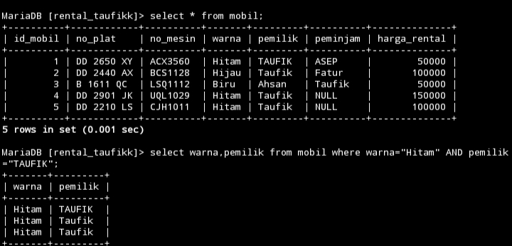
### Analisis
Kode tersebut adalah sebuah perintah SQL yang digunakan untuk mengambil data dari tabel 'mobil'. Perintah SELECT digunakan untuk memilih kolom 'warna' dan 'pemilik'. Klausa WHERE digunakan untuk menetapkan kondisi yang harus dipenuhi oleh baris-baris yang dipilih. Dalam hal ini, hanya baris-baris dengan warna "hitam" dan pemilik "Taufik" yang akan dipilih. Jadi, perintah tersebut akan mengembalikan data warna mobil yang "hitam" dan dimiliki oleh "Taufik".
### Kesimpulan
Kode tersebut digunakan untuk mengambil data dari tabel 'mobil' yang memenuhi dua kondisi: warna mobil harus "hitam" dan pemilik mobil harus "Taufik". Dengan demikian, kesimpulannya adalah bahwa perintah tersebut akan menghasilkan daftar mobil yang berwarna hitam dan dimiliki oleh seseorang dengan nama "Taufik"

---
# OR
### Struktur query
```mysql
select data 1,data 2 from [nama_tabel] where data 1="nilai 1" OR data 2="nilai 2";
```
### Contoh query
```mysql
select warna,pemilik from mobil where warna="hitam" OR pemilik="Ahsan";
```
### Hasil
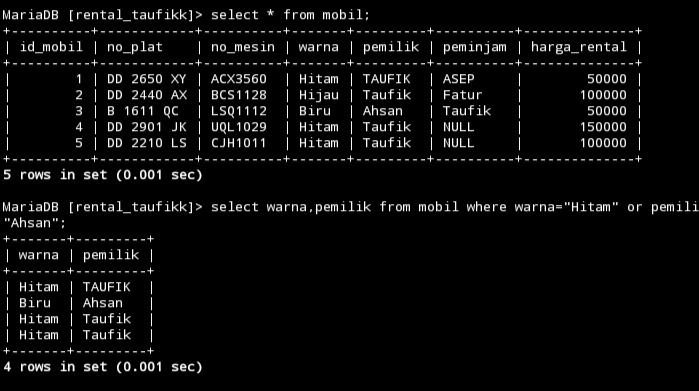
### Analisis
Kode tersebut adalah sebuah perintah SQL yang digunakan untuk mengambil data dari tabel 'mobil'. Perintah SELECT digunakan untuk memilih kolom 'warna' dan 'pemilik'. Klausa WHERE digunakan untuk menetapkan kondisi yang harus dipenuhi oleh baris-baris yang dipilih. Dalam hal ini, kondisi adalah bahwa warna mobil harus "hitam" ATAU pemilik mobil harus "Ahsan". Jadi, perintah tersebut akan mengembalikan data mobil yang berwarna "hitam" atau dimiliki oleh "Ahsan".
### Kesimpulan
Kode tersebut digunakan untuk mengambil data dari tabel 'mobil' yang memenuhi salah satu dari dua kondisi: warna mobil harus "hitam" atau pemilik mobil harus "Ahsan". Jadi, kesimpulannya adalah bahwa perintah tersebut akan menghasilkan daftar mobil yang berwarna hitam atau dimiliki oleh seseorang dengan nama "Ahsan".

---
# BETWEEN
### Struktur query
```mysql
select * from [nama_tabel] where data 1 BETWEEN nilai 1 AND nilai 2;
```
### Contoh query
```mysql
select * from mobil where harga_rental BETWEEN 50000 AND 100000;
```
### Hasil
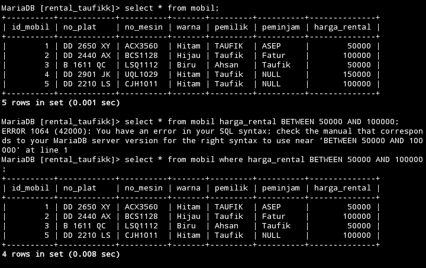
### Analisis
Kode tersebut adalah sebuah perintah SQL yang digunakan untuk mengambil data dari tabel 'mobil'. Perintah SELECT * digunakan untuk memilih semua kolom dari tabel 'mobil'. Klausa WHERE digunakan untuk menetapkan kondisi yang harus dipenuhi oleh baris-baris yang dipilih. Dalam hal ini, kondisi adalah bahwa nilai dalam kolom 'harga_rental' harus berada di antara 50000 dan 100000. Jadi, perintah tersebut akan mengembalikan data mobil yang memiliki harga sewa antara 50000 dan 100000.
### Kesimpulan
Kode tersebut digunakan untuk mengambil semua data dari tabel 'mobil' yang memiliki harga sewa (harga_rental) di antara 50000 dan 100000. Jadi, kesimpulannya adalah perintah tersebut akan menghasilkan daftar mobil yang tersedia untuk disewa dengan harga sewa dalam kisaran tersebut.

---
# NOT BETWEEN
### Struktur query
```mysql
select * from [nama_tabel] where data 1 NOT BETWEEN nilai 1 AND nilai 2;
```
### Contoh query
```mysql
select * from mobil where harga_rental NOT BETWEEN 50000 AND 100000;
```
### Hasil
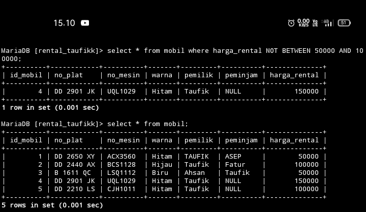
### Analisis
Kode tersebut adalah sebuah perintah SQL yang digunakan untuk mengambil data dari tabel 'mobil'. Perintah SELECT * digunakan untuk memilih semua kolom dari tabel 'mobil'. Klausa WHERE digunakan untuk menetapkan kondisi yang harus dipenuhi oleh baris-baris yang dipilih. Dalam hal ini, kondisi adalah bahwa nilai dalam kolom 'harga_rental' tidak boleh berada di antara 50000 dan 100000.
### Kesimpulan
Kode tersebut digunakan untuk mengambil semua data dari tabel 'mobil' dimana harga sewa (harga_rental) tidak berada di antara 50000 dan 100000. Jadi, kesimpulannya adalah perintah tersebut akan menghasilkan daftar mobil yang tidak termasuk dalam rentang harga sewa tersebut

---
# <=
### Struktur query
```mysql
select * from [nama_tabel] where data 1 <= nilai 1;
```
### Contoh query
```mysql
select * from mobil where harga_rental <= 50000;
```
### Hasil
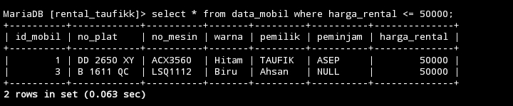
### Analisis
Kode tersebut adalah sebuah perintah SQL yang digunakan untuk mengambil data dari tabel 'mobil'. Perintah SELECT * digunakan untuk memilih semua kolom dari tabel 'mobil'. Klausa WHERE digunakan untuk menetapkan kondisi yang harus dipenuhi oleh baris-baris yang dipilih. Dalam hal ini, kondisi adalah bahwa nilai dalam kolom 'harga_rental' harus kurang dari atau sama dengan 50000.
### Kesimpulan
Kode tersebut digunakan untuk mengambil semua data dari tabel 'mobil' dimana harga sewa (harga_rental) kurang dari atau sama dengan 50000. Jadi, kesimpulannya adalah perintah tersebut akan menghasilkan daftar mobil yang tersedia untuk disewa dengan harga sewa kurang dari atau sama dengan 50000.

---
# >=
### Struktur query
```mysql
select * from [nama_tabel] where data 1 >= nilai 1;
```
### Contoh query
```mysql
select * from mobil where harga_rental >= 50000;
```
### Hasil
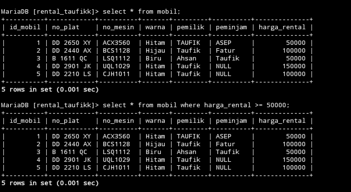
### Analisis
Kode tersebut adalah sebuah perintah SQL yang digunakan untuk mengambil data dari tabel "mobil" di mana nilai kolom "harga_rental" lebih besar dari atau sama dengan 50000. Dengan kata lain, perintah tersebut akan mengembalikan semua baris dari tabel "mobil" di mana harga rental mobilnya setidaknya 50000
### Kesimpulan
Kesimpulan dari perintah SQL adalah bahwa kita ingin menampilkan semua data mobil yang memiliki harga rental setidaknya 50000.

---
# <>
### Struktur query
```mysql
select * from [nama_tabel] where data 1 <> nilai 1;
```
### Contoh query
```mysql
select * from mobil where harga_rental <> 50000;
```
### Hasil
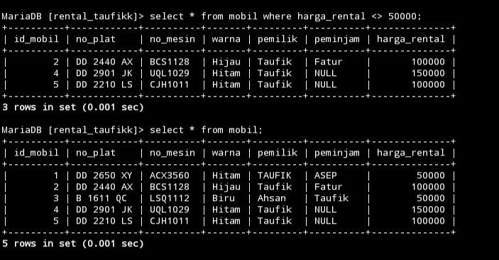
### Analisis
Kode tersebut adalah perintah SQL yang digunakan untuk mengambil data dari tabel "mobil" di mana nilai kolom "harga_rental" tidak sama dengan 50000. Dengan kata lain, perintah tersebut akan mengembalikan semua baris dari tabel "mobil" di mana harga rental mobilnya tidak sama dengan 50000.
### Kesimpulan
Kesimpulan kode perintah SQL adalah bahwa kita ingin menampilkan semua data mobil yang memiliki harga rental yang tidak sama dengan 50000.

---
# !=
### Struktur query
```mysql
select * from [nama_tabel] where data 1 != nilai 1;
```
### Contoh query
```mysql
select * from mobil where harga_rental != 50000;
```
### Hasil
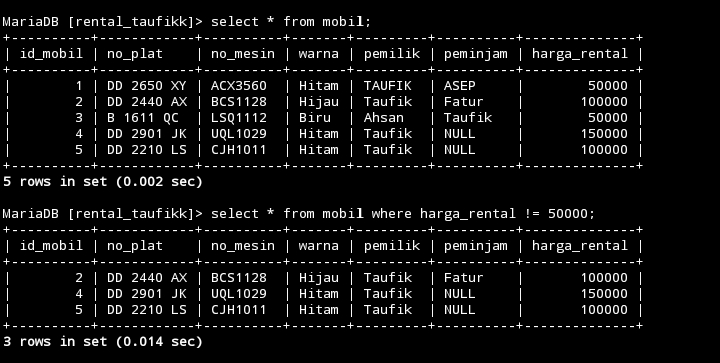
### Analisis
Kode tersebut adalah perintah SQL yang serupa dengan yang sebelumnya. Ini juga digunakan untuk mengambil data dari tabel "mobil" di mana nilai kolom "harga_rental" tidak sama dengan 50000. Dengan kata lain, perintah tersebut akan mengembalikan semua baris dari tabel "mobil" di mana harga rental mobilnya tidak sama dengan 50000. Pemakaian operator != memiliki makna yang sama dengan <> dalam SQL, yaitu "tidak sama dengan".
### Kesimpulan
Kesimpulan dari kode tersebut adalah bahwa kita ingin menampilkan semua data mobil yang memiliki harga rental yang tidak sama dengan 50000.

---
# TANTANGAN LOGIN
### Struktur query
```mysql
select data1 from nama_tabel where data2='admin' and data3='12345';
```
### Contoh query
```mysql
select nama from tantangan_login where username='admin' and password='12345';
```
### Hasil

### Analisis
Kode tersebut adalah perintah SQL yang digunakan untuk mengambil data dari tabel "tantangan_akun" di mana nilai kolom "nama" adalah "githa". Dengan kata lain, perintah tersebut akan mengembalikan semua baris dari tabel "tantangan_login" di mana nama akun yang ingin di seleksi adalah "githa"
### Kesimpulan
Kesimpulan dari kode tersebut adalah bahwa kita ingin seleksi data akun yang dimiliki oleh seseorang dengan nama "githa".

---
# Materi IN
## IN
### Struktur Query
```mysql
select * from nama_tabel where data IN('nilai 1','nilai 2');
```
### Contoh Query
```mysql
select * from mobil where warna IN('Hijau','Biru');
```
### Hasil
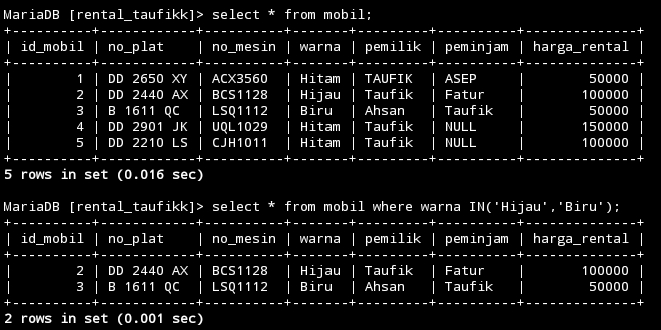
### Analisis
SELECT * FROM mobil: Ini adalah perintah untuk memilih semua kolom dari tabel "mobil". Tanda asterisk (*) digunakan untuk menunjukkan bahwa kita ingin mengambil semua kolom.

WHERE warna IN('Hijau','Biru'): Ini adalah klausa WHERE yang digunakan untuk memfilter baris-baris dari tabel. Di sini, hanya baris-baris yang memiliki nilai kolom "warna" sama dengan 'Hijau' atau 'Biru' yang akan dipilih.
### Kesimpulan
kode SQL ini akan mengembalikan semua baris dari tabel "mobil" di mana warnanya adalah 'Hijau' atau 'Biru'. Ini bermanfaat jika Anda ingin melihat daftar mobil yang memiliki warna tertentu atau melakukan analisis berdasarkan warna.
___
## IN/AND
### Struktur Query
```mysql
select * from nama_tabel where data IN('nilai 1','nilai 2')AND data 2=nilai 1;
```
### Contoh Query
```mysql
select * from mobil where warna IN('Hijau','Hitam')AND harga_rental=50000;
```
### Hasil
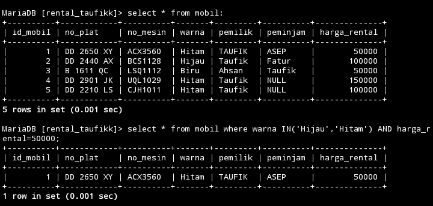
### Analisis
SELECT * FROM mobil: Seperti sebelumnya, ini adalah perintah untuk memilih semua kolom dari tabel "mobil".

WHERE warna IN('Hijau','Hitam'): Ini adalah klausa WHERE yang digunakan untuk memfilter baris-baris dari tabel. Di sini, hanya baris-baris yang memiliki nilai kolom "warna" sama dengan 'Hijau' atau 'Hitam' yang akan dipilih.

AND harga_rental=50000: Ini adalah tambahan pada klausa WHERE yang sebelumnya, yang berarti hanya baris-baris dengan harga_rental sebesar 50000 yang akan dipilih
### Kesimpulan
kode SQL ini akan mengembalikan semua baris dari tabel "mobil" di mana warnanya adalah 'Hijau' atau 'Hitam', dan harga rentalnya adalah 50000. Ini berguna jika Anda ingin melihat daftar mobil dengan kriteria spesifik tersebut atau melakukan analisis berdasarkan warna dan harga rental.

---
## IN/OR
### Struktur query
```mysql
select * from nama_tabel where data IN('nilai 1','nilai 2')OR data 2=nilai 1;
```
### Contoh query
```mysql
select * from mobil where warna IN('Hijau','Biru')OR harga_rental=50000;
```
### Hasil
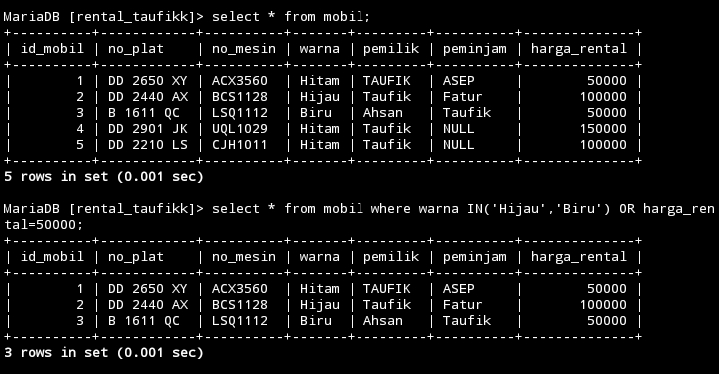
### Analisis
WHERE warna IN ('Hijau', 'Biru') OR harga_rental = 50000: Ini adalah klausa WHERE yang digunakan untuk memfilter baris-baris dari tabel. Di sini, kita memilih baris-baris yang memenuhi salah satu dari dua kondisi:

warna IN ('Hijau', 'Biru'): Baris-baris dengan warna 'Hijau' atau 'Biru' akan dipilih.
harga_rental = 50000: Baris-baris dengan harga rental sebesar 50000 akan dipilih.
### Kesimpulan
kode SQL ini adalah untuk mengambil semua baris dari tabel "mobil" di mana warnanya adalah 'Hijau' atau 'Biru', atau harga rentalnya adalah 50000. Ini berguna jika Anda ingin melihat daftar mobil dengan kriteria spesifik tersebut atau melakukan analisis berdasarkan warna dan harga rental.
___
## IN/AND/OPERATOR
### Struktur query
```mysql
select * from nama_tabel where data IN('nilai 1','nilai 2')AND data 2<nilai 1;
```
### Contoh query
```mysql
 select * from mobil where warna IN('Hijau','Biru')AND harga_rental<100000;
```
### Hasil
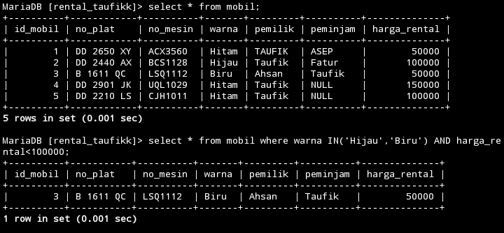
### Analisis
SELECT * FROM mobil: Ini memilih semua kolom dari tabel "mobil".

WHERE warna IN ('Hijau', 'Biru') AND harga_rental < 100000: Ini adalah klausa WHERE yang digunakan untuk memfilter baris-baris dari tabel. Di sini, kita memilih baris-baris yang memenuhi kedua kondisi:

warna IN ('Hijau', 'Biru'): Baris-baris dengan warna 'Hijau' atau 'Biru' akan dipilih.
harga_rental < 100000: Baris-baris dengan harga rental kurang dari 100000 akan dipilih.
### Kesimpulan
kode SQL ini adalah untuk mengambil semua baris dari tabel "mobil" di mana warnanya adalah 'Hijau' atau 'Biru', dan harga rentalnya kurang dari 100000. Ini berguna jika Anda ingin melihat daftar mobil dengan kriteria spesifik tersebut atau melakukan analisis berdasarkan warna dan harga rental.
___
# Materi LIKE
## LIKE(mencari awalan)
### Struktur query
```mysql
select * from nama_tabel where data LIKE 'n%';
```
### Contoh query
```mysql
select * from mobil where pemilik LIKE 'Ta%';
```
### Hasil
![[Screenshot_2024-02-27-14-57-24-79_84d3000e3f4017145260f7618db1d683.jpg]]
### Analisis
SELECT * FROM mobil: Ini memilih semua kolom dari tabel "mobil".

WHERE pemilik LIKE 'Ta%': Ini adalah klausa WHERE yang digunakan untuk memfilter baris-baris dari tabel. Di sini, kita memilih baris-baris di mana nilai kolom "pemilik" dimulai dengan huruf 'Ta'. Operator LIKE digunakan untuk mencocokkan pola teks, dan '%' adalah wildcard yang cocok dengan nol atau lebih karakter apa pun.
### Kesimpulan
kode SQL ini adalah untuk mengambil semua baris dari tabel "mobil" di mana nama pemiliknya dimulai dengan 'Ta'. Ini berguna jika Anda ingin mencari mobil yang dimiliki oleh seseorang dengan awalan nama tersebut.
___
## LIKE(mencari akhir)
### Struktur query
```mysql
select * from nama_tabel where data LIKE '%n';
```
### Contoh query
```mysql
select * from mobil where pemilik LIKE '%n';

```
### Hasil
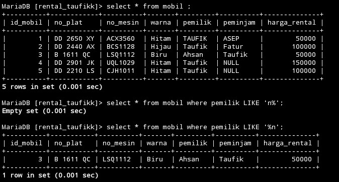
### Analisis
SELECT * FROM mobil: Ini memilih semua kolom dari tabel "mobil".

WHERE pemilik LIKE '%n': Ini adalah klausa WHERE yang digunakan untuk memfilter baris-baris dari tabel. Di sini, kita memilih baris-baris di mana nilai kolom "pemilik" berakhir dengan huruf 'n'. Operator LIKE digunakan untuk mencocokkan pola teks, dan '%' adalah wildcard yang cocok dengan nol atau lebih karakter apa pun sebelum karakter 'n'.
### Kesimpulan
kode SQL ini adalah untuk mengambil semua baris dari tabel "mobil" di mana nama pemiliknya berakhir dengan huruf 'n'. Ini berguna jika Anda ingin mencari mobil yang dimiliki oleh seseorang dengan akhiran nama tersebut.
___
## LIKE(mencari awalan/akhir)
### Struktur query
```mysql
select * from nama_tabel where data LIKE 'a%n';
```
### Contoh query
```mysql
select * from mobil where pemilik LIKE 'a%n';
```
### Hasil
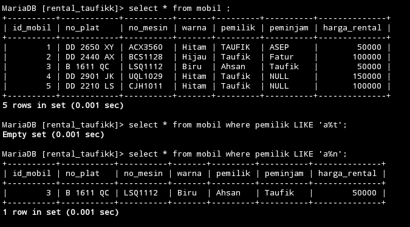
### Analisis
SELECT * FROM mobil: Ini memilih semua kolom dari tabel "mobil".

WHERE pemilik LIKE 'a%n': Ini adalah klausa WHERE yang digunakan untuk memfilter baris-baris dari tabel. Di sini, kita memilih baris-baris di mana nilai kolom "pemilik" dimulai dengan huruf 'a' dan diikuti oleh nol atau lebih karakter apa pun sebelum karakter 'n'. Operator LIKE digunakan untuk mencocokkan pola teks, dan '%' adalah wildcard yang cocok dengan nol atau lebih karakter apa pun.
### Kesimpulan
kode SQL ini adalah untuk mengambil semua baris dari tabel "mobil" di mana nama pemiliknya dimulai dengan huruf 'a' dan diikuti oleh karakter apa pun sebelum karakter 'n'. Ini berguna jika Anda ingin mencari mobil yang dimiliki oleh seseorang dengan awalan 'a' dan diikuti oleh karakter apa pun sebelum 'n'.
____
## LIKE(mencari total karakter)
### Struktur query
```mysql
select * from nama_tabel where data LIKE 'n';
```
### Contoh query
```mysql
select * from mobil where pemilik LIKE 'Taufik';
```
### Hasil
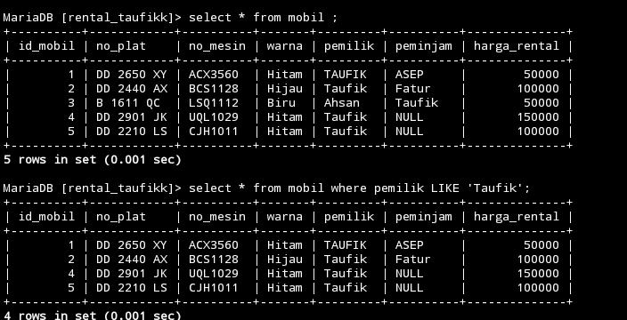
### Analisis
SELECT * FROM mobil: Ini memilih semua kolom dari tabel "mobil".

WHERE pemilik LIKE 'Taufik': Ini adalah klausa WHERE yang digunakan untuk memfilter baris-baris dari tabel. Di sini, kita mencari baris-baris di mana nilai kolom "pemilik" cocok secara tepat dengan string 'Taufik'. Operator LIKE digunakan untuk mencocokkan pola teks, tetapi dalam kasus ini, karena tidak ada wildcard yang digunakan seperti '%', itu hanya mencari string yang persis sama dengan 'Taufik'.
### Kesimpulan
kode SQL ini adalah untuk mengambil semua baris dari tabel "mobil" di mana nama pemiliknya adalah 'Taufik'. Ini akan mengembalikan baris yang memiliki pemilik dengan nama 'Taufik' secara tepat, tanpa memperhitungkan karakter lain sebelum atau sesudahnya.
____
## LIKE(Kombinasi)
### Struktur query
```mysql
select * from nama_tabel where data LIKE '_%';
```
### Contoh query
```mysql
select * from mobil where pemilik LIKE 'ahsan%';
```
### Hasil
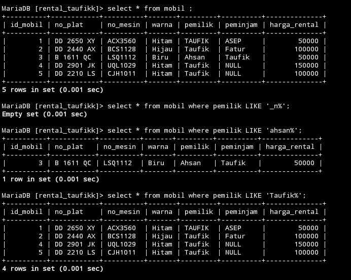
### Analisis
SELECT * FROM mobil: Ini memilih semua kolom dari tabel "mobil".

WHERE pemilik LIKE 'ahsan%': Ini adalah klausa WHERE yang digunakan untuk memfilter baris-baris dari tabel. Di sini, kita memilih baris-baris di mana nilai kolom "pemilik" dimulai dengan string 'ahsan' dan diikuti oleh nol atau lebih karakter apa pun. Operator LIKE digunakan untuk mencocokkan pola teks, dan '%' adalah wildcard yang cocok dengan nol atau lebih karakter apa pun setelah 'ahsan'.
### Kesimpulan
kode SQL ini adalah untuk mengambil semua baris dari tabel "mobil" di mana nama pemiliknya dimulai dengan 'ahsan'. Ini berguna jika Anda ingin mencari mobil yang dimiliki oleh seseorang dengan awalan 'ahsan'.
___
# Materi Not Like
## NOT LIKE
### Struktur query
```mysql
select * from nama_tabel where data NOT LIKE '_%';
```
### Contoh query
```mysql
select * from mobil where peminjam NOT LIKE 'A%';
```
### Hasil
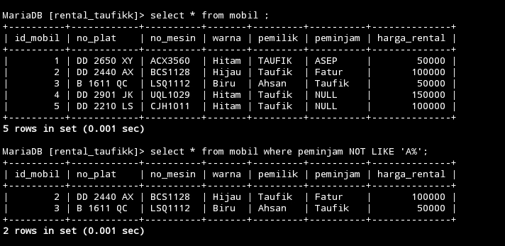
### Analisis
SELECT * FROM mobil: Ini memilih semua kolom dari tabel "mobil".

WHERE peminjam NOT LIKE 'A%': Ini adalah klausa WHERE yang digunakan untuk memfilter baris-baris dari tabel. Di sini, kita memilih baris-baris di mana nilai kolom "peminjam" tidak dimulai dengan huruf 'A'. Operator LIKE digunakan untuk mencocokkan pola teks, dan '%' adalah wildcard yang cocok dengan nol atau lebih karakter apa pun setelah 'A'.
### Kesimpulan
kode SQL ini adalah untuk mengambil semua baris dari tabel "mobil" di mana nilai kolom "peminjam" tidak dimulai dengan huruf 'A'. Ini berguna jika Anda ingin mencari mobil yang belum dipinjam oleh seseorang dengan awalan 'A'.
___
# Materi NULL & NOTNULL
## NULL
### struktur query
```mysql
select * from nama_tabel where kolom_tabel IS NULL;
```
### Contoh query
```mysql
select * from mobil where peminjam IS NULL;
```
### Hasil

### Analisis
SELECT * FROM mobil: Ini memilih semua kolom dari tabel "mobil".

WHERE peminjam IS NULL: Ini adalah klausa WHERE yang digunakan untuk memfilter baris-baris dari tabel. Di sini, kita memilih baris-baris di mana nilai kolom "peminjam" kosong atau NULL.
### Kesimpulan
kode SQL ini adalah untuk mengambil semua baris dari tabel "mobil" di mana nilai kolom "peminjam" tidak diisi atau kosong. Ini berguna jika Anda ingin mencari mobil yang belum dipinjam oleh siapapun.
___
## NOT NULL
### Struktur query
```Mysql
select * from nama_tabel where kolom_tabel IS NOT NULL;
```
### contoh query
```mysql
select * from mobil where peminjam IS NOT NULL;
```

### Hasil

### Analisis
SELECT * FROM mobil WHERE peminjam IS NOT NULL; digunakan untuk mengambil semua baris dari tabel mobil di mana kolom peminjam tidak kosong atau memiliki nilai. Ini berarti query tersebut akan mengembalikan semua data tentang mobil yang sedang dipinjam.
### Kesimpulan
kode SQL ini adalah bahwa kita ingin melihat data tentang mobil yang sedang dipinjamkan atau sedang digunakan, dan mungkin akan menggunakan informasi tersebut untuk pengelolaan inventaris atau analisis penggunaan mobil dalam suatu periode waktu tertentu.
___
# ORDER BY & Limit
### Struktur query
```mysql
select * from nama_tabel ORDER BY kolom_tabel ASC;
```
### Contoh Query
```mysql
select * from mobil ORDER BY pemilik ASC
```
### Hasil

### Analisis
Perintah SQL SELECT * FROM mobil ORDER BY pemilik ASC; digunakan untuk mengambil semua baris dari tabel mobil dan mengurutkannya berdasarkan kolom pemilik secara ascending (dari yang terkecil hingga yang terbesar).
### Kesimpulan
kode SQL ini adalah bahwa kita ingin melihat data tentang mobil berdasarkan pemiliknya dan mengurutkannya secara alfabetis berdasarkan nama pemilik. Ini mungkin digunakan untuk melihat distribusi mobil antara berbagai pemilik atau untuk melakukan analisis berdasarkan kepemilikan mobil.

## Limit
### Struktur query
```mysql
SELECT * FROM nama_tabel WHERE nama_data = ”data” ORDER BY nama_data ASC LIMIT 2;
```
### contoh query
```mysql
SELECT * FROM mobil WHERE warna = ”Hitam” ORDER BY harga ASC LIMIT 2;
```
### hasil
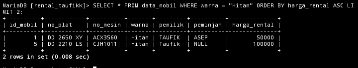
### analisis
1. SELECT * FROM mobil WHERE warna = "Hitam": Ini adalah bagian pertama dari pernyataan SQL. Ini berarti kita ingin memilih semua kolom`(*)` Dari tabel mobil di mana nilai kolom warna sama dengan "Hitam". Ini akan mengambil semua baris yang memiliki mobil berwarna hitam.
2. ORDER BY harga ASC: Bagian ini menginstruksikan database untuk mengurutkan hasil berdasarkan kolom harga secara ascending (dari yang terkecil ke terbesar). Artinya, mobil dengan harga yang lebih rendah akan muncul lebih dulu dalam hasil.
3. LIMIT 2: Ini adalah batasan yang diberikan pada jumlah baris yang ingin ditampilkan. Dalam kasus ini, hanya dua baris dengan harga terendah yang akan ditampilkan.
### kesimpulan
Query tersebut adalah sebuah perintah SQL yang digunakan untuk mengambil data dari tabel "mobil" dimana nilai kolom "warna" adalah "Hitam". Hasilnya akan diurutkan berdasarkan kolom "harga" secara menaik (ASC) dan hanya akan menampilkan 2 baris data pertama yang memenuhi kriteria tersebut.
___
# DISTINCT
### Struktur query
```mysql
select distinct (pemilik) from mobil;
```
### contoh query
```mysql
Select DISTINCT (kolom_tabel) from nama_tabel;
```

### Hasil

### Analisis
SELECT DISTINCT(pemilik): Digunakan untuk memilih nilai dari kolom pemilik dalam tabel mobil. DISTINCT memastikan bahwa hanya nilai unik yang akan ditampilkan, sehingga tidak ada duplikat pada hasil.

Hasil query ini akan menghasilkan satu kolom tunggal yang berisi nilai-nilai unik dari kolom pemilik dalam tabel mobil. Setiap nilai yang muncul dalam hasil query akan bersifat unik, tanpa adanya duplikat.
### Kesimpulan
Query ini akan menampilkan semua nama peminjam yang ada pada tabel mobil.
___
# Concat & Concat_WS,AS
## Menggabung kolom tanpa pemisah
### Struktur query
```mysql
SELECT CONCAT(data 1,data 2) FROM nama_tabel;
```

### contoh query
```mysql
SELECT CONCAT(pemilik,warna) FROM mobil;
```
### Hasil
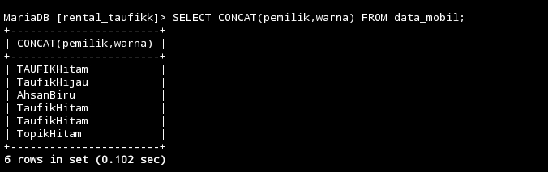
### Analisis
SELECT`: Digunakan untuk memilih kolom yang akan ditampilkan dalam hasil query.

`CONCAT_WS("-", no_plat, no_mesin, id_mobil)`: Fungsi CONCAT_WS digunakan untuk menggabungkan nilai dari kolom "no_plat", "no_mesin", dan "id_mobil" dengan menggunakan pemisah "-" (dash) di antara setiap nilai. Hasil penggabungan tersebut akan menjadi satu nilai tunggal.

`FROM mobil`: Menunjukkan bahwa tabel yang digunakan dalam query ini adalah "mobil".

Hasil query ini menghasilkan satu kolom yang berisi nilai-nilai hasil penggabungan antara kolom "no_plat", "no_mesin", dan "id_mobil" dari setiap baris dalam tabel "mobil" dengan pemisah "-" di antara setiap nilai.
### Kesimpulan
Pada query ini, SELECT CONCAT(pemilik, warna) FROM mobil;, dilakukan seleksi data dari tabel mobil dengan melakukan penggabungan antara kolom pemilik dan warna.
___
## Menggabung kolom dengan pemisah (WS)
### Struktur query
```sql
SELECT CONCAT_WS("-",data 1,data 2,data 3) FROM nama_tabel;
```
### contoh query
```mysql
SELECT CONCAT_WS("-",no_plat,no_mesin,id_mobil) FROM mobil;
```
### Hasil
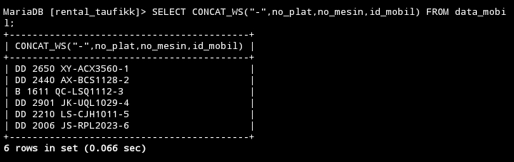

### Analisis
SELECT: Digunakan untuk memilih kolom yang akan ditampilkan dalam hasil query. CONCAT_WS("-", no_plat, no_mesin, id_mobil): CONCAT_WS digunakan untuk menggabungkan nilai dari kolom no_plat, no_mesin, dan id_mobil dengan menggunakan pemisah - (dash) di antara setiap nilai. Hasil penggabungan tersebut akan menjadi satu nilai tunggal. FROM mobil: Menunjukkan bahwa tabel yang digunakan dalam query ini adalah mobil. Hasil query ini menghasilkan satu kolom yang berisi nilai-nilai hasil penggabungan antara kolom no_plat, no_mesin, dan id_mobil dari setiap baris dalam tabel mobil dengan pemisah - di antara setiap nilai.
### Kesimpulan
Kesimpulannya Pada query ini, SELECT CONCAT_WS("-", no_plat, no_mesin, id_mobil) FROM mobil;, dilakukan seleksi data dari tabel "mobil" dengan menggabungkan antara kolom no_plat, no_mesin, dan id_mobil menggunakan pemisah - (dash).
___
## Memberikan nama kolom alias (AS)
### Struktur query
```mysql
SELECT
CONCAT_WS("+",data1,data2) AS
COLLAB FROM nama_tabel;
```
### contoh query
```mysql
SELECT
CONCAT_WS("+",pemilik,peminjam) AS
COLLAB FROM mobil;
```
### hasil
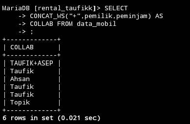

### Analisis
SELECT: Digunakan untuk memilih kolom yang akan ditampilkan dalam hasil query. CONCAT_WS("+", pemilik, peminjam) AS COLLAB: CONCAT_WS digunakan untuk menggabungkan nilai dari kolom pemilik dan peminjam dengan menggunakan pemisah + (plus) di antara setiap nilai. Hasil penggabungan tersebut akan menjadi satu nilai . COLLAB diberikan pada kolom hasil penggabungan. FROM mobil: Menunjukkan bahwa tabel yang digunakan dalam query ini adalah mobil. Hasil query tersebut akan menghasilkan satu kolom tunggal dengan nama COLLAB yang berisi nilai-nilai hasil penggabungan antara kolom pemilik dan peminjam dari setiap baris dalam tabel mobil dengan pemisah + di antara setiap nilai.
### Kesimpulan
Pada query SQL ini, SELECT CONCAT_WS("+", pemilik, peminjam) AS COLLAB FROM mobil;untuk menyeleksi data dari tabel "mobil" dengan melakukan penggabungan antara kolom pemilik dan peminjam menggunakan pemisah + (plus) sebagai CONCAT_WS. Hasil penggabungan diberi alias COLLAB pada hasil query.
___
# View
### Struktur query
```mysql
CREATE VIEW nama_tabel AS

-> SELECT data 1, data 2, data 3,data 4

-> FROM mobil

-> WHERE pemilik = "Ibrahim";

```

### contoh query
```mysql
Create View info_platt AS select id_mobil,no_plat,pemilik,peminjam from data_mobil where pemilik ="Taufik";
```

### Hasil
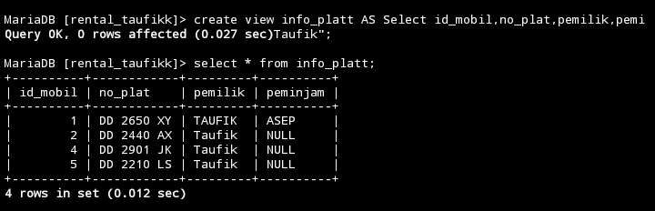

### Analisis

1. **CREATE VIEW**: Ini adalah perintah untuk membuat sebuah view baru dalam database. Dalam hal ini, view bernama `info_platt` akan dibuat.

2. **AS**: Digunakan untuk menentukan query yang akan mengisi data dari view yang dibuat. 

3. **SELECT**: Ini adalah perintah untuk memilih kolom-kolom yang akan dimasukkan ke dalam view.

4. **id_mobil, no_plat, pemilik, peminjam**: Ini adalah kolom-kolom yang dipilih dari tabel `data_mobil`.

5. **FROM data_mobil**: Menunjukkan bahwa data untuk view ini akan diambil dari tabel `data_mobil`.

6. **WHERE pemilik = "Taufik"**: Ini adalah klausa untuk memfilter baris-baris dari tabel `data_mobil` di mana nilai kolom `pemilik` adalah "Taufik".

Jadi, keseluruhan query ini akan membuat sebuah view yang berisi informasi mengenai mobil-mobil yang dimiliki oleh "Taufik", dengan kolom-kolom yang terpilih yaitu `id_mobil`, `no_plat`, `pemilik`, dan `peminjam`.

### Kesimpulan
Query ini membuat sebuah view bernama info_platt yang menampilkan kolom-kolom id_mobil, no_plat, pemilik, dan peminjam dari tabel data_mobil dimana nilai kolom pemilik adalah "Taufik". Dengan membuat view ini, pengguna dapat dengan mudah melihat informasi mobil-mobil yang dimiliki oleh pemilik dengan nama "Taufik".
___

## Tantangan

1.Buatkan tabel virtual dan tampilkan datanya yang mana peminjamannya itu tidak ada
(NULL).
### query
```Mysql
CREATE VIEW peminjam_NULL AS SELECT id_mobil,no_plat, peminjam, harga_rental FROM mobil WHERE peminjam IS NULL;
```
### hasil
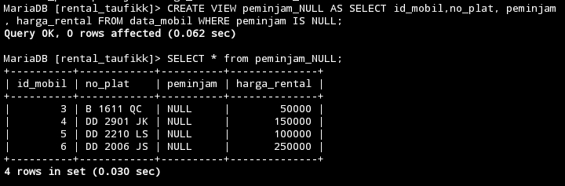
2.update atau ganti salah satu data peminjam dari tabel mobil dengan nilai NULL, tampilkan isi data pada tabel
### query
```mysql
Update mobil SET peminjam=NULL WHERE id_mobil=2;
```
### hasil
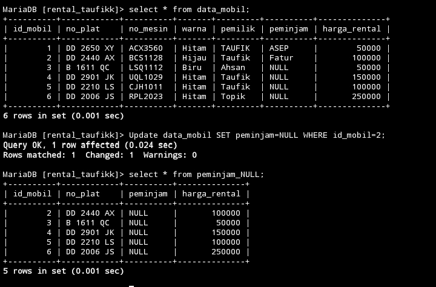

3. Berikan Kesimpulan mengapa tabel virtual ini dibuat

>[!info] Tabel Virtual ini dibuat untuk menyediakan informasi tentang mobil yang saat ini tidak dipinjam (peminjamnya NULL), sehingga memudahkan pengelolaan dan pelacakan mobil yang tersedia untuk disewakan. Dengan demikian, orang dapat dengan mudah melihat daftar mobil yang tersedia untuk disewa tanpa harus memeriksa satu per satu dalam database.

___
# Agregasi
### Sum
### Struktur query
```mysql
SELECT SUM(nama_kolom) AS total FROM nama_tabel
WHERE kondisi_opsional;
```
### contoh query
```mysql
SELECT SUM(harga_rental) FROM mobil;
```
### Hasil
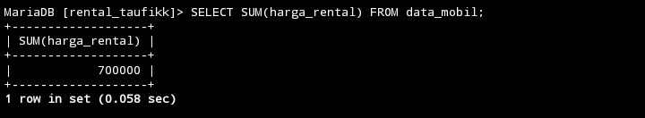
### Analisis
SELECT SUM(harga_rental): Ini adalah bagian dari pernyataan SELECT yang mengambil nilai total dari kolom harga_rental. SUM digunakan untuk menjumlahkan nilai-nilai dalam kolom tertentu.

FROM mobil: Ini menunjukkan bahwa tabel yang digunakan dalam query ini adalah mobil. Anda mengambil nilai dari kolom harga_rental di dalam tabel ini.

### Kesimpulan
Kesimpulannya,SUM ini akan menampilkan hasil penjumlahan dari seluruh penjumlahan harga_rental dari tabel mobil.

___
## Count
### Struktur Query
```mysql
SELECT COUNT(*)AS jumlah FROM nama_tabel WHERE kondisi_opsional
```

### Contoh Query
```mysql
SELECT COUNT(pemilik) FROM mobil;
```

### Hasil
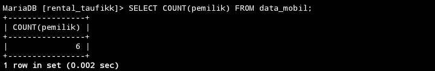
### analisis
SELECT COUNT(pemilik) adalah nama kolomnya FROM mobil; adalah nama tabelnya, perintah ini akan menghitung jumlah baris dalam tabel mobil di mana kolom pemilikmemiliki nilai yang tidak NULL. Ini akan memberikan jumlah total entitas mobil yang memiliki nilai yang valid dalam kolom pemilik. jika tabel mobil berisi lima baris dan hanya tiga baris memiliki nilai yang tidak null dalam kolom pemilik, maka perintah ini akan hanya menampilkan nilai yang tidak NULL.
### Kesimpulan
Kesimpulannya, ketika kita mau menghitung jumlah peminjam yang ada di tabel mobil yang memiliki nilai yang valid (NULL) dan sebaliknya tidak akan menampilkan nilai yang tidak valid (NOT NULL)

____
## Min
### Struktur Query

```Mysql
SELECT MIN(nama_kolom) AS nilai_minimum FROM nama_tabel WHERE kondisi_opsional;
```

### Contoh Query

```mysql
SELECT MIN(harga_rental) AS MINIMAL FROM mobil;

```
### Hasil
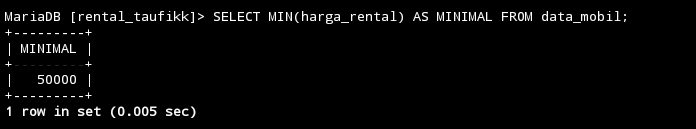
### analisis
SELECT MIN(harga_rental) ini nama kolom yang akan di tampilkan AS MINIMAL FROM mobil; nama tabelnya, ini akan mengambil nilai terkecil dari kolom harga_rental dalam tabel mobil dan memberikan hasilnya dengan nama kolom MINIMAL.disini hasilnya yang tampil adalah 5000 karena 5000 adalah nilai yang paling rendah dari nilai lainnya.

### Kesimpulan
Kesimpulannya,MIN ini akan menampilkan nilai yang paling rendah dalam sebuah kolom dari sebuah tabel.
___
## Max
### Struktur Query
```mysql
SELECT MAX(nama_kolom) AS nilai_maksimum FROM nama tabel
WHERE kondisi_opsional;
```

### Contoh Query
```mysql
SELECT MAX(harga_rental) AS MAXIMAL FROM mobil;
```

### Hasil
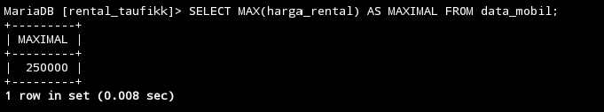
### analisis
SELECT MAX (harga_rental) ini nama kolom yang akan di tampilkan AS MAXIMAL FROM mobil; nama tabelnya, ini akan mengambil nilai terkecil dari kolom harga_rental dalam tabel mobil dan memberikan hasilnya dengan nama kolom MINIMAL.disini hasilnya yang tampil adalah 15000 karena 15000 adalah nilai yang paling rendah dari nilai lainnya.

### Kesimpulan
Kesimpulannya,MAX ini akan menampilkan nilai yang paling tinggi dalam sebuah kolom dari sebuah tabel.
___

## AVG
### Struktur Query
```mysql
SELECT AVG(nama_kolom) AS rata_rata FROM nama_tabel
WHERE kondisi_opsional;

```
Contoh Query
```mysql
SELECT AVG(harga_rental) AS RATA_RATA FROM mobil;
```

### Hasil
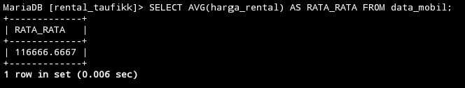
### analisis
Select AVG (harga_rental) adalah nama kolom yang akan dihitung rata-rata harga rentalnya.Dengan menggunakan AVG kita dapat menghasilkan rata-rata harga rental mobil dari tabel mobil. Perintah SELECT AVG(harga_rental) menghitung nilai rata-rata dari kolom harga_rental. Hasil dari query ini akan memberikan rata-rata harga rental mobil di tabel mobil.hasil dari rata-rata harga mobil adalah 90000.0000.
### Kesimpulan
Kesimpulannya,akan menampilkan hasil dari rata-rata harga mobil pada kolom harga_rental.

---