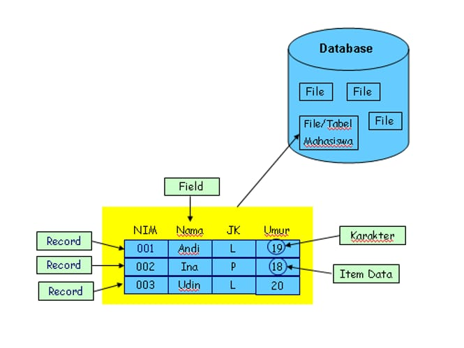
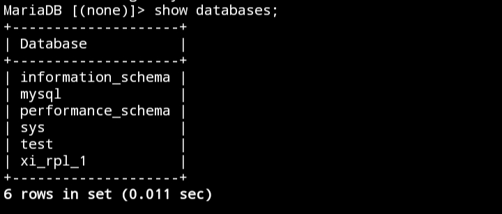
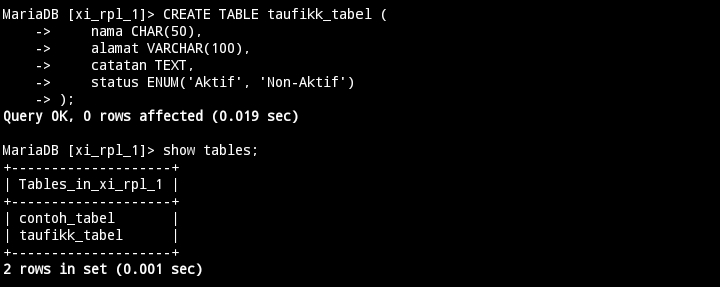
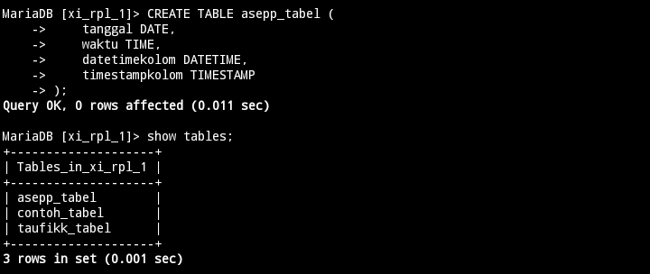
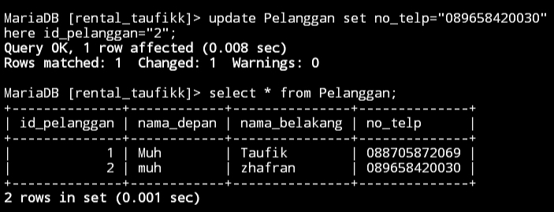

# DEFINISI BASIS DATA
Basis data memiliki makna/arti yang berbeda yang dimana :
Basis Istilah "Basis" mengacu pada gudang atau tempat penyimpanan.
Data Sedangkan "Data " merujuk pada fakta-fakta yang di kumpulkan
>[!faq]- Apa sih itu Basis Data?
Basis Data adalah kumpulan data-data yang mempunyai hubungan secara logika yang di sertai dengan deskripsi data-data.

## KESIMPULAN BASIS DATA
Kesimpulan dari ==basis data== adalah informasi yang digunakan untuk mengelola data dan menyediakan akses yang yang efisien.

## PERANAN BASIS DATA
Di sebuah kampus, terdapat beberapa data yang di tampung seperti data Rektor, Dekan, Ketua prodi, Ketua jurusan, Direktur, Dosen, Staff, Pengawai, Mahasiswa. Yang dimana orang yang menginput data-data tersebut merupakan staff dibidang IT/Admin.

## STRUKTUR TABEL DALAM BASIS DATA
Hirarki database adalah struktur organisasi data dalam database yang mengatur hubungan antara entitas atau tabel data. Dalam hirarki database, data diorganisir dalam bentuk pohon dengan satu entitas induk atau tabel utama yang memiliki beberapa entitas anak atau tabel terkait.

Data Siswa XI RPL 1 :
>[!faq] | No | Nama    | JK  |
| -------- | ------- | ------ |
| 1       | Taufik  | LAKI LAKI |
| 2       | Adiguna | LAKI LAKI|
| 3       | Jordan  | LAKI LAKI |


**KOLOM/FIELD**
Record dalam basis data merujuk kepada kumpulan informasi yang berkaitan dan terkait dengan entitas tun ggal atau objek dalam suatu sistem basis data.
Field dalam basis data merujuk kepada komponen terkecil dari sebuah record atau tupel dalam tabel.
Data Value dalam basis data merujuk kepada nilai konkret yang disimpan dalam field atau atribut dalam suatu record

**Contoh Tabel Database**


___
# Penginstalan mySQL di termux
## Menggunakan Termux
1. Berikan akses termux ke memori internal
Ketik`termux-setup-storage`
2. Muncul pop-up untuk meminta izin akses ke memori internal
Klik` izinkan/allow acces`
3. Lakukan uptade dan sekaligus upgrade paket
Ketik`pkg update && upgrade -y`
4. jika ada konfirmasi untuk melanjutkan instalasi.
Silahkan` klik y dan enter`
5. instal aplikasi MariaDB
Ketik `pkg install mariadb`
6. Memberikan Akses aman ke MySQL
Ketik` mysqld_Safe`
7. Menghentikan Proses 
Ketik`CTRL+Z`
8. untuk Masuk Kedalam admin
Ketik` mysql -u root`
## Referensi video youtube
https://youtu.be/ez3nx3xH-y4?si=T4saycipqfBcqL1c
# Penggunaan awal MySQL
## Query
MySQL -u root
```mysql
mysql -u root
```
### Hasil

### Analisis 
**MySql**:
Ini adalah perintah untuk mengakses shell MySQL, yaitu antarmuka command-line untuk berinteraksi dengan server MySQL.

**-u root**-:
Parameter ini menentukan pengguna (user) yang akan digunakan untuk masuk ke server MySQL. Dalam hal ini, "root" adalah nama pengguna yang diberikan, dan "root" adalah tingkat tertinggi dengan hak akses penuh.
### **Kesimpulan**:
mysql -u root memberikan akses penuh ke server MySQL dengan menggunakan pengguna "root", yang memiliki hak akses maksimum. Penggunaan perintah ini perlu hati-hati untuk menghindari risiko keamanan.
___
# DataBase
## Membuat Database
Untuk membuat database di MySQL,Anda dapat menggunakan perintah **==CREATE DATABASE==** dengan nama database yang akan di buat contohnya: **==xi_rpl_1;==** .pastikan untuk memiliki hak akses yang sesuai,dan verifikasi pembuatan database dengan perintah **==SHOW DATABASE==**.
### Struktur
```mysql
CREATE DATABASE [nama_database];
```
### Contoh
```mysql
CREATE DATABASE xi_rpl_1;
```
### Hasil

### Analisis 
Kode tersebut membuat database dengan perintah **CREATE DATABASE**
### Kesimpulan
Dengan menggunakan perintah **create database**
Kita dapat membuat database dengan nama yang pengguna inginkan.
___
## Menampilkan database
Untuk menampilkan daftar database diMySQL,anda dapat menggunakan perintah SQL **==SHOW DATABASE==**. perintah ini memberikan gambaran keseluruhan Database yang tersedia di server MySQL. Pastikan pengguna yang di gunakan memiliki izin untuk melihat database dan gunakan perintah melalui antarmuka **command-line** atau alat manajemen database seperti **phpMyAdmin**.
### contoh kode
```mysql
Show Database;
```
### Hasil

### Analisis
Kode dengan perintah **show databases;** dapat menampilkan sebuah database
### kesimpulan
Dengan kode tersebut database yg ingin ditampilkan dapat menggunakan perintah **show databases;**

___
## Menghapus database
Untuk menghapus sebuah database di SQL, anda dapat menggunakan perintah **==DATABASE xi_rpl_1==** (**Nama database yang akan di hapus**). Namun perlu diingat bahwa tindakan ini akan menghapus semua data yang ada di dalam database. pastikan anda memiliki backup data yang di butuhkan sebelum melanjutkan
### Struktur 
```mysql
drop database [nama_database];
```
### Contoh
```mysql
drop database xi_rpl_1;
```
### Hasil

### Analisis
Kode tersebut berfungsi untuk menghapus sebuah database yg telah dibuat
### kesimpulan
Kode tersebut bertujuan menghapus database secara permanen beserta data yang terkait dalam database tersebut.
___
## Menggunakan database
Perintah use di gunakan untuk beralih atau menggunakan sebuah database tertentu di server. Perintah ini sangat berguna ketika anda bekerja dengan beberapa Database di server MySQL dan ingin fokus pada satu database dalam sesi tertentu. Contohnya: **==use xi_rpl_1;==**
### struktur
```mysql
use [nama_database];
```
### contoh
```mysql
Use xi_rpl_1;
```
### Hasil

### Analisis
Dengan Kode perintah **use** pengguna dapat menggunakan databases atau masuk kedalam database tersebut
### kesimpulan
 pengguna dapat masuk kedalam database yang telah dibuat dengan kode perintah -contoh- **use xi_rpl_1**

___
# Tipe Data
## Angka
-  ==INT:== Untuk menyimpan nilai bilangan bulat (integer). Misalnya, INT dapat digunakan untuk menyimpan angka seperti 1, 100, -10, dan sebagainya. 

 - ==DECIMAL: ==Digunakan untuk menyimpan nilai desimal presisi tinggi, cocok untuk perhitungan finansial atau keuangan.
 - 
 - ==FLOAT dan DOUBLE: ==Digunakan untuk menyimpan nilai desimal dengan presisi floating-point. DOUBLE memiliki presisi lebih tinggi dibandingkan FLOAT.
 
 - ==TINYINT, SMALLINT,== ==MEDIUMINT==, dan ==BIGINT: ==Tipe data ini menyimpan bilangan bulat dengan ukuran yang berbeda-beda.
   Contoh : 
```Mysql

CREATE TABLE contoh_tabel (
    id INT,
    harga DECIMAL(10, 2),
    jumlah_barang TINYINT
);
```
Dalam contoh tersebut, `id` menggunakan tipe data `INT`, `harga` menggunakan tipe data `DECIMAL `dengan presisi 10 digit dan 2 angka di belakang koma, dan `jumlah_barang` menggunakan tipe data `TINYINT.`
#### Hasil

___
## Teks

- ==CHAR(N) ==Menyimpan string karakter tetap dengan panjang N. Contoh: ==CHAR(10) ==akan menyimpan string dengan panjang tepat 10 karakter.

- ==VARCHAR(N):== Menyimpan string karakter dengan panjang variabel maksimal N. Misalnya, ==VARCHAR(255) ==dapat menyimpan string hingga 255 karakter, tetapi sebenarnya hanya menyimpan panjang yang diperlukan plus beberapa overhead.

- ==TEXT: ==Digunakan untuk menyimpan teks dengan panjang variabel, tanpa batasan panjang tertentu. Cocok untuk data teks yang panjangnya tidak terduga.

- ==ENUM: ==Memungkinkan Anda mendefinisikan set nilai yang mungkin dan membatasi kolom hanya dapat mengambil salah satu dari nilai tersebut.

- ==SET: ==Mirip dengan ENUM, namun dapat menyimpan satu atau lebih nilai dari himpunan yang telah ditentukan.

Contoh :
```MYSQl
CREATE TABLE taufikk_tabel (
    nama CHAR(50),
    alamat VARCHAR(100),
    catatan TEXT,
    status ENUM('Aktif', 'Non-Aktif')
);
```
### Hasil

___
## Tanggal
- **==DATE==** :  Menyimpan nilai tanggal dengan format YYYY-MM-DD.
- **==TIME==**: Menyimpan nilai waktu dengan format HH:MM:SS.

- **==DATETIME==**: Menggabungkan nilai tanggal dan waktu dengan format YYYY-MM-DD HH:MM:SS.

- **==TIMESTAMP ==** :Sama seperti DATETIME, tetapi dengan kelebihan diatur secara otomatis saat data dimasukkan atau diubah.

```MYsql
CREATE TABLE asepp_tabel (
    tanggal DATE,
    waktu TIME,
    datetimekolom DATETIME,
    timestampkolom TIMESTAMP
);
```
### Hasil


Dalam contoh ini, kolom **==tanggal==** akan menyimpan nilai tanggal, **==waktu==** menyimpan nilai waktu, ==**datetimekolom**== menyimpan kombinasi tanggal dan waktu, dan **==timestampkolom==** akan secara otomatis diatur saat data dimasukkan atau diubah.

---
## Boolean
=BOOL / BOOLEAN / TINYINT(1):== Digunakan untuk menyimpan nilai boolean, yang dapat mewakili kebenaran atau kesalahan. Representasi nilai benar adalah 1, sedangkan nilai salah direpresentasikan sebagai 0. Meskipun nilai selain 0 dianggap benar, secara umum, ketiganya seringkali digunakan secara bergantian. Seringkali, ketika Anda mendeklarasikan kolom sebagai BOOL atau BOOLEAN, MySQL mengonversinya secara otomatis menjadi TINYINT(1), yang juga dapat digunakan untuk menyimpan nilai boolean dengan 0 untuk false dan 1 untuk true.

1. Menggunakan `BOOLEAN`
```sql
CREATE TABLE TaufikTabel (
    title VARCHAR(255),
    completed BOOLEAN
);```
Dalam contoh diatas, kita mendefinisikan kolom `completed` sebagai tipe data `BOOLEAN`. Ini merupakan cara yang sah dan umum digunakan di MySQL. Nilai yang dapat disimpan dalam kolom ini adalah `TRUE` atau `FALSE`, atau dalam representasi angka, 1 atau 0.

2. Menggunakan `BOOL`
```sql
CREATE TABLE TaufikTabel (
    title VARCHAR(255),
    completed BOOL
);
```
Dalam contoh ini, kita menggunakan `BOOL` sebagai tipe data untuk kolom `completed`. Perlu dicatat bahwa MySQL secara otomatis mengonversi `BOOL` menjadi `TINYINT(1)`. Oleh karena itu, pada dasarnya, ini setara dengan contoh pertama. Namun, beberapa pengembang lebih suka menggunakan `BOOLEAN` untuk kejelasan.

3. Menggunakan `TINYINT(1)`
```sql
CREATE TABLE Taufik_Tabel (
    title VARCHAR(255),
    completed TINYINT(1)
);
```
Dalam contoh ini, kita menggunakan `TINYINT(1)` sebagai tipe data untuk kolom `completed`. Ini adalah pendekatan yang valid karena MySQL mengonversi `BOOL` menjadi `TINYINT(1)` secara otomatis. Dalam hal ini, nilai yang dapat disimpan adalah 1 untuk `TRUE` dan 0 untuk `FALSE`.
___
# Tabel
## Membuat tabel
### Struktur tabel
```sql
CREATE TABLE [nama_table] ( 
nama_kolom1 tipe_data(ukuran) [tipe_constraint] 
nama_kolom2 tipe_data(ukuran) [tipe_constraint] 
nama_kolom3 tipe_data(ukuran) [tipe_constraint] );
```
### Contoh
```sql
CREATE TABLE Pelanggan (
id_pelanggan int(4) PRIMARY KEY NOT NULL,
nama_depan varchar(25) NOT NULL,
nama_belakang varchar(25) NOT NULL,
no_telp char(12) UNIQUE );
```
### Hasil


### Analisis
`id_pelanggan` :
Tipe data: Integer dengan panjang 4 digit.
Atribut: PRIMARY KEY dan NOT NULL. Ini berarti kolom ini digunakan sebagai kunci utama dan tidak boleh kosong.

`nama_depan (VARCHAR):`
Tipe data: Varchar (karakter variable) dengan panjang maksimum 25 karakter.
Atribut: NOT NULL. Ini berarti kolom ini tidak boleh kosong.

`nama_belakang (VARCHAR):`
Tipe data: Varchar (karakter variable) dengan panjang maksimum 25 karakter.
Atribut: NOT NULL. Ini berarti kolom ini tidak boleh kosong.

`no_telp (CHAR):`
Tipe data: Char (karakter tetap) dengan panjang 12 karakter.
Atribut: UNIQUE. Ini berarti setiap nomor telepon harus unik dalam tabel.
### Kesimpulan
Kode SQL tersebut menciptakan tabel "Pelanggan" dengan empat kolom: `id_pelanggan`, `nama_depan`, `nama_belakang`, dan `no_telp`. Kolom `id_pelanggan` ditetapkan sebagai kunci utama dengan batasan `NOT NULL`, memastikan setiap entri memiliki ID unik. Sementara itu, kolom `nama_depan` dan `nama_belakang` juga diset sebagai `NOT NULL`, memastikan tidak ada entri tanpa nama depan atau belakang. Kolom `no_telp` memiliki batasan `UNIQUE`, yang memungkinkan setiap nomor telepon hanya muncul sekali dalam tabel. Dengan demikian, struktur tabel ini memfasilitasi penyimpanan data pelanggan dengan kebutuhan integritas referensial yang baik, memungkinkan identifikasi dan pengelompokan pelanggan dengan jelas berdasarkan ID unik dan nomor telepon yang tidak duplikat.
___
## Menampilkan Struktur Tabel
## Struktur 
```mysql
Desc [nama_tabel];
```
### contoh
```mysql
Desc pelanggan;
```
### Hasil

### Analisis
Kode perintah **desc** kita dapat melihat sebuah kolom databases yang kita buat.
### Kesimpulan
**desc** merupakan kode yang dapat menampilkan sebuah kolom database.
___
## Menampilkan daftar tabel
### Struktur Query:
`show tables;`
### **Contoh Query:**
`show tables;`
### Hasil Query

### Analisis
kode perintah ini dapat menampilkan sebuah tabel tabel yang kita buat 
### Kesimpulan
Dengan kode perintah **Show_tables** tabel yang telah kita buat akan tampil dengan kode perintah tersebut.

___
# QnA
>[!faq] Mengapa pada kolom no_telp yang menggunakan tipe data char bukan Varchar?
>Karena setiap pengguna no_telp harus berbeda tidak boleh ada yang duplikat
>

>[!faq] Mengapa hanya kolom no_telp yang menggunakan constraint **==UNIQUE?==**
>karena setiap pelanggan memiliki no_telp yang unik tidak ada yang duplikat.
>
>

>[!faq] Mengapa kolom no_telp tidak memakai Constraint NOT NULL, sementara kolom lainnya menggunakan Constraint tersebut?
>Karena NOT NULL berfungsi untuk Yang harus diisi.Mungkin Karena No_hp tidak harus di isi jadi tidak di kasih NOT NULL

>[!faq] Perbedaan Antara PRIMARY KEY DAN UNIQUE
>`Primary key` adalah sebuah kolom atau kumpulan kolom yang digunakan untuk secara unik mengidentifikasi setiap baris dalam tabel.
 `Unique` adalah sebuah konstrain yang digunakan untuk memastikan bahwa nilai-nilai dalam suatu kolom atau kumpulan kolom adalah unik. Perbedaan utama antara unique dan primary key adalah bahwa unique dapat memungkinkan nilai NULL, sedangkan primary key tidak dapat.

>[!faq] Mengapa hanya kolom id_pelanggan yang menggunakan constraint PRIMARY KEY?
>untuk mencegah adanya id_pelanggan yang duplikat oleh karena itu PRIMARY KEY berguna untuk sebuah id_pelanggan
___
# Insert
## Insert 1 Data

## Struktur 
```Mysql
insert into [nama_tabel] values(data 1,"data 2","data 3",data 4);
```
### Contoh 
```mysql
insert into Pelanggan values(1,"Muh","taufik",088705872069);
```
## Hasil 

### Analisis
Perintah INSERT INTO digunakan untuk menambahkan data ke dalam tabel yang telah ditentukan.Data yang dimasukkan melibatkan informasi seperti ID pelanggan (1), nama_depan ("Muh"), nama_belakang ("taufik"), dan no_telp ('083856721479'). 
### Kesimpulan
kode tersebut adalah perintah untuk menyisipkan baris data ke dalam tabel "pelanggan". 
## Insert >1 Data
### Struktur
```mysql
insert into [nama_tabel] values(data 1,"data 2","data 3",data 4),(data 1,"data 2","data 3",data 4);
```
### Contoh
```mysql
insert into Pelanggan values(1,"Muh","taufik",088705872069),(2,"Muh","zhafran",089658420030);
```
### Hasil

### Analisis 
Data yang dimasukkan mencakup dua baris/lebih dengan kolom-kolom yang sama seperti yang telah disebutkan sebelumnya: ID pelanggan, nama depan, nama belakang, dan nomor telepon. 
### Kesimpulan
Kesimpulan dari kode tersebut adalah perintah SQL untuk menyisipkan dua baris/lebih data sekaligus ke dalam tabel "pelanggan".

___
## Menyebut Kolom
### Struktur 
```mysql
insert into Pelanggan (id_pelanggan,nama_depan,nama_belakang) values (data 1,"data 2","data 3");
```
### Contoh 
```mysql
insert into Pelanggan (id_pelanggan,nama_depan,nama_belakang) values (100,"Muh","Taufik");
```
### Hasil

### analisis
Kode perintah insert into [nama_tabel] sebuah perintah yang dapat memanggil kolom data yang terdapat pada tabel kita buat.
### kesimpulan
Kode tersebut bertujuan untuk menyisipkan sebuah rekaman baru kedalam tabel pelanggan
___
# Select
### Struktur 
```mysql
Select * from [nama_tabel];

```
### Contoh
```mysql
Select * from pelanggan;
```
### Hasil

### Analisis
Kode Perintah SELECT * from digunakan untuk memilih semua kolom dari sebuah tabel
### Kesimpulan
Perintah **SELECT * FROM pelanggan**; memberikan gambaran keseluruhan tentang data yang tersimpan dalam tabel pelanggan
___
## Klausa Where
### struktur
```mysql
select kondisi from [nama_tabel];
```
### Contoh
```mysql
select nama_depan from Pelanggan;
```
### Hasil


### Analisis
Kode "select nama_depan from Pelanggan;" adalah perintah SQL yang digunakan untuk mengambil nilai dari kolom "nama_depan" dari tabel "Pelanggan" di dalam database
### Kesimpulan
Perintah Ini akan mengembalikan semua nilai yang ada di kolom "nama_depan" untuk setiap catatan dalam tabel "Pelanggan".
___
## Update
### Struktur 
```mysql
update [nama tabel] set kondisi where kondisi;
```
### Contoh
```mysql
update pelanggan set no_telp="089658420030" where id_pelanggan="2";
```
### Hasil

### Analisis
Kode "update pelanggan set no_telp='089658420030' where id_pelanggan='2';" adalah perintah SQL yang digunakan untuk mengubah nilai kolom "no_telp" menjadi "089658420030" di dalam tabel "pelanggan" di database di mana nilai kolom "id_pelanggan" sama dengan '2'.
### Kesimpulan
Kode perintah Ini akan memperbarui data yang ada di dalam tabel "pelanggan" sesuai dengan kondisi yang ditentukan
___
## Delete Kolom
### Struktur 
```mysql
Delete from [nama_tabel] where kondisi;
```
### Contoh
```mysql
Delete from pelanggan where id_pelanggan="2";
```
### Hasil

### Analisis
Kode "Delete from pelanggan where id_pelanggan='2';" adalah perintah SQL yang digunakan untuk menghapus baris atau catatan dari tabel "pelanggan" di database di mana nilai kolom "id_pelanggan" sama dengan '2'.
### Kesimpulan
Kode perintah Ini akan menghapus satu atau lebih baris yang memenuhi kondisi tersebut dari tabel "pelanggan".
___
## Delete Tabel
### Struktur 
```mysql
drop table [nama_tabel];
```
### Contoh
```mysql
drop table belajar;
```
### Hasil

### Analisis
Kode berikut dapat menghapus sebuah tabel
Dengan perintah **drop table 
[nama_tabel]**.
### Kesimpulan
Kode "drop table belajar;" merupakan perintah SQL yang digunakan untuk menghapus tabel yang disebut "belajar" dari basis data. Hal ini akan menghapus seluruh struktur tabel beserta data yang terkandung di dalamnya secara permanen.
