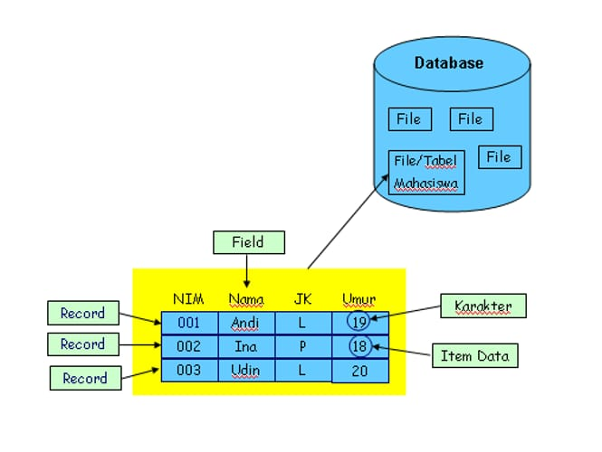

# DEFINISI BASIS DATA
Basis data memiliki makna/arti yang berbeda yang dimana :
Basis Istilah "Basis" mengacu pada gudang atau tempat penyimpanan.
Data Sedangkan "Data " merujuk pada fakta-fakta yang di kumpulkan
>[!faq]- Apa sih itu Basis Data?

Basis Data adalah kumpulan data-data yang mempunyai hubungan secara logika yang di sertai dengan deskripsi data-data.

## KESIMPULAN BASIS DATA
Kesimpulan dari ==basis data== adalah informasi yang digunakan untuk mengelola data dan menyediakan akses yang yang efisien.

## PERANAN BASIS DATA
Di sebuah kampus, terdapat beberapa data yang di tampung seperti data Rektor, Dekan, Ketua prodi, Ketua jurusan, Direktur, Dosen, Staff, Pengawai, Mahasiswa. Yang dimana orang yang menginput data-data tersebut merupakan staff dibidang IT/Admin.

## STRUKTUR TABEL DALAM BASIS DATA
Hirarki database adalah struktur organisasi data dalam database yang mengatur hubungan antara entitas atau tabel data. Dalam hirarki database, data diorganisir dalam bentuk pohon dengan satu entitas induk atau tabel utama yang memiliki beberapa entitas anak atau tabel terkait.

Data Siswa XI RPL 1 :
>[!faq] | No | Nama    | JK  |
| -------- | ------- | ------ |
| 1       | Taufik  | LAKI LAKI |
| 2       | Adiguna | LAKI LAKI|
| 3       | Jordan  | LAKI LAKI |

**KOLOM/FIELD**
Record dalam basis data merujuk kepada kumpulan informasi yang berkaitan dan terkait dengan entitas tun ggal atau objek dalam suatu sistem basis data.
Field dalam basis data merujuk kepada komponen terkecil dari sebuah record atau tupel dalam tabel.
Data Value dalam basis data merujuk kepada nilai konkret yang disimpan dalam field atau atribut dalam suatu record

**Contoh Tabel Database**
