# Pengenalan Bootstrap
## Apa Itu Bootstrap?
Bootstrap adalah salah satu dari banyak framework front-end yang ada di web development. Framework-front end menyediakan serangkaian alat dan gaya bawaan untuk mempercepat proses pengembangan web dengan menyediakan komponen-komponen UI siap pakai dan sistem grid yang responsif. Bootstrap khususnya, terkenal dengan kemampuannya dalam menciptakan tata letak yang responsif dan komponen-komponen UI yang seragam.
# Instalasi Bootstrap
## Cara instalasi Bootstrap secara online / CDN.
sekarang kita akan menjelaskan bagaimana cara menginstall bootstrap secara online. Berikut langkah-langkahnya:

1. Masuklah ke website resmi Bootstrap dengan mengunjungi situs web resmi di https://getbootstrap.com/.
2. Di laman utama web Bootstrap, cari dan klik menu "Introduction" yang terletak pada sisi sebelah kiri website.
3. Pada bagian "Starter Template" di halaman Introduction, kita akan melihat kode yang dapat kita gunakan untuk menghubungkan website kita yang mau diterapkan Bootstrap.
4. Klik tombol "Copy" untuk menyalin seluruh kode tersebut.
5. Buatlah file baru dengan nama index.html atau nama yang kita inginkan menggunakan teks editor atau editor HTML yang kita biasa pakai.
6. Tempelkan(paste) kode yang telah kita salin dari langkah sebelumnya ke dalam file html yang baru kita buat. dengan menempelkan kode tersebut maka bootstrap kita sudah terhubung namun harus secara online.
7. kita dapat mulai memberikan gaya pada tag-tag atau elemen dalam file HTML tersebut dengan menggunakan kelas-kelas Bootstrap. kita dapat melihatnya pada website resmi Bootstrap untuk mempelajari lebih lanjut tentang kelas-kelas yang tersedia dan cara penggunaannya.
8. Untuk melihat hasilnya, buka file html tadi menggunakan web browser kita.
9. Halaman web yang ditampilkan akan menggunakan Bootstrap untuk gaya dan fungsionalitasnya

## Mengunduh dan menginstal Bootstrap secara lokal.
Untuk menginstal Bootstrap secara offline, kita perlu mengunduh file Bootstrap dan menyimpannya di folder proyek kita. Berikut adalah langkah-langkah untuk menginstal Bootstrap secara offline:
1. **Unduh File Bootstrap:** Kunjungi situs web resmi Bootstrap di https://getbootstrap.com/ dan cari tautan unduhan untuk versi Bootstrap yang diinginkan. Klik atau ikuti instruksi untuk mengunduh file ZIP Bootstrap.
2. **Ekstrak File Bootstrap:** Setelah mengunduh file ZIP Bootstrap, temukan file tersebut di komputer kita dan ekstrak isi file ZIP ke folder proyek kita. kita dapat menggunakan aplikasi pengarsipan file atau ekstraksi bawaan (Archiver, 7zip, dll) pada sistem operasi kita untuk mengekstrak file ZIP . Setelah diekstrak, kita akan memiliki folder Bootstrap yang berisi berkas-berkas Bootstrap yang diperlukan.
3. **Hubungkan Berkas Bootstrap pada Halaman HTML:** Buka file HTML proyek kita menggunakan teks editor atau editor HTML yang biasa kita gunakan. Di dalam tag pada halaman HTML , tambahkan tautan ke berkas CSS Bootstrap dan skrip JavaScript Bootstrap. Gunakan tag link di dalam tag head untuk tautan CSS dan tag script di dalam tag body untuk javascript. Berikut contoh tautan yang umum di bootstrap:
```html
<link href="path/to/bootstrap.min.css" rel="stylesheet">
// tautan bootstrap CSS
<script src="path/to/bootstrap.bundle.min.js"></script>
// tautan bootstrap Javascript
```
dengan menuliskan script diatas, maka kita telah menghubungkan antara file html kita dengan bootstrap yang kita unduh tadi.
4. **Gunakan Kelas Bootstrap:** Setelah tautan Bootstrap ditambahkan, Kita dapat menggunakan kelas-kelas Bootstrap dalam elemen HTML proyek Kita untuk menerapkan gaya dan fungsionalitas yang disediakan oleh bootstrap kita. Kita dapat masuk ke web resmi Bootstrap untuk mempelajari lebih lanjut tentang kelaskelas yang tersedia dan cara penggunaannya.
5. **Jalankan File HTML:** Setelah Kita selesai menghbungkan tautan dan menggunakan kelas Bootstrap, Kita dapat menjalankan halaman HTML kita di web browser Kita untuk melihat hasilnya. Buka file HTML menggunakan web browser Kita dan lihat hasilnya
# Komponen-Komponen Bootstrap
Bootstrap menyediakan berbagai komponen yang siap pakai untuk membangun tampilan website yang responsif dan menarik. Berikut adalah beberapa komponen utama yang disediakan oleh Bootstrap:
## Grid System
Grid system Bootstrap adalah sistem layout yang responsif dan fleksibel. kita dapat membagi halaman menjadi baris(rows) dan kolom(columns) yang membentuk grid. Grid terdiri dari 12 kolom, yang dapat kita susun sesuai kebutuhan. Dengan menggunakan kelas CSS yang disediakan oleh Bootstrap, kita dapat dengan mudah menentukan berapa banyak kolom yang akan digunakan oleh setiap elemen di halaman web kita. Grid system ini sangat berguna dalam menciptakan tata letak yang responsif dan dapat menyesuaikan diri dengan berbagai ukuran layar
## Typography
Komponen typography Bootstrap menyediakan gaya dan kelas CSS yang konsisten untuk tipografi di halaman web kita. kita dapat dengan mudah mengatur ukuran teks, gaya huruf, dan pengaturan lainnya menggunakan kelas-kelas yang telah ditentukan. Ini memastikan bahwa teks di halaman web kita memiliki tampilan yang konsisten dan mudah dibaca di berbagai perangkat.
## Button
Komponen tombol Bootstrap memungkinkan kita dengan mudah membuat tombol dengan tampilan yang menarik dan responsif. kita dapat menggunakan kelas-kelas Bootstrap untuk mengatur berbagai gaya tombol, termasuk ukuran (large, small), warna (default, primary, secondary, dll.), dan variasi lainnya. Tombol-tombol ini dapat digunakan untuk tindakan seperti mengirim formulir, memuat ulang halaman, atau memicu tindakan lainnya di aplikasi web kita.
## Forms
Bootstrap menyediakan komponen form yang mudah digunakan untuk membuat form input. Ini termasuk input teks, area teks, kotak centang (checkbox), tombol radio, dropdown, dan lain-lain. Komponen form Bootstrap telah dirancang dengan tampilan yang responsif dan mudah dikustomisasi. kita dapat dengan mudah menambahkan validasi form dan mengatur tampilan form kita dengan menggunakan kelas-kelas Bootstrap yang telah ditentukan.
## Navbar
Komponen navbar Bootstrap memungkinkan kita membuat navigasi yang responsif dan mudah dikustomisasi di halaman web. kita dapat menambahkan logo, menu, tombol, dan komponen lainnya ke navbar dengan mudah. Navbar Bootstrap juga menyediakan fitur seperti menu dropdown, navigasi yang terlipat untuk perangkat mobile, dan tata letak yang fleksibel.
## Cards
Cards adalah komponen yang digunakan untuk menampilkan informasi dalam format yang terstruktur. Komponen kartu Bootstrap memungkinkan kita untuk membuat kolom dengan gambar, teks, tombol, dan komponen lainnya. cards ini dapat digunakan untuk menampilkan artikel, produk, profil pengguna, atau konten lainnya dengan tampilan yang menarik.
## Modal
Komponen modal Bootstrap digunakan untuk menampilkan jendela pop-up yang tumpang tindih dengan konten utama halaman. Modal ini berfungsi untuk menyoroti konten tambahan, pesan, atau form yang membutuhkan fokus pengguna. kita dapat menyesuaikan tampilan modal, mengatur ukuran, menambahkan judul, dan mengatur perilaku saat modal ditampilkan atau ditutup.
## Carousel
Carousel adalah komponen Bootstrap yang digunakan untuk membuat tampilan slide gambar atau konten lainnya. kita dapat menambahkan gambar, teks, tombol navigasi, dan indikator slide untuk membuat tampilan yang menarik dan interaktif. Carousel Bootstrap mendukung navigasi otomatis, kontrol manual, dan animasi transisi yang halus.
## Icons
Bootstrap sendiri menggunakan ikon dari Font Awesome, yang merupakan kumpulan ikon vektor yang sangat populer dan kaya akan fitur. kita dapat dengan mudah menambahkan ikon ke elemen seperti tombol, tautan, dan elemen lainnya menggunakan class-class ikon Bootstrap. Ini berfungsi untuk memperindah halaman web kita.
## Jumbotron
Jumbotron adalah komponen Bootstrap yang digunakan untuk menyoroti konten utama di halaman web. Biasanya ditempatkan di bagian atas halaman dengan judul besar danTerima kasih atas klarifikasinya.Komponen carousel Bootstrap digunakan untuk membuat tampilan slide yang interaktif. kita dapat menambahkan gambar, teks, dan tombol navigasi ke dalam carousel. Carousel Bootstrap mendukung navigasi otomatis, kontrol manual, dan animasi transisi. 

kita dapat menemukan daftar komponen lengkap dan dokumentasi resmi di situs web Bootstrap (https://getbootstrap.com/docs/).
# Contoh Penerapan Komponen Bootstrap
## Typography
1. Buka situs resmi Bootstrap di [getboostrap.com](getbootstrap.com)
	
2. Klik "Read the docs". Maka kita akan diarahkan pada halaman web yang berisi berbagai macam Typografi (class Bootstrap).
	
3. Misalnya kita akan membuat sebuah teks quotes seperti di bawah ini:
	
4. Ketikan "Typography" di kolom search lalu enter. Maka kita akan masuk ke halaman berikut:
	
5. Carilah Subbab "Alignment":
	
6. Salinlah kode yang tertera, lalu tempelkan di tag body pada halaman html yang telah kita hubungkan dengan Bootstrap kita
```html
<figure class="text-center">
<blockquote class="blockquote">
<p>A well-known quote, contained in a blockquote element.</p>
</blockquote>
<figcaption class="blockquote-footer">
Someone famous in 
<cite title="Source Title">Source Title </cite>
</figcaption>
</figure>
```
7. Hasilnya akan terlihat seperti berikut:
	
8. Kita bisa mengganti kata kata nya dengan cara mengganti teks yang ada di dalam tag p dan untuk teks kecil bagian bawah kita ganti pada bagian dalam tag figcaption
```html
<figure class="text-center">
  <blockquote class="blockquote">
    <p>Sebenarnya otak kita sama aja, yang <br>
    membedakan hanya siapa yang <br>
    mulai belajar duluan dan siapa yang <br>
    belajar terus menerus </p>
  </blockquote>
  <figcaption class="blockquote-footer">
    Dea Afrizal Doroboka<cite title="Source Title">Doroboka</cite>
  </figcaption>
</figure>
```
Hasilnya adalah sebagai berikut:

*Keterangan :*
1. ==`text-center`== pada ==`<figure>`==: Kelas ini diterapkan pada elemen ==`<figure>`== , yang mengakibatkan kontennya, termasuk elemen ==`<blockquote>`== dan ==`<figcaption>`== , akan diatur menjadi ketengah halaman maupun kontainer.
2. blockquote pada ==`<blockquote>`== : Kelas ini memberikan gaya khusus pada elemen ==`<blockquote>`== . Elemen ini digunakan untuk merinci sebuah kutipan atau teks yang dianggap signifikan. Penggunaan kelas ini dari Bootstrap mungkin memberikan tampilan tertentu, seperti memodifikasi gaya margin atau padding, untuk memberikan estetika yang lebih baik.
3. blockquote-footer pada ==`<figcaption>`== : Kelas ini memberikan gaya khusus pada elemen ==`<figcaption>`== yang berada di dalam ==`<figure>`== . Elemen ini kemungkinan berisi informasi tambahan atau keterangan terkait elemen-elemen lain dalam ==`<figure>`==.
	- **`Dea Afrizal Doroboka`**: Ini adalah teks yang berada di dalam elemen ==`<figcaption>`==, memberikan informasi tambahan atau keterangan terkait dengan kutipan atau elemen-elemen lain dalam ==`<figure>`==.
	-  **`<cite title="Source Title">Doroboka / cite>`**: Ini adalah elemen ==`<cite>`== yang memberikan judul sumber ("Source Title"). Penggunaan kelas `blockquote-footer` dari Bootstrap mungkin menyusun elemen ini dengan tata letak dan gaya tertentu, seperti menetapkannya sebagai teks kaki atau memberikan gaya yang konsisten dengan elemen lain dalam kelompok ==`<figure>`==.
*Keterangan*: 
Untuk bagian "Dea Afrizal" adalah nama seseorang yang mengatakan quotes tersebut dan "Doroboka" adalah sumber dimana orang tersebut mengatakn kata-kata itu. Kata- kata yang dituliskan yaitu berada dalam tag ==`p`== .
## Navbar
1. Bukalah Kembali [getbootstrap.com](getbootstrap.com) lalu ketik "navbar" dikolom "search" dan klik enter
	
2. Carilah jenis navbar yang diinginkan.
	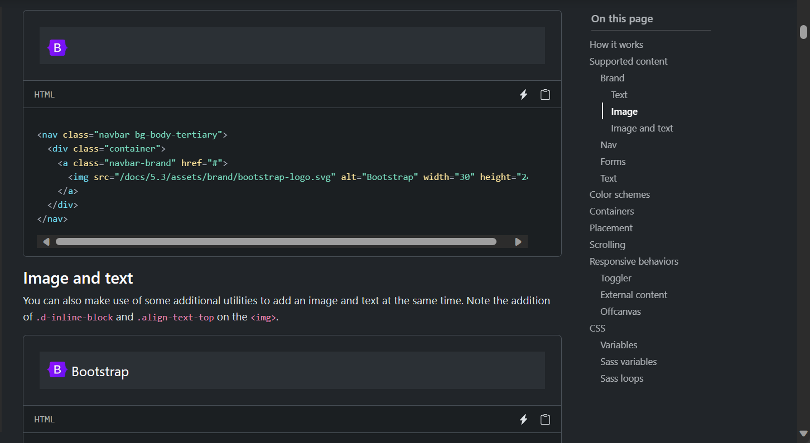
3. Jika misalnya kita telah menemukan jenis navbar yang kita inginkan, maka, salinlah kode program yang ada dibawah gambar contoh navbar tersebut
	
```html

<nav class="navbar navbar-expand-lg bg-body-tertiary">
    <div class="container-fluid">
        <a class="navbar-brand" href="#">Navbar</a>
        <button class="navbar-toggler" type="button" data-bs-toggle="collapse" data-bs-target="#navbarNavDropdown" aria-controls="navbarNavDropdown" aria-expanded="false" aria-label="Toggle navigation">
            <span class="navbar-toggler-icon"></span>
        </button>
        <div class="collapse navbar-collapse" id="navbarNavDropdown">
            <ul class="navbar-nav">
                <li class="nav-item">
                    <a class="nav-link active" aria-current="page" href="#">Home</a>
                </li>
                <li class="nav-item">
                    <a class="nav-link" href="#">Features</a>
                </li>
                <li class="nav-item">
                    <a class="nav-link" href="#">Pricing</a>
                </li>
                <li class="nav-item dropdown">
                    <a class="nav-link dropdown-toggle" href="#" role="button" data-bs-toggle="dropdown" aria-expanded="false">
                        Dropdown link
                    </a>
                    <ul class="dropdown-menu">
                        <li><a class="dropdown-item" href="#">Action</a></li>
                        <li><a class="dropdown-item" href="#">Another action</a></li>
                        <li><a class="dropdown-item" href="#">Something else here</a></li>
                    </ul>
                </li>
            </ul>
        </div>
    </div>
</nav>

```
4. Tempelkanlah kode program yang terlah kita salin ke dalam tag body di file html kita. Jangan lupa untuk menautkan file html kita dengan bootstrap seperti pada langkah-langkah sebelumnya
	
5. Jalankanlah file html yang sudah ditempeli kode program bootstrap tadi melalui web browser. Maka lihatlah hasilnya
	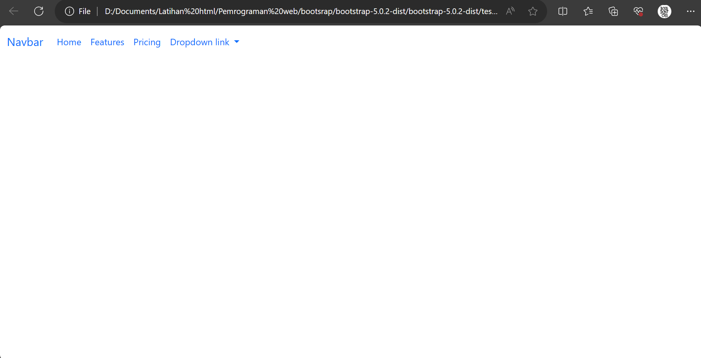
6. Misalnya kita ingin memberikan warna hijau pada background navbar kita. Pertama ketiklah "background" di kolom search
	
7. Carilah Warna yang kita inginkan. Misalnya dalam praktek ini adalah warna hijau
	
	
	Terdapat banyak jenis warna dalam bootstrap.
8. Karena kita ingin mengkostumisasi warna background kita menjadi hijau maka kita akan memakai bg-succes . ketikkan bg-succes pada class tag pembuka seperti di bawah ini
	
	**Keterangan**:
	Karena kita akan memberikan warna background pada navbar maka untuk menerapkannya, langsung terapkan class tag yang membungkus semua eleme-elemen yang ada pada tag tersebut.
9. Jika sudah maka hasilnya akan seperti ini:
	
10. Sekarang kita akan mengubah warna font yang ada pada navbar. Langkah pertama klik "Colors" pada bagian Utilities
	
11. Maka kita akan diarahkan pada halaman yang memuat berbagai macam warna font
	
12. Carilah warna font yang kita inginkan. Misalnya pada kostumisasi navbar ini. Kita akan menggunakan warna font putih
	
13. Karena kita ingin menggunakan warna font putih maka perintah yang digunakan adalah "text-white"
14. Masuklah kembali ke dalam file html kita
15. pada bagian class sebuah tag yang membungkus text yang akan kita ganti warna, ketiklah text-white . Contohny ada pada gambar berikut:
	
16. Hasilnya akan terlihat seperti di gambar ini:
	
17. Terapkanlah Text-White diseluruh class pada tag yang membungkus text-text itu seperti halnya pada text navbar tadi
	
18. Jika file html dijalankan, hasilnya adalah sebagai berikut
	
19. Sekarang kita akan mengganti text yang ada di navbar tersebut. Caranya sangat mudah, yaitu cukup kita ganti text-text tadi dengan kata kata yang kita inginkan. Misalnya adalah sebagai berikut:
	
20. Maka hasilnya adalah sebagai berikut:
	
21. Sekarang kita akan menambahkan kolom search pada navbar kita. pada bagian navbar di [getbootstrap.com](getbootstrap.com) Scroll ke bawah hingga menemukan seperti pada gambar
	
22. Salin kodenya lalu tempelkan di bagian bawah kode navbar kita tadi. Jadi jangan disatukan ke dalam kode navbar tadi.
```html
<nav class="navbar bg-body-tertiary">
    <div class="container-fluid">
        <form class="d-flex" role="search">
            <input class="form-control me-2" type="search" placeholder="Search" aria-label="Search">
            <button class="btn btn-outline-success" type="submit">Search</button>
        </form>
    </div>
</nav>
```


*Keterangan*:
1. ==`navbar`== : Kelas ini menunjukkan bahwa elemen ==`<nav>`== adalah bagian dari komponen navbar. Navbar adalah bagian dari Bootstrap yang menyediakan navigasi di bagian atas halaman web. Dengan memberikan kelas navbar , kita memberitahu Bootstrap untuk menerapkan gaya dan tata letak khusus yang terkait dengan navigasi.
2. ==`bg-body-tertiary`== : Kelas ini memberikan warna latar belakang pada navbar. Dalam hal ini, warna latar belakangnya diberi warna sesuai dengan warna "hijau" Warna latar belakang ini dapat disesuaikan sesuai kebutuhan desain.
3. ==`container-fluid`== : Kelas ini diterapkan pada elemen ==`<div>`== yang membungkus elemen-elemen dalam navbar. Kelas ini memberikan padding yang sesuai dan membuat elemen-elemen di dalamnya menjaga lebar penuh dari layar (menggunakan grid system Bootstrap). Dengan kata lain, kontennya akan merespons secara baik pada berbagai lebar perangkat.
4. ==`d-flex`== : Kelas ini mengubah elemen ==`<form>`== menjadi kontainer flex. Flexbox adalah teknik tata letak yang kuat di CSS yang memudahkan pengaturan dan penataan elemen dalam satu atau dua dimensi. Dengan memberikan kelas d-flex , elemen form dan anak-anaknya dapat disusun secara fleksibel.
5. ==`form-control`== : Kelas ini diterapkan pada elemen ==`<input>`== untuk memberikan gaya yang konsisten pada elemen formulir. Di sini, elemen input diberi gaya Bootstrap standar untuk mengubahnya menjadi kontrol formulir yang responsif dan berada dalam baris yang sesuai.
6. ==`me-2`== : Ini adalah kelas Bootstrap yang memberikan margin kanan sebesar 2 pada elemen yang memilikinya. Dalam codingan ini, kelas ini diterapkan pada elemen input untuk memberikan jarak margin kanan.
7. ==`btn`== dan ==`btn-outline-success`== : Kelas ini memberikan gaya pada elemen ==`<button>`== . Kelas btn mengindikasikan bahwa ini adalah elemen tombol Bootstrap, sedangkan btn-outline-success memberikan gaya tombol dengan warna tepi hijau ("success" dalam Bootstrap).
8. ==`type="submit"`== pada tombol: Ini menentukan bahwa tombol tersebut bertindak sebagai tombol submit dalam formulir. Ketika ditekan, formulir akan dikirim.
9. Maka hasilnya adalah seperti berikut:
	
10. Untuk membuat agar navbar tersebut terlihat menyatu, berikan background-color yang sama pada navbar diatasnya, yaitu menggunakan kode bg-succes . Letakkan di class tag yang membungkus seluruh elemen search tadi.
	
11. Maka hasil yang muncul akan seperti ini
	
## Buttons
Pada praktek sebelumnya kita sudah mengatur navbar dan juga menambahkan kolom search. Namun ada masalah dengan tombolnya. Karena tombolnya memiliki warna yang sama dengan warna background yang digunakan yaitu hijau, Maka tombol tersebut tidak terlihat akibat warnanya menyatu. Pada bagian kali kita akan membahas cara mengatur sebuah tombol di bootstrap. Berikut caranya:

1. Permasalahan tadi ialah background color tombolnya yang menyatu dengan warna backgriund navbarnya. Untuk mengatur warna tombol, pertama di situs getbootstrap.com, carilah bagian "buttons" di Components
	
2. Jika sudah menemukan klik bagian tersebut, maka kita akan diarahkan pada bagian buttons seperti pada gambar
	
3. Scroll lah ke bawah hingga menemukan bagian "Outline Buttons"
	
4. Saat ini kita akan menggunakan jenis warna putih agar tidak lagi menyatu dengan warna background navabrnya. Pada outline buttons yang berwarna putih, tertulis "Light". Oleh karena itu salinlah kode program yang ada tulisan "Light".
```html
<button type="button" class="btn btn-outline-light">Light</button>
```
5. Blok lah terlebih dahulu kode program yang mengatur tombol pada bagian search tadi
	
6. Tempelkanlah kode program outline light, untuk menggantikan kode program button yang lama
	
7. Maka hasilnya akan bagus seperti pada gambar dibawah ini:
	
8. Ubahlah Text "Light" menjadi "Search"
	
9. Maka hasilnya akan seperti ini:
	
## Cards dan Form
Sekarang kita akan membuat sebuah form, dimana form tersebut kita asumsikan sebagai login page dari web kita tadi. Dalam pembuatan form login ini, kita akan menggunakan cards sebagai layout/tata letak yang akan mengatur form login tadi. Berikut langkah-langkahnya:

1. Yang pertama kita tentunya harus menentukan layout cards nya terlebih dahulu. Hal ini bertujuan agar jika tata letak card sudah ada, maka kita tinggal mengatur form nya di dalam card tadi. Masuk ke situs bootstrap tadi lalu pilih cards
	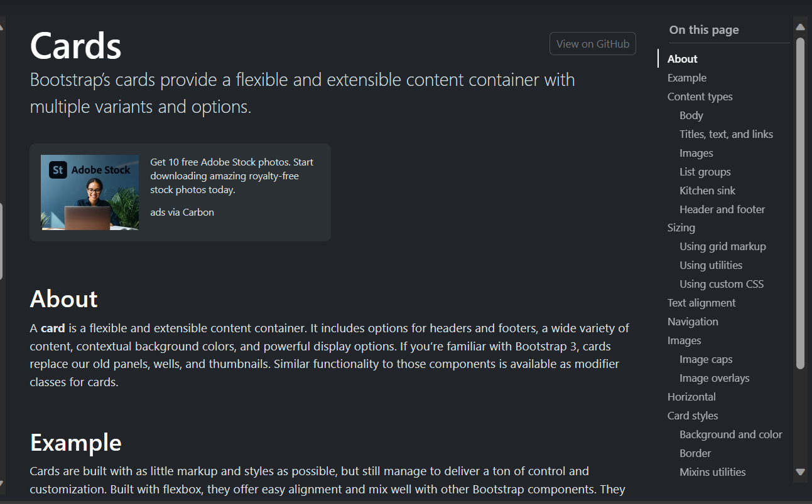
2. Scrol ke bawah hingga menemukan layout yang kita inginkan, misalnya seperti pada gambar:
	
3. Pada bagian bawah contoh, terdapat kode program. Salinlah kode program tersebut
```html
<div class="card">
    <div class="card-header">
        Featured
    </div>
    <div class="card-body">
        <h5 class="card-title">Special title treatment</h5>
        <p class="card-text">With supporting text below as a natural lead-in to additional content.</p>
        <a href="#" class="btn btn-primary">Go somewhere</a>
    </div>
</div>
```
4. Tempelkanlah kode program itu pada halaman html terkait. Tentu saja dengan bootstrap yang sudah ditautkan, baik offline, maupun online.
5. Maka hasil awalnya adalah sebagai berikut:
	
6. karena jarak atas antara card dengan batas website terlalu dekat maka pada class card tambahkan mt-2 .
```html
<div class="card mt-2">
    <div class="card-header">
        Featured
    </div>
    <div class="card-body">
        <h5 class="card-title">Special title treatment</h5>
        <p class="card-text">With supporting text below as a natural lead-in to additional content.</p>
        <a href="#" class="btn btn-primary">Go somewhere</a>
    </div>
</div>
```
7. Maka hasilnya adalah seperti ini:
	
8. Sekarang kita ingin membuatnya terlihat ke tengah. Maka buatlah sebuah div dengan class yaitu "container", lalu salin masuklah kode program card tadi. Dengan kata lain, bungkuslah kode program card dengan sebuah div dengan class="container".
```html
<div class="container">
    <div class="card mt-2">
        <div class="card-header">
            Featured
        </div>
        <div class="card-body">
            <h5 class="card-title">Special title treatment</h5>
            <p class="card-text">With supporting text below as a natural lead-in to additional content.</p>
            <a href="#" class="btn btn-primary">Go somewhere</a>
        </div>
    </div>
</div>
```
9. Berikut hasil dari di bungkusnya cards tadi.
	
10. Sekarang kita akan membuat form nya. Pertama-tama, kita perlu membuat judul form. Caranya adalah ganti tulisan "Featured" di html kita dengan kata yang kita inginkan. misalnya pada program ini kita akan mengganti tulisan menjadi "Form Login".
	
```html
<div class="container">
    <div class="card mt-2">
        <div class="card-header">
            <h5>Form Login</h5>
        </div>
        <div class="card-body">
            <h5 class="card-title">Special title treatment</h5>
            <p class="card-text">With supporting text below as a natural lead-in to additional content.</p>
            <a href="#" class="btn btn-primary">Go somewhere</a>
        </div>
    </div>
</div>
```
*Keterangan*:
	1. ==`container`== pada ==`<div class="container">`== : Kelas ini memberikan tata letak yang terkandung pada lebar tertentu (dalam pixel) dan ditengahkan di tengah halaman atau elemen yang memuatnya. Ini membantu dalam mengatur konten agar sesuai dengan standar desain Bootstrap.
	2. ==`card`== pada ==`<div class="card mt-2">`== : Kelas ini memberikan gaya dan tata letak khusus untuk elemen ==`<div>`== yang merupakan kartu (card). Kartu adalah elemen Bootstrap yang sering digunakan untuk menampilkan konten atau informasi dalam satu unit terpisah dengan gaya yang konsisten.
		- `mt-2` : Kelas ini memberikan margin atas (margin-top) sebesar 2 unit. Ini membantu memberikan ruang di bagian atas kartu dan memisahkannya dari elemen-elemen sekitarnya.
	3. ==`card-header`== pada ==`<div class="card-header">`== : Kelas ini memberikan gaya khusus untuk elemen ==`<div>`== yang berfungsi sebagai header kartu. Header kartu biasanya berisi judul atau informasi lain yang menandai atau menjelaskan konten kartu.
		- ==`<h5>Form Login / h5>`== : Ini adalah elemen judul level 5 (h5) di dalam header kartu yang memberikan judul "Form Login" pada kartu.
	4. ==`card-body`== pada ==`<div class="card-body">`== : Kelas ini memberikan gaya khusus untuk elemen ==`<div>`== yang berisi tubuh atau konten utama kartu. Ini membantu memisahkan dan memvisualisasikan konten utama kartu.
		- ==`<h5 class="card-title">Special title treatment / h5>`== : Ini adalah elemen judul level 5 (h5) di dalam tubuh kartu yang memberikan judul khusus.
		- ==`<p class="card-text">With supporting text below as a natural lead-in to additional content. / p>`== : Ini adalah elemen paragraf di dalam tubuh kartu yang memberikan teks pendukung atau keterangan untuk konten utama kartu.
		- ==`<a href="#" class="btn btn-primary">Go somewhere / a>`== : Ini adalah elemen anchor (tautan) yang merupakan tombol dengan kelas Bootstrap "btn" dan "btn-primary", memberikan tampilan dan warna tertentu sesuai dengan desain Bootstrap.
	**Perbedaan Container dengan Container-fluid**: 
	**container**: 
	- ==`container`== memberikan tata letak yang terpusat dan memiliki lebar yang tetap (fixed-width).
	- Lebar ==`container`== diatur dalam satuan piksel dan tetap konstan terlepas dari ukuran layar pengguna.
	- Digunakan untuk membuat tata letak yang terkonsentrasi di tengah halaman dan memberikan batasan pada lebar kontennya.
	**container-fluid**:
		- ==`container-fluid`== memberikan tata letak yang penuh lebar, mengisi seluruh lebar layar.
		- Lebar ==`container-fluid`== disesuaikan dengan lebar layar pengguna, sehingga konten dapat memanfaatkan seluruh lebar tampilan tanpa batasan piksel tertentu.
		- Digunakan ketika Anda ingin membuat tata letak yang menyesuaikan diri dengan lebar layar dan memberikan tampilan responsif.
11. Hasilnya adalah sebagai berikut
	
12. Sekarang pada bagian dalam div card-body hapus semua elemen yang ada didalamnya kecuali button:
```html
<div class="container">
    <div class="card mt-2">
        <div class="card-header">
            <h5>Form Login</h5>
        </div>
        <div class="card-body">
            <a href="#" class="btn btn-primary">Go somewhere</a>
        </div>
    </div>
</div>
```
13. Hasilnya akan seperti ini
	
14. Langkah selanjutnya adalah menambahkan elemen-elemen form ke dalam card-body untuk membuat formulir login. Anda dapat menggunakan elemen-elemen HTML seperti form , input , dan button untuk ini. bukalah kembali getbootstrap.com dan pilihlah form yang kita inginkan:
	
15. Salinlah kode program dibawah contoh forms tadi:
```html
<form>
    <div class="mb-3">
        <label for="exampleInputEmail1" class="form-label">Email address</label>
        <input type="email" class="form-control" id="exampleInputEmail1" aria-describedby="emailHelp">
        <div id="emailHelp" class="form-text">We'll never share your email with anyone else.</div>
    </div>
    <div class="mb-3">
        <label for="exampleInputPassword1" class="form-label">Password</label>
        <input type="password" class="form-control" id="exampleInputPassword1">
    </div>
    <div class="mb-3 form-check">
        <input type="checkbox" class="form-check-input" id="exampleCheck1">
        <label class="form-check-label" for="exampleCheck1">Check me out</label>
    </div>
    <button type="submit" class="btn btn-primary">Submit</button>
</form>
```
16. Tempelkanlah didalam cards-body tadi
	
17. Maka hasilnya adalah sepert ini:
	
Dengan demikian kita sudah berhasil membuat layoutcards dimana form login sebagai kontennya
# Grid For Responsive Web/Layouting
Bootstrap memiliki sistem tata letak yang kuat yang bernama grid. Grid berguna untuk membuat tata letak yang responsif di halaman web kita. Sistem grid Bootstrap berdasarkan konsep kolom yang dapat diatur dalam baris. Berikut adalah beberapa hal penting yang perlu kita ketahui tentang grid dan layouting di Bootstrap:

1. **KONTAINER (Container)**
	Grid Bootstrap harus ditempatkan dalam elemen kontainer. Terdapat dua jenis kontainer yang tersedia, yaitu .container dan .container-fluid. .container memiliki lebar terbatas dan akan disesuaikan dengan lebar layar. .container ini digunakan ketika kita ingin membuat tata letak yang terpusat dan terbatas pada lebar tertentu. .container-fluid memiliki lebar penuh dan akan mengisi seluruh lebar layar. Kontainer ini digunakan ketika kita ingin membuat tata letak yang menyesuaikan dengan lebar layar penuh.
2. **BARIS (Row)**
	Baris digunakan untuk mengelompokkan kolom-kolom dalam tata letak. kita dapat menambahkan class .row pada elemen yang berfungsi sebagai wadah kolom. Baris ini akan memastikan bahwa kolom-kolom di dalamnya akan diatur secara horizontal.
3. **KOLOM (Column):**
	Kolom adalah bagian dasar dari sistem grid Bootstrap. Kolom- kolom ditempatkan di dalam baris dan digunakan untuk membagi horizontal ruang dalam grid. Setiap baris dipecah menjadi 12 kolom, yang dapat kita bagi sesuai kebutuhan.

	**Catatan**: kita dapat menggunakan kelas seperti .col- , .col-sm- , .col-md- , .col-lg- , atau .col-xl- untuk menentukan bagaimana kolom akan berperilaku di berbagai ukuran perangkat. Misalnya, .col-sm-6 akan membuat kolom tersebut memiliki lebar setengah dari baris pada ukuran layar kecil. kita dapat menggabungkan kelas kolom untuk ukuran layar yang berbeda untuk menciptakan tata letak yang responsif. Misalnya, .col-md-6 .col-lg-4 akan membuat kolom tersebut memiliki lebar setengah dari baris pada ukuran layar medium, dan memiliki lebar sepertiga dari baris pada ukuran layar besar.
4. **OFFSET**
	Kita dapat menggunakan kelas offset untuk memindahkan kolom ke samping. Misalnya, .offset-md-2 akan memindahkan kolom 2 satuan ke kanan pada layar dengan ukuran medium. Offset digunakan ketika Kita ingin membuat ruang kosong di antara kolom-kolom.
5. **Perilaku pada Ukuran Layar yang Berbeda**
	Kita dapat menggunakan kelas-kelas grid Bootstrap yang berbeda untuk mengontrol tampilan kolom pada ukuran layar yang berbeda. Misalnya, Kita dapat menggunakan .colsm- untuk ukuran layar kecil, .col-md- untuk ukuran layar medium, dan sebagainya. Dengan cara ini, Kita dapat membuat tata letak yang responsif untuk berbagai perangkat.
6. **NESTING**
	Nesting memungkinkan Kita menempatkan baris dan kolom di dalam kolom lainnya. Dengan cara ini, Kita dapat membuat tata letak yang lebih kompleks dengan komponen-komponen yang terkait. Misalnya, Kita dapat menempatkan sebuah baris di dalam kolom yang ada di dalam baris lainnya
7. **ORDER**
	Kita dapat menggunakan kelas .order- untuk mengubah urutan kolom pada ukuran layar tertentu. Misalnya, .order-first akan memindahkan kolom ke posisi pertama, dan .orderlast akan memindahkan kolom ke posisi terakhir. Dengan menggunakan kelas ini, Kita dapat mengatur ulang urutan kolom untuk mencapai tata letak yang diinginkan pada berbagai ukuran layar.

Itu adalah beberapa konsep penting dalam sistem grid Bootstrap. Dengan menggunakan sistem grid ini, kita dapat membuat tata letak yang responsif dan menyesuaikan tampilan elemen-elemen pada berbagai ukuran layar dengan mudah.
## Contoh Penggunaan dan Penjelasannya
Sekarang kita akan mencoba penggunaan grid yang dengan bantuan Bootstrap. Berikut langkah-langkahnya:

1. Masuklah kembali ke web getbootstrap.com.
	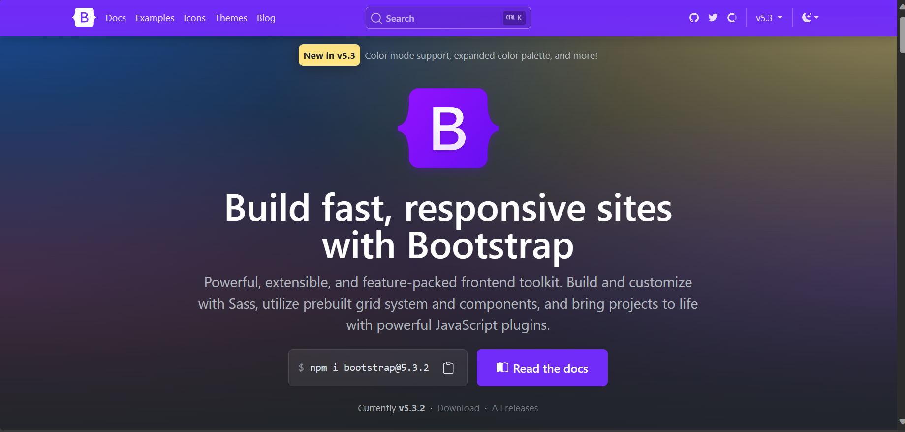
2. carilah "Grid" di Kolom search lalu klik enter. Maka kita akan diarahkan pada halaman web yang berisi tentang grid.
	
3. Carilah layout atau tata letak grid yang kita inginkan. Misalnya pada praktek kali ini, kita akan menggunakan layout "Row columns".
	
4. Salinlah kode program yang terletak di kode bawah contohnya.
```html
<div class="container text-center">
    <div class="row row-cols-2">
        <div class="col">Column</div>
        <div class="col">Column</div>
        <div class="col">Column</div>
        <div class="col">Column</div>
    </div>
</div>
```
5. Tempelah pada file html yang tentunya telah dihubungkan dengan tautan bootstrap, baik secara offline maupun online.
	
6. Maka hasilnya akan seperti berikut:
	
	*Keterangan:*
	Jadi tulisan "Column" adalah isi konten yang sudah teratur dalam grid ini. kita bisa mengganti "konten" ini dengan konten yang kita inginkan
7. Untuk mengganti kontennya hapuslah tulisan "Column" lalu gantilah dengan kontent yang kita inginkan.
```html
<div class="container text-center">
    <div class="row row-cols-2">
        <div class="col">
            <div>
                
                <h3>HTML</h3>
                <p>Lorem ipsum dolor sit amet consectetur adipisicing elit. <br>Nobis totam assumenda unde quod et vitae minus beatae, <br> quibusdam impedit laboriosam earum, <br> possimus consequatur quisquam dolore ex ipsa eaque cupiditate neque.</p>
            </div>
        </div>
        <div class="col">
            <div>
                
                <h3>CSS</h3>
                <p>Lorem ipsum dolor sit amet consectetur adipisicing elit. <br>Nobis totam assumenda unde quod et vitae minus beatae, <br> quibusdam impedit laboriosam earum, <br> possimus consequatur quisquam dolore ex ipsa eaque cupiditate neque.</p>
            </div>
        </div>
        <div class="col">
            <div>
                
                <h3>JavaScript</h3>
                <p>Lorem ipsum dolor sit amet consectetur adipisicing elit. <br>Nobis totam assumenda unde quod et vitae minus beatae, <br> quibusdam impedit laboriosam earum, <br> possimus consequatur quisquam dolore ex ipsa eaque cupiditate neque.</p>
            </div>
        </div>
        <div class="col">
            <div>
                
                <h3>JQuery</h3>
                <p>Lorem ipsum dolor sit amet consectetur adipisicing elit. <br> Nobis totam assumenda unde quod et vitae minus beatae, <br> quibusdam impedit laboriosam earum, <br> possimus consequatur quisquam dolore ex ipsa eaque cupiditate neque.</p>
            </div>
        </div>
    </div>
</div>
```
8. Hasil nya akan menjadi seperti berikut:
	
	*Keterangan:*
	Jadi Grid tadi mengatur Row dan Column dimana terdapat 2 baris berisi 4 kolom sebagai kontennya. Kontennya tadi kita ganti dengan konten yang kita inginkan
9. Apabila layar yang kita kecilkan, maka grid akan menyesuaikan ukurannya seperti pada gambar ini
	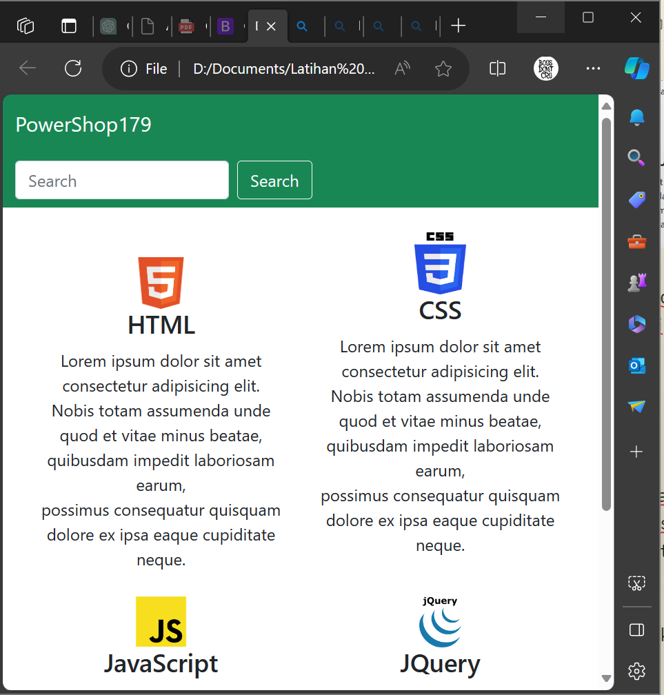
	*Keterangan:*
	Jadi grid ini sudah mengatur mengenai penyesuaian ukuran layar kita, sehingga, dapat menyesuaikan di segala ukuran monitor.
10. Apabila kita melihatnya di perangkat, maka akan terlihat seperti ini:
	*Keterangan:*
	Jadi karena grid yang disediakan oleh bootstrap telah mendukung fitur responsive, maka ketika user melihat tampilan web kita di ponsel, maka tata letak akan mengikutinya sesuai dengan ukuran ponsel, seperti yang terlihat pada gambar di atas
## Contoh Penggunaan `col-md`, `col-lg` dan `col-sm`
Kelas ==`col-md`== , ==`col-lg`== , dan ==`col-sm`== adalah kelas-kelas kolom dalam Bootstrap yang digunakan untuk meresponsifkan tata letak halaman web sesuai dengan ukuran layar perangkat. Bootstrap menggunakan sistem grid yang terdiri dari 12 kolom, dan kelas-kelas ini memungkinkan Anda mengontrol sejauh mana elemen-elemen tersebut harus meluas pada layar yang berbeda.

- ==`col-sm`== : Digunakan untuk layar kecil (small), seperti pada perangkat mobile atau tablet dalam orientasi potret. Kolom ini akan berlaku untuk layar dengan lebar 576px atau lebih.
- ==`col-md`== : Digunakan untuk layar sedang (medium), yang mencakup perangkat seperti tablet dalam orientasi landscape. Kolom ini akan berlaku untuk layar dengan lebar 768px atau lebih.
- ==`col-lg`== : Digunakan untuk layar besar (large), yang mencakup desktop. Kolom ini akan berlaku untuk layar dengan lebar 992px atau lebih.

**Contoh**:
Sekarang kita akan coba untuk membuat sebuah tampilan dengan menggunakan class diatas tadi. Berikut contohnya: 
1. Bukalah kembali web getbootsrap lalu di kolom pencarian carilah "grid".
	
2. Cari dan copylah kembali codingan grid yang kita gunakan pada praktek sebelumnya.
	
```html
<div class="container text-center">
    <div class="row row-cols-2">
        <div class="col">Column</div>
        <div class="col">Column</div>
        <div class="col">Column</div>
        <div class="col">Column</div>
    </div>
</div>
```
3. Tempelkanlah codingan tadi di visual studio kode pada file tempat kita mempraktekkan grid pada praktikum sebelumnya, agar kita bisa menggunakan satu file saja untuk praktek.
	
4. Maka akan terlihat seperti gambar di bawah ini:
	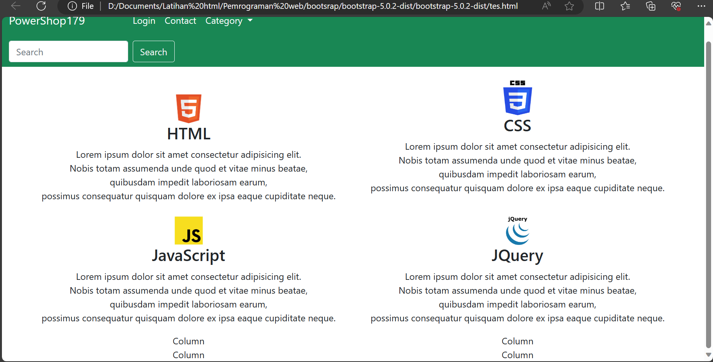
	*Keterangan*:
	Perhatikanlah di bawah kolom JavaScript dan JQuery, terdapat tulisan column sebanyak 4 dan bersusun hal ini dikarenakan pada kodingan tadi, teks yang dipakai sebagai template di bootstrap adalah "Column", nanti pada tahap selanjutnya kita akan mengganti "Column" itu dengan text atau item yang kita inginkan.
5. Sekarang, pada codingan yang kita ambil dari web bootstrap tadi pada bagian ==`<div class="col">`== yang pertama, tambahkanlah -md sehingga menjadi ==`<div class="col-md>"`== . Kemudian pada ==`<div class="col">`== yang kedua, tambahkanlah - lg sehingga menjadi ==`<div class="col-lg">`== , dan terakhir pada ==`<div class="col">`== yang ketiga, tambahkanlah -sm sehingga menjadi ==`<div class="col-sm">`== , sementara pada ==`<div class="col">`== yang terakhir kita biarkan saja seperti bawaan.
```html
<div class="container text-center">
    <div class="row row-cols-2">
        <div class="col-md">Column</div>
        <div class="col-lg">Column</div>
        <div class="col-sm">Column</div>
        <div class="col">Column</div>
    </div>
</div>
```
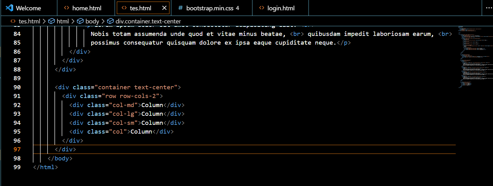
6. Maka hasilnya akan menjadi seperti ini:
	**Sebelum:**
	
	**Sesudah:**
	
*Keterangan:*
- ==`col-md`== :Dengan menambahkan -md pada codingan tadi akan membuat kolom tersebut mengambil sebagian besar lebar tersedia (12 kolom) pada layar dengan lebar medium (768px atau lebih).
- ==`col-lg`== : Sama seperti col-md , tetapi ditujukan untuk layar lebar (large, 992px atau lebih). col-sm : Sama seperti col-md , tetapi ditujukan untuk layar kecil (small, 576px atau lebih).
7. Tambahkanlah teks ataupun item dari yang kita inginkan dengan cara hapuslah teks "Column" tadi, dan ditempat teks "Column" yang sudah dihapus, tempelkan lah item atau teks yang kita inginkan
```html
<div class="container text-center">
    <div class="row row-cols-2">
        <div class="col-md">
            <div>
                
                <h3>HTML</h3>
                <p>Lorem ipsum dolor sit amet consectetur adipisicing elit. <br>
                    Nobis totam assumenda unde quod et vitae minus beatae, <br> quibusdam impedit laboriosam earum, <br>
                    possimus consequatur quisquam dolore ex ipsa eaque cupiditate neque.</p>
            </div>
        </div>
        <div class="col-lg">
            <div>
                
                <h3>CSS</h3>
                <p>Lorem ipsum dolor sit amet consectetur adipisicing elit. <br>
                    Nobis totam assumenda unde quod et vitae minus beatae, <br> quibusdam impedit laboriosam earum, <br>
                    possimus consequatur quisquam dolore ex ipsa eaque cupiditate neque.</p>
            </div>
        </div>
        <div class="col-sm">
            <div>
                
                <h3>JavaScript</h3>
                <p>Lorem ipsum dolor sit amet consectetur adipisicing elit. <br>
                    Nobis totam assumenda unde quod et vitae minus beatae, <br> quibusdam impedit laboriosam earum, <br>
                    possimus consequatur quisquam dolore ex ipsa eaque cupiditate neque.</p>
            </div>
        </div>
        <div class="col">
            <div>
                
                <h3>JQuery</h3>
                <p>Lorem ipsum dolor sit amet consectetur adipisicing elit. <br>
                    Nobis totam assumenda unde quod et vitae minus beatae, <br> quibusdam impedit laboriosam earum, <br>
                    possimus consequatur quisquam dolore ex ipsa eaque cupiditate neque.</p>
            </div>
        </div>
    </div>
</div>
```

8. Maka hasilnya akan seperti ini:
	
	*Keterangan:*
	Jadi pada praktek sebelumnya tanpa adanya tambahan pada class bootstrap tadi maka elemen akan menyesuaikan lebar pada pembungkus menjadi full, sedangkan untuk praktek yang saat ini kita tampilkan, item dan teks nya menyesuaikan ukurannya sesuai dengan tambahannnya. Untuk penjelasan ukurannya **Penjelasannya telah kami sediakan di langkah ke-6**.
# Penggunaan Tema
Dalam Bootstrap, tema dasarnya terdiri dari sejumlah variabel CSS yang mengontrol aspek-aspek seperti warna, ukuran teks, jarak, dan banyak lagi. Untuk melakukan kostumisasi tema, kita dapat mengganti nilai-nilai variabel ini sesuai dengan preferensi kita.

Berikut adalah langkah-langkah umum untuk melakukan kostumisasi tema Bootstrap:
1. **Menentukan gaya desain**: Pertama, tentukan gaya desain yang ingin kita terapkan pada situs web kita. Apakah kita ingin tampilan yang lebih minimalis, warna yang cerah, atau mungkin tampilan yang lebih kustom dengan elemen desain yang unik? Menentukan gaya desain akan membantu kita memutuskan bagaimana mengubah tema Bootstrap.
2. **Menggunakan Sass atau CSS**: Bootstrap menyediakan versi Sass (Syntactically Awesome Style Sheets) dari file sumbernya. Sass adalah bahasa pemrograman yang memungkinkan kita menulis CSS dengan sintaks yang lebih kuat dan fleksibel. Jika kita memiliki pengetahuan tentang Sass, kita dapat mengunduh versi Sass Bootstrap dan mengedit variabel-variabelnya. Jika kita tidak familiar dengan Sass , kita masih dapat mengedit file CSS Bootstrap langsung.
3. **Membuat file kustom**: Buat file kustom yang akan berisi kostumisasi tema kita. Dalam file ini, kita dapat menetapkan nilai-nilai variabel yang ingin kita ubah. Misalnya, kita dapat mengubah warna primer, warna latar belakang, ukuran huruf, dan lain sebagainya.
4. **Mengganti variabel**: Temukan variabel yang relevan dalam file sumber Bootstrap dan ubah nilainya sesuai dengan preferensi kita. Misalnya, jika kita ingin mengubah warna primer, cari variabel ==`$primary-color`== atau sejenisnya dalam file sumber dan ubah nilainya menjadi warna yang diinginkan.
5. **Mengompilasi tema kustom**: Setelah kita selesai mengedit file kustom, kita perlu mengompilasinya ke dalam file CSS yang dapat digunakan pada situs web kita. Jika kita menggunakan Sass, kita perlu mengompilasi file Sass menjadi CSS . Jika kita mengedit file CSS langsung, kita dapat menggunakan file tersebut langsung.
6. **Menerapkan tema kustom**: Setelah kita memiliki file CSS tema kustom, kita perlu menggantikan file Bootstrap default dengan file tema kustom kita pada situs web kita. Pastikan untuk menghubungkan file CSS tema kustom kita setelah file Bootstrap default sehingga kostumisasi kita akan ditimpa pada tema default. Kita dapat membuat tema kostuminasi Bootstrap yang sesuai dengan kebutuhan dan gaya desain kita. Penting untuk diingat bahwa jika kita menggunakan versi Bootstrap yang lebih baru, beberapa variabel atau struktur file mungkin telah berubah.

Kita dapat membuat tema kostuminasi Bootstrap yang sesuai dengan kebutuhan dan gaya desain kita. Penting untuk diingat bahwa jika kita menggunakan versi Bootstrap yang lebih baru, beberapa variabel atau struktur file mungkin telah berubah.
# Contoh Penggunaan Tema dalam Bootstrap
1. Jadi misalnya kita ingin memberikan tema pada website yang telah kita buat sebelumnya
	
2. Bukalah website bootswacth.com dimana website ini menyediakan tema tema yang dapat digunakan untuk web bootstrap kia.
	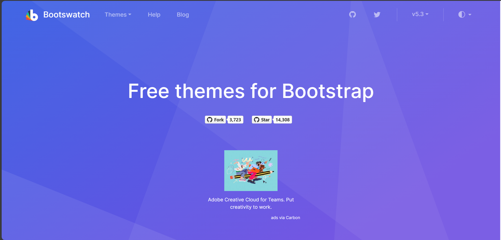
3. Scroll lah ke bawah hingga kita menemukan kumpulan tema tema yang telah disediakaan oleh website ini
	
4. Misalnya kita akan memilih tema "Darkly", oleh karena itu, klik download pada bagian bawah contoh tema tersebut.
	
5. Jika sudah mendownloadnya maka kita telah mendapatkan file css untuk tema tersebut
	
6. Pindahkanlah file css tersebut ke dalam folder yang berisi file html yang akan kita berikan tema
	
7. Sekarang, masuklah ke dalam file html yang akan kita berikan tema bootstrap, lalu panggillah secara eksternal file css tema tadi ke dalam file html tersebut
	
8. Maka hasilnya adalah sebagai berikut dengan demikian kita sudah berhasil memberikan tema gelap pada tampilan html kita menggunakan tema dark pada bootstrap
	
	dengan demikian kita sudah berhasil memberikan tema gelap pada tampilan html kita menggunakan tema dark pada bootstrap
# Modifikasi Template Bootstrap 
Kostumasisasi dalam bootstrap adalah menggunakan template bootstrap kemudian kita akan memodifikasi template tersebut sesuai dengan keinginan kita.

Template dalam Bootstrap adalah struktur dasar atau kerangka kerja yang telah dirancang sebelumnya dan dapat digunakan sebagai dasar untuk membangun halaman web. Bootstrap adalah sebuah framework front-end yang populer digunakan untuk pengembangan web responsif. Dalam konteks Bootstrap, template menyediakan struktur HTML dan gaya CSS dasar yang dapat digunakan sebagai dasar untuk membangun halaman web yang responsif dan mudah diatur.

Dengan menggunakan template Bootstrap, kita dapat menghemat waktu dan usaha dalam merancang tata letak dan gaya dasar dari suatu proyek web. Template ini biasanya sudah mencakup elemen￾elemen umum seperti navigasi, grid system, tombol, formulir, dan banyak lagi. Dengan cara ini, kita dapat fokus pada konten dan fitur unik dari situs web kita tanpa harus memulai dari awal.

Template dalam Bootstrap juga mendukung konsep responsivitas, yang berarti halaman web atau aplikasi yang dibangun dengan menggunakan template ini dapat menyesuaikan diri dengan berbagai ukuran layar, mulai dari perangkat seluler hingga desktop, tanpa perlu penyesuaian tambahan. Ini membuat pengembangan web lebih efisien dan memastikan pengalaman pengguna yang konsisten di berbagai perangkat.

Berikut cara mengkostumisasi template bootstrap:

1. Pertama adalah kita akan membuka sebuah website yang menyediakan template bootstrap. Kali ini web akan kita gunakan adalah themewagon.com
	
2. Masuklah ke dalam website tersebut
	
3. Carilah template yang ingin kita sesuaikan dengan cara mensearch ataupun menscroll hingga menemukan tema yang sesuai
	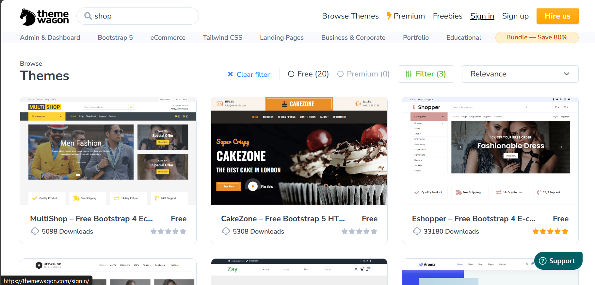
4. Jika sudah menemukan template yang kita inginkan, masuk ke template tersebut lalu klik download pada bagian kanan sebelah, contoh gambar dibawah ini.
	
5. Jika sudah mendownloadnya maka kita telah mendapatkan file template bootsrap kita dalam bentuk zip. File ini berisi asset gambar, style css, index tml, maupun javascript yang menyusun komponen template ini
	
6. Ekstraklah file tersebut hingga berbentuk seperti file biasa dengan cara klik kanan pada file zip tadi lalu pilih "Extract All".
	
7. Jika proses ekstrak sudah selesai maka kita tela mendapatkan folder template tersebut dalam bentuk folder biasa
	
8. Masuklah ke dalam folder template yang telah diekstrak tadi
	
9. Masuklah ke dalam folder index.html. didalam sana terdapat tampilan template kita
	
10. Sekarang kita akan mengkostumasisasi tampilan web template ini. Caranya adalah buka file template nya di visual studio code
	
11. Mulailah mengganti konten-konten seperti teks, gambarm dan lainnya seperti yang kita inginkan. Misalnya saya akan mengganti teks yang ada di gambar ini
	
12. Buka kembali visual studio dan masuk ke file index.html tersebut lalu carilah penyusun konten itu
	
13. Gantilah kalimat dan tujuan email dan nomor telp itu dengan yang kita inginkan
```html
<a class="navbar-sm-brand text-light text-decoration-none" href="mailto:powershop179@gmail.com">powershop179@gmail.com</a>
<i class="fa fa-phone mx-2"></i>
<a class="navbar-sm-brand text-light text-decoration-none" href="tel:082133273167">082133273167</a>
```
Maka hasilnya akan terlihat seperti dibawah ini:
	
14. Mulailah mengganti elemen-elemen lainnya sesuai keinginan kita. Misalnya kita ingin juga mengganti logo yang ada di website ini
	
```html
<a class="navbar-brand text-success logo h1 align-self-center" href="index.html">
    Powershop179
</a>
```
15. Hasil setelah diganti adalah seperti ini
	
16. Sekarang kita akan mengganti Nama web kita yang ada di slide carousel
	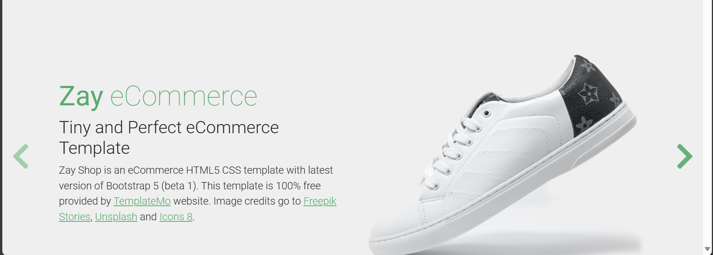
```html
<div class="col-lg-6 mb-0 d-flex align-items-center">
    <div class="text-align-left align-self-center">
        <h1 class="h1 text-success"><b>PowerShop179</b> eCommerce</h1>
        <h3 class="h2">Tiny and Perfect eCommerce Template</h3>
        <p>
            PowerShop179 is an eCommerce HTML5 CSS template with the latest version of Bootstrap 5 (beta 1).
            This template is 100% free provided by <a rel="sponsored" class="text-success" href="https://templatemo.com" target="_blank">TemplateMo</a> website. Image credits go to
            <a rel="sponsored" class="text-success" href="https://stories.freepik.com/" target="_blank">Freepik Stories</a>,
            <a rel="sponsored" class="text-success" href="https://unsplash.com/" target="_blank">Unsplash</a> and
            <a rel="sponsored" class="text-success" href="https://icons8.com/" target="_blank">Icons 8</a>.
        </p>
    </div>
</div>

```
Hasilnya akan menjadi seperti ini:
	
17. bagaimana jika kita ingin mengganti gambar? Misalnya kita akan mengganti gambar yang ada di card ini
	
18. Masuklah ke visual studio code dan ke index.html tadi lalu carilah kode penyusun untuk gambar ini, kemudian gantilah di bagian src gambar yang sudah ada dengan gambar yang kita inginkan
```html
<a href="shop-single.html">

</a>
```
Maka haslinya akan menjadi seperti ini:
	
Demikianlah kostumisasi template bootstrap ini. Kesimpulanya kita dapat mengganti text, gambar, link tujuan, atau menambahkan elemen tertentu sesuai dengan kebutuhan kita. Ini tentunya sangat menghemat waktu dan tenaga, dimana kita hanya fokus pada konten yang kita sajikan dibanding harus menyusun grid, responsif, dan lainnya dari awal
# Studi Kasus Pengaplikasian Bootstrap dalam Desain Web
**Contoh Desain Web Yang Akan di Implementasikan**:
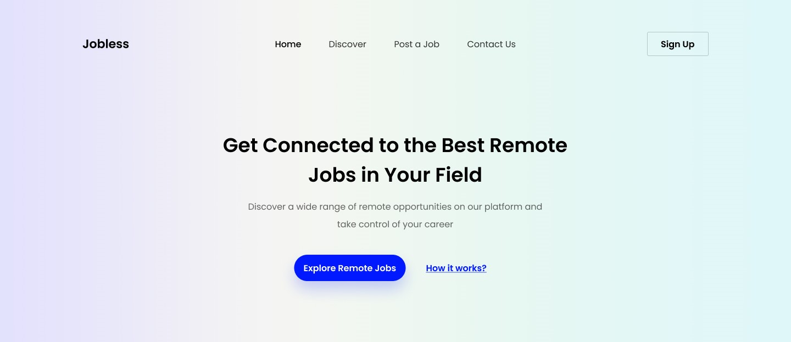
1. dalam desain web tersebut terdapat beberapa komponen, yaitu
   - Navbar, Hero Section, Button dll
2. Pertama-tama kita perlu Inisialisasikan class ==`container`== agar dapat memberikan tata letak konten yang sesuai dengan desainnya.
```html
<div class="container">
</div>
```
*Keterangan*:
- pada ==`<div class="container">`== : Kelas ini memberikan tata letak yang terkandung pada lebar tertentu (dalam pixel) dan ditengahkan di tengah halaman atau elemen yang memuatnya. Ini membantu dalam mengatur konten agar sesuai dengan standar desain Bootstrap.

3. Selanjutnya kita akan implementasikan navbarnya, bukalah kembali web getbootsrap lalu di kolom pencarian carilah "navbar".
	   
4. Cari dan copylah codingan komponen navbar yang mungkin sesuai dengan desainnya.
	   
```html
<nav class="navbar navbar-expand-lg bg-body-tertiary"> <div class="container-fluid"> <a class="navbar-brand" href="#">Navbar</a> <button class="navbar-toggler" type="button" data-bs-toggle="collapse" data-bs-target="#navbarSupportedContent" aria-controls="navbarSupportedContent" aria-expanded="false" aria-label="Toggle navigation"> <span class="navbar-toggler-icon"></span> </button> <div class="collapse navbar-collapse" id="navbarSupportedContent"> <ul class="navbar-nav me-auto mb-2 mb-lg-0"> <li class="nav-item"> <a class="nav-link active" aria-current="page" href="#">Home</a> </li> <li class="nav-item"> <a class="nav-link" href="#">Link</a> </li> <li class="nav-item dropdown"> <a class="nav-link dropdown-toggle" href="#" role="button" data-bs-toggle="dropdown" aria-expanded="false"> Dropdown </a> <ul class="dropdown-menu"> <li><a class="dropdown-item" href="#">Action</a></li> <li><a class="dropdown-item" href="#">Another action</a></li> <li> <hr class="dropdown-divider"> </li> <li><a class="dropdown-item" href="#">Something else here</a></li> </ul> </li> <li class="nav-item"> <a class="nav-link disabled" aria-disabled="true">Disabled</a> </li> </ul> <form class="d-flex" role="search"> <input class="form-control me-2" type="search" placeholder="Search" aria-label="Search"> <button class="btn btn-outline-success" type="submit">Search</button> </form> </div> </div> </nav>
```
*Keterangan*:
	1. ==`navbar`== : Kelas ini menunjukkan bahwa elemen ==`<nav>`== adalah bagian dari komponen navbar. Navbar adalah bagian dari Bootstrap yang menyediakan navigasi di bagian atas halaman web. Dengan memberikan kelas navbar , kita memberitahu Bootstrap untuk menerapkan gaya dan tata letak khusus yang terkait dengan navigasi.
	2. ==`bg-body-tertiary`== : Kelas ini memberikan warna latar belakang pada navbar. Dalam hal ini, warna latar belakangnya diberi warna sesuai dengan warna "hijau" Warna latar belakang ini dapat disesuaikan sesuai kebutuhan desain.
	3. ==`container-fluid`== : Kelas ini diterapkan pada elemen ==`<div>`== yang membungkus elemen-elemen dalam navbar. Kelas ini memberikan padding yang sesuai dan membuat elemen-elemen di dalamnya menjaga lebar penuh dari layar (menggunakan grid system Bootstrap). Dengan kata lain, kontennya akan merespons secara baik pada berbagai lebar perangkat.
	4. ==`d-flex`== : Kelas ini mengubah elemen ==`<form>`== menjadi kontainer flex. Flexbox adalah teknik tata letak yang kuat di CSS yang memudahkan pengaturan dan penataan elemen dalam satu atau dua dimensi. Dengan memberikan kelas d-flex , elemen form dan anak-anaknya dapat disusun secara fleksibel.
	5. ==`me-2`== : Ini adalah kelas Bootstrap yang memberikan margin kanan sebesar 2 pada elemen yang memilikinya. Dalam codingan ini, kelas ini diterapkan pada elemen input untuk memberikan jarak margin kanan.

5. Tempelkanlah kode program itu didalam class ==`container`== sebelumnya pada halaman html terkait. Tentu saja dengan bootstrap yang sudah ditautkan, baik offline, maupun online.
6. Maka hasilnya akan seperti ini:
	   
7. Sekarang pada bagian dalam div `navbar-collapse` hapus elemen form:
```html
<form class="d-flex" role="search"> <input class="form-control me-2" type="search" placeholder="Search" aria-label="Search" /> <button class="btn btn-outline-success" type="submit">Search</button> </form>
```
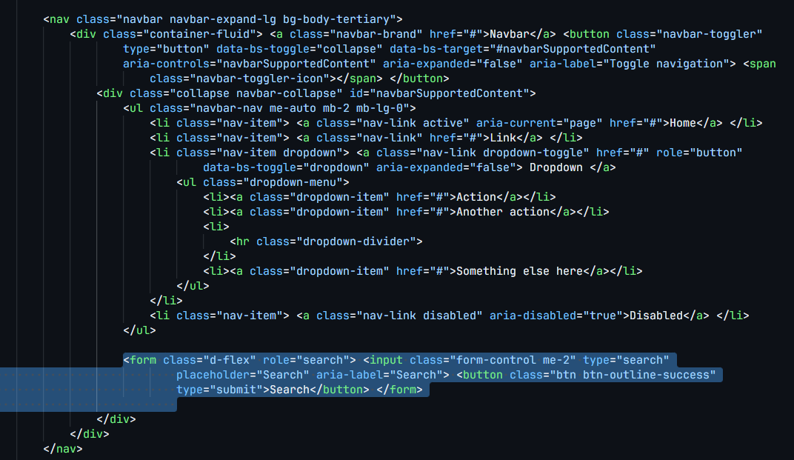
8. Hasilnya akan seperti ini:
	   
9. Langkah Selanjutnya kita perlu mengganti list list serta nama logo pada navbarnya
```html
<ul class="navbar-nav me-auto mb-2 mb-lg-0"> <li class="nav-item"> <a class="nav-link active fw-bold" aria-current="page" href="#">Home</a> </li> <li class="nav-item"> <a class="nav-link text-muted" href="#">Discover</a> </li> <li class="nav-item"> <a class="nav-link text-muted" href="#">Post a Job</a> </li> <li class="nav-item"> <a class="nav-link text-muted" href="#">Contact Us</a> </li> </ul>
```
*Keterangan*:
	1. Disini kita mengganti text list item, dari sebelumnya default dari bootstrap ke desain yang akan diimplementasikan seperti: home,discover,post a job dan contact us
	2. ==`fw-bold`== dalam Bootstrap digunakan untuk memberikan tebal pada teks. Kelas ini merupakan bagian dari utilitas ==`font-weight`== yang disediakan oleh Bootstrap, yang memungkinkan Anda untuk dengan cepat mengubah berat font teks dengan kelas `.fw-*`. Kelas ==`fw-bold`== setara dengan berat font 700
	3. ==`text-muted`== digunakan untuk memberi gaya pada teks dengan warna yang redup. Kelas ini merupakan bagian dari utilitas ==`text-color`== yang disediakan oleh Bootstrap, yang memungkinkan Anda untuk dengan mudah mengubah warna teks dengan kelas ==`.text-*`.== Kelas ==`text-muted`== setara dengan warna ==`$gray-600`==, yang merupakan warna abu-abu yang redup.


10. Kemudian tambah tombol `sign-up`  di sebelah kanan, sama seperti form namun kita berikan tag anchor
```html
<a href="/sign-up" class="btn btn-outline-dark rounded-0 fw-bold"> Sign Up </a>
```
*Keterangan*:
	1. class ==`btn`==  digunakan untuk mengatur tampilan tombol. Class ini menambahkan beberapa stil ke tampilan tombol, seperti padding, margin, dan warna latar belakang.
	2. ==`btn-outline-dark`== digunakan untuk mengatur tampilan tombol dengan latar belakang transparan dan warna tekstu yang hitam.
	3. ==`rounded-0`==  digunakan untuk mengatur bentuk tombol dengan sudut yang tidak ada (0).
	4. ==`fw-bold`==  digunakan untuk mengatur font teks dengan berat font yang tebal.
	5.  ==`text-muted`==  digunakan untuk mengatur warna teks dengan warna yang redup.


11. Selanjutnya ganti background navbarnya dari `bg-body-tertiary` menjadi transparan dengan menggunakan class `bg-trasnparent`


	
1. Sekarang kita akan menengahkan list navbarnya dengan menggunakan class `m-auto`

sebelum
!
sesudah

13. Hasilnya akan seperti ini:
	
1. Sekarang kita akan implementasikan komponen hero section, tuliskan kode berikut.
```html
<section id="hero"></section>
```
15. dapat kita lihat pada komponen hero terdapat text dan tombol posisinya ditengah, nah disini kita bisa menggunakan grid system bootstrap agar dapat mengatur posisinya.
```html
<div class="row h-100 justify-content-center align-items-center text-center"> <div class="col-12"> <h1 class="fw-bold">Get Connected to the Best Remote <br />Jobs in Your Field </h1> <p class="text-muted">Discover a wide range of remote opportunities on our platform and<br />take control of your career</p> </div> </div>
```
*Keterangan*:
	1.  ==`row`== digunakan untuk mengatur tata letak konten dalam satu baris. Class ini menambahkan beberapa stil ke tata letak konten, seperti mengatur margin dan padding untuk konten yang berada di sisi.
	2.  ==`h-100`== adalah class Bootstrap yang digunakan untuk mengatur tinggi konten dalam sebuah halaman web. Class ini menambahkan stil yang memastikan konten berada pada tinggi penuh dari bagian atas ke bawah.d
	3.  ==`justify-content-center`== adalah class Bootstrap yang digunakan untuk mengatur posisinya konten di tengah bagian horizontal.
	4. class ==`align-items-center`== adalah class Bootstrap yang digunakan untuk mengatur posisinya konten di tengah bagian vertikal.
	5. class ==`text-center`== adalah class Bootstrap yang digunakan untuk mengatur posisi teks di tengah bagian konten.
	6. class ==`col-12`== adalah class Bootstrap yang digunakan untuk mengatur lebar konten. Class ini menambahkan stil yang memastikan konten berada pada lebar penuh dari bagian atas ke bawah.

16. Hasilnya akan seperti ini:
	
17. Disini text nya hanya ke tengah secara horizontal, agar dapat ke tengah secara vertikal perlu kita atur tinggi pada hero sectionnya dengan external style
```html
<style> #hero { height: 85vh; } </style>
```
![[bf-r3.png]]
*Keterangan*:
	 ini mengatur tinggi dari elemen yang memiliki ID `hero` menjadi 85% dari tinggi viewport (viewport height).

18. Hasilnya akan seperti ini:
	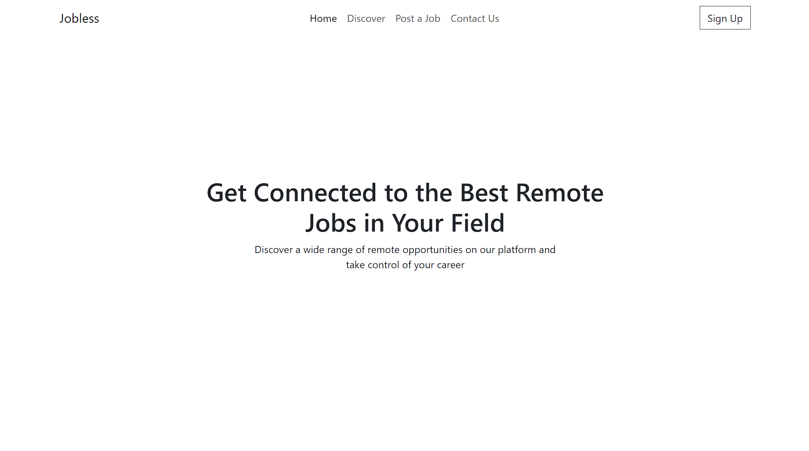
19. Sekarang kita akan implementasikan komponen button nya, dapat kita lihat pada desainnya terdapat dua button sejajar secara horizontal, maka kita perlu memakai flexbox yang disediakan oleh bootstrap.
```html
<div class="d-flex gap-4 justify-content-center align-items-center"> <a href="#" class="">Explore Remote Jobs</a> <a href="#" class="">How it works?</a> </div>
```
*Keterangan*:
	1. ==`d-flex`==  digunakan untuk mengatur tata letak konten dalam satu baris. Class ini menambahkan stil yang memastikan konten berada pada satu baris dan tidak berpindah ke baris baru.
	2. ==`gap-4`==  digunakan untuk mengatur jarak antara konten dalam satu baris. Class ini menambahkan stil yang membuat jarak antara konten berada 4 unit.
	3. ==`justify-content-center`== digunakan untuk mengatur posisinya konten di tengah bagian horizontal.
	4. ==`align-items-center`== digunakan untuk mengatur posisinya konten di tengah bagian vertikal.


20. Selanjutnya kita perlu beri space dari setiap buttonnya, dan beri warna pada button sebelah kiri
```html
<div class="d-flex gap-4 justify-content-center align-items-center"> <a href="#" class="p-2 px-3 text-decoration-none bg-primary rounded-5 text-white shadow-sm ">Explore Remote Jobs</a> <a href="#" class="p-2 px-3 text-primary rounded-5 fw-semibold">How it works?</a> </div>
```
*Keterangan*:
	1.  ==`p-2`== digunakan untuk mengatur padding pada tautan. Class ini menambahkan stil yang membuat padding pada tautan berada 0.5 unit pada sisi atas dan bawah, serta 0.75 unit pada sisi kiri dan kanan.
	2. ==`px-3`== digunakan untuk mengatur padding pada tautan. Class ini menambahkan stil yang membuat padding pada tautan berada 0.75 unit pada sisi kiri dan kanan.
	3. ==`text-decoration-none`== digunakan untuk mengatur dekorasi teks pada tautan. Class ini menghilangkan dekorasi garis bawah yang biasanya muncul pada tautan.
	4. ==`bg-primary`== digunakan untuk mengatur warna latar belakang pada tautan. Class ini menambahkan stil yang membuat latar belakang tautan berwarna hitam.
	5.  ==`rounded-5`== digunakan untuk mengatur bentuk tautan. Class ini menambahkan stil yang membuat bentuk tautan berbentuk lingkaran dengan jari-jari 5 unit.
	6. ==`text-white`== digunakan untuk mengatur warna teks pada tautan. Class ini menambahkan stil yang membuat warna teks tautan berwarna putih.
	7. ==`shadow-sm`== digunakan untuk mengatur gaya bagian atas tautan. Class ini menambahkan stil yang membuat bagian atas tautan berwarna abu-abu dengan efek shadow.
	8. ==`fw-semibold`== digunakan untuk mengatur font teks dengan berat font yang semibold.
	9. ==`text-primary`== digunakan untuk mengatur warna teks pada tautan. Class ini menambahkan stil yang membuat warna teks tautan berwarna hitam.


21. Sekarang kita akan mengganti background body nya
```html
<style> body { background-color: #F6FAFF; background-image: linear-gradient(90deg, #0500FF 0%, #F8FB76 35%, #4EFF75 64%, #00FFD1 100%); background-blend-mode: overlay; } </style>
```
![[bf-r4.png]]
22. Hasilnya akan seperti ini:
	
# Best Practices dan Tips
## Gunakan Grid Sistem:
Manfaatkan grid sistem Bootstrap untuk mengatur tata letak (layout) situs Anda dengan baik. Gunakan kelas-kelas seperti `container`, `row`, dan `col` untuk membagi konten Anda menjadi bagian-bagian yang sesuai.
## Gunakan Komponen Bootstrap:
Manfaatkan komponen-komponen yang disediakan oleh Bootstrap seperti navbar, card, form, dll. Komponen-komponen ini sudah dirancang dan diuji untuk memastikan konsistensi dan fungsionalitas yang baik.
## Uji pada Berbagai Browser:
Pastikan situs Anda berfungsi dengan baik di berbagai browser, termasuk versi lama dan baru, dengan melakukan pengujian silang browser.