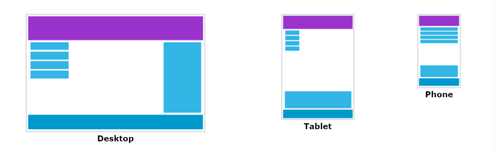
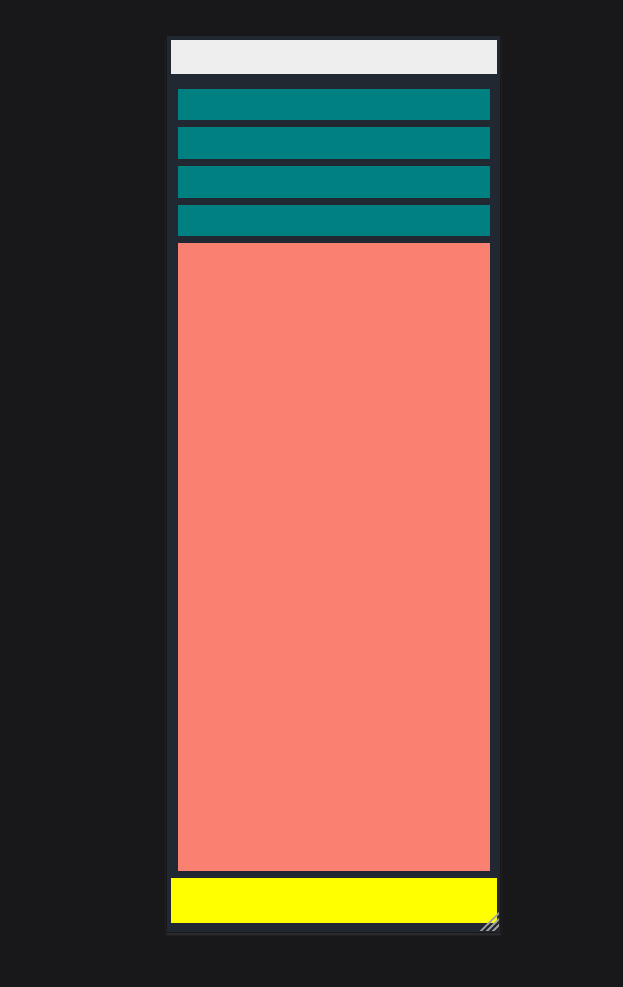

# Pengenalan Responsive Web Design
Responsive web design atau desain web responsif adalah sebuah teknik atau metode bagi web designer untuk membuat suatu layout website yang dapat menyesuaikan diri sesuai dengan ukuran layar pengguna. Baik dari ukuran huruf, user interface, gambar dan tata letak akan menyesuaikan dengan lebar layar dan resolusi device yang digunakan. 
Selain dapat memengaruhi apa yang ditampilkan pada perangkat tertentu, ini juga untuk meningkatkan kenyamanan pengguna dalam mengunjungi suatu website.

# Mengapa perlu CSS Responsive?
Pernahkah Anda mengunjungi situs web di smartphone Anda dan halaman webnya berantakan atau teksnya terlalu kecil untuk dibaca? Ini artinya situs web tersebut belum responsif. Dengan memakai css responsif maka web kita memungkinkan tampil optimal di berbagai perangkat, mulai dari desktop, laptop, tablet, hingga smartphone. Berikut alasan beberapa alasan mengapa css responsif penting: 
- **Tampilan yang Bagus di Semua Perangkat**
	CSS responsif memungkinkan tampilan situs web beradaptasi dengan baik terhadap berbagai perangkat dan ukuran layar, sehingga pengguna akan memiliki pengalaman yang konsisten dan optimal, baik mereka mengakses situs melalui desktop, tablet, atau ponsel.
- **Mudah Diakses**
	Situs yang responsif bisa diakses dengan mudah oleh lebih banyak orang, termasuk yang menggunakan ponsel untuk browsing.
- **Interaksi yang Lebih Baik**
	Situs yang responsif cenderung membuat orang merasa lebih nyaman dan lebih mudah berinteraksi. Ini bisa meningkatkan kemungkinan orang melakukan hal-hal seperti membeli produk atau menghubungi Anda.
# Teknik Dasar CSS Responsif
## Konsep Dasar
- **Grid System**: Menggunakan grid system dalam CSS untuk mempermudah penataan elemen pada halaman web.
- **Flexbox**: Memahami penggunaan flexbox untuk menata elemen secara responsif.
## Media Query
Media query adalah fitur CSS yang memungkinkan Anda menargetkan perangkat dan ukuran layar yang berbeda dengan aturan CSS yang spesifik. Hal ini sangat penting untuk membuat website yang responsif, yaitu website yang dapat menyesuaikan tata letak dan desainnya secara otomatis agar terlihat optimal di semua perangkat, mulai dari desktop, laptop, tablet, hingga smartphone.
### Cara Kerja Media Query
Media query menggunakan aturan `@media` untuk menargetkan perangkat dan ukuran layar yang berbeda. Aturan ini terdiri dari dua bagian:
- **Media type:** Menentukan jenis perangkat yang ingin Anda targetkan, seperti `screen` (untuk desktop, laptop, tablet, dan smartphone) atau `print` (untuk printer).
- **Media feature:** Menentukan karakteristik perangkat yang ingin Anda targetkan, seperti `max-width` (lebar layar maksimum), `min-width` (lebar layar minimum), `device-width` (lebar perangkat), dan `orientation` (orientasi perangkat).
### Breakpoints
Breakpoints adalah titik-titik di mana tata letak halaman web akan berubah. Breakpoints biasanya ditentukan berdasarkan lebar layar perangkat.

- **320px:** Lebar minimum untuk smartphone.
- **768px:** Lebar minimum untuk tablet.
- **1024px:** Lebar minimum untuk laptop.
- **1200px:** Lebar minimum untuk desktop.

```css
@media screen and (max-width: 768px) {
  /* Aturan CSS untuk perangkat mobile */
  body {
    font-size: 16px;
  }
  .container {
    width: 100%;
  }
}
```
## Unit Relatif
Unit relatif adalah unit yang digunakan dalam CSS untuk menentukan ukuran elemen secara proporsional. Berbeda dengan unit absolut seperti piksel dan sentimeter, unit relatif tidak memiliki nilai tetap dan dapat berubah tergantung pada konteksnya.
### Keuntungan
- **Fleksibilitas:** Unit relatif memungkinkan Anda membuat website yang responsif dan dapat menyesuaikan dengan berbagai ukuran layar dan perangkat.
- **Kemudahan Penggunaan:** Unit relatif lebih mudah digunakan untuk menentukan ukuran elemen yang proporsional dan konsisten di seluruh website.
- **Pemeliharaan:** Website yang menggunakan unit relatif lebih mudah dipelihara dan diubah karena ukuran elemen akan menyesuaikan secara otomatis.
### Jenis-jenis Unit Relatif:
- **em:** Ukuran font elemen induk
- **rem:** Ukuran font elemen root (biasanya elemen `<html>`)
- **vw:** Lebar viewport (layar perangkat pengguna)
- **vh:** Tinggi viewport (layar perangkat pengguna)
- **vmin:** Nilai terkecil antara vw dan vh
- **vmax:** Nilai terbesar antara vw dan vh
## Viewport Meta Tag
Viewport meta tag adalah sebuah elemen HTML yang memberitahu browser web bagaimana cara menampilkan website Anda pada perangkat pengguna. Tag ini sangat penting untuk website responsif, yaitu website yang dapat menyesuaikan tata letak dan desainnya secara otomatis agar terlihat optimal di semua perangkat, mulai dari desktop, laptop, tablet, hingga smartphone.

```html
<meta name="viewport" content="width=device-width, initial-scale=1.0">
```

- **width=device-width:** Menentukan lebar awal website agar sama dengan lebar perangkat pengguna.
- **initial-scale=1.0:** Mengatur skala awal website menjadi 100%.
# Best Practices
## Gunakan Mobile-First
Saat mendesain website, mulailah dengan mempertimbangkan tampilan website pada perangkat mobile. Hal ini akan membantu Anda membuat website yang lebih ringkas dan mudah digunakan di semua perangkat.

# Implementasi CSS Responsif
## Sebelum Responsif

## Sesudah Responsif

## Kode
### HTML
```html
<!DOCTYPE html>
<html>
  <head>
    <link rel="stylesheet" href="style.css" />
    <meta name="viewport" content="width=device-width, initial-scale=1" />
    <title>CSS Responsif</title>
  </head>
  <body>
    <header></header>
    <section class="container">
      <div class="list">
        <div class="item"></div>
        <div class="item"></div>
        <div class="item"></div>
        <div class="item"></div>
      </div>
      <aside></aside>
    </section>
    <footer></footer>
  </body>
</html>
```
### CSS
```css
body {
  background-color: #222831;
  color: white;
}

header {
  width: 100%;
  height: 77px;
  background-color: #EEEEEE;
}

.container {
  display: flex;
  justify-content: space-between;
}
.item {
  width: 250px;
  height: 70px;
  background-color: teal;
  margin: 1em 0;
}

aside {
  width: 300px;
  height: 70vh;
  background-color: salmon;
}

footer {
  width: 100%;
  height: 100px;
  background-color: yellow;
}

@media screen and (max-width: 768px) {
  .container {
    padding: 1rem;
    flex-direction: column;
  }
  .item {
    width: 100%;
  }
  aside {
    width: 100%;
  }
}
```
### Penjelasan Singkat
```css
body {
  background-color: #222831;
  color: white;
}
```
- `body`: Ini adalah elemen HTML yang menandakan seluruh konten halaman web.
- `background-color: #222831`: Ini mengatur warna latar belakang dari elemen "body" menjadi warna gelap dengan kode warna #222831 (hampir hitam).
- `color: white`: Ini mengatur warna teks di dalam elemen "body" menjadi putih.

```css
header {
  width: 100%;
  height: 77px;
  background-color: #EEEEEE;
}
```
- `header`:  elemen HTML yang menandakan bagian atas halaman web.
- `width: 100%`: membuat lebar elemen "header" sejajar dengan lebar area yang mengandungnya, yang mungkin adalah lebar jendela browser atau lebar elemen induk lainnya. Dengan memberikan nilai 100%, elemen "header" akan merentang ke seluruh lebar area tersebut.
- `height: 77px`: menetapkan tinggi elemen "header" menjadi 77 piksel. Jadi, meskipun lebarnya mengikuti lebar area induknya (100%), tingginya tetap diberikan secara spesifik dengan 77 piksel. Ini bertujuan untuk memastikan bahwa tinggi header tetap konsisten meskipun konten di dalamnya berubah.
- `background-color: #EEEEEE` : Ini mengatur warna latar belakang dari elemen "header" menjadi abu-abu muda dengan kode warna # EEEEEE.

```css
.container {
  display: flex;
  justify-content: space-between;
}
```
- `.container`: Ini adalah kelas CSS yang digunakan untuk menargetkan elemen HTML dengan kelas "container".
- `display: flex`: membuat elemen dengan kelas "container" menggunakan model tata letak flexbox.
- `justify-content: space-between`: Ini mengatur jarak antara elemen-elemen di dalam flexbox container agar rata di sepanjang sumbu utama (biasanya sumbu horizontal), dengan menjaga jarak yang sama antara elemen-elemen dan meletakkan mereka pada posisi ujung container.

```css
.item {
  width: 250px;
  height: 70px;
  background-color: teal;
  margin: 1em 0;
}
```
- `.item`: Ini adalah sebuah selektor CSS yang memilih elemen dengan kelas "item".
- `width: 250px`: Ini mengatur lebar elemen menjadi 250 piksel.
- `height: 70px;`: Ini mengatur tinggi elemen menjadi 70 piksel.
- `background-color: teal;`: Ini mengatur warna latar belakang elemen menjadi warna teal.
- `margin: 1em 0;`: Ini mengatur jarak antara elemen dengan elemen lainnya, dengan 1 em (ukuran relatif terhadap font-size) pada bagian atas dan bawah, dan 0 pada bagian kanan dan kiri.

```css
aside {
  width: 300px;
  height: 70vh;
  background-color: salmon;
}
```
- `aside`: Ini adalah sebuah elemen HTML yang biasanya digunakan untuk menunjukkan konten tambahan di samping konten utama.
- `width: 300px;`: Ini mengatur lebar elemen "aside" menjadi 300 piksel.
- `height: 70vh;`: Ini mengatur tinggi elemen "aside" menjadi 70% dari tinggi viewport.
- `background-color: salmon;`: Ini mengatur warna latar belakang elemen "aside" menjadi warna salmon.

```css
footer {
  width: 100%;
  height: 100px;
  background-color: yellow;
}
```
- `footer`: Ini adalah sebuah elemen HTML yang biasanya digunakan untuk menampilkan informasi tambahan di bagian bawah halaman web.
- `width: 100%;`: Ini mengatur lebar elemen "footer" agar mengisi seluruh lebar dari parent element (biasanya body atau container lainnya).
- `height: 100px;`: Ini mengatur tinggi elemen "footer" menjadi 100 piksel.
- `background-color: yellow;`: Ini mengatur warna latar belakang elemen "footer" menjadi warna kuning.

```css
@media screen and (max-width: 768px) {
  .container {
    padding: 1rem;
    flex-direction: column;
  }
  .item {
    width: 100%;
  }
  aside {
    width: 100%;
  }
}
```
- `@media screen and (max-width: 768px)`: Ini adalah aturan media query yang diterapkan ketika lebar layar kurang dari atau sama dengan 768 piksel.
- `.container`: Mengatur tampilan untuk elemen dengan kelas "container" ketika media query aktif.
    - `padding: 1rem;`: Memberikan padding sebesar 1 rem di sekitar elemen "container".
    - `flex-direction: column;`: Mengubah arah penataan elemen menjadi vertikal (kolom), sehingga elemen akan ditata dari atas ke bawah.
- `.item`: Mengatur tampilan untuk elemen dengan kelas "item" ketika media query aktif.
    - `width: 100%;`: Memberikan lebar sebesar 100% dari parent element, sehingga elemen akan mengisi lebar penuh.
- `aside`: Mengatur tampilan untuk elemen "aside" ketika media query aktif.
    - `width: 100%;`: Memberikan lebar sebesar 100% dari parent element, sehingga elemen "aside" akan mengisi lebar penuh.