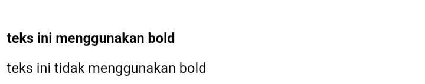
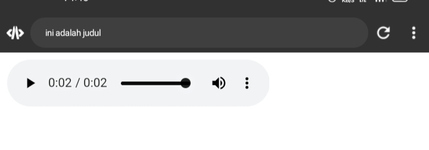

# Sejarah Html
Sejarah terciptanya Web development pada tahun 1990 seorang Insinyur bernama ==Tim Bernes Lee ==yang menciptakan suatu konsep sistem yang memungkinkan sebuah dokumen bisa terhubung satu sama lain yang terkoneksi internet. Ia juga menciptakan Protokol HTTP yang jadi jembatan antara client dan server saling mengirim data.

Karena data yang dikirim merupakan teks mentah dan akan lebih mudah membaca dokumen yang di format maka dia menciptakan HTML sebagai b ahasa untuk markup simpel membuat format teks lebih mudah dan lebih terstruktur. Dan dia menciptakan browser pertama yang di namakan WWW atau ==WORLD WIBE WEB== yang dimana nama ini terus digunakan di setiap website.

Pada tahun 1994, terciptalah CSS oleh Bapak Hakon Wium Lie yang bertujuan agar styling dan struktur HTML terpisah dan menjadi lebih muda untuk pelihara sampai saat ini. Unntuk styling sebenarnya sederhana, hanya perlu memberi identitas tiap komponen HTML yang ingin kita hiasi.

## HTML
Ibarat struktur tubuh manusia, HTML seperti tulang yang mengatur setiap bagian tubuh website yang akan kita buat.
Contoh setiap file HTML di anggap 1 halaman, setiap halaman akan dimulai dengan tag <`html`> dan di akhiri </`html`>
tag tersebut digunakan agar browser dapat mengenali bahwa teks tersebut digunakan agar browser dapat mengenali bahwa teks tersebut merupakan teks HTML dan bukan teks biasa. Kemudian ada yang namanya <`html`> </`head`> yang dimana fungsinya adalah untuk menyimpan informasi yang dibutuhkan website seperti <body> </body> sebagai tempat komponen" website dibuat seperti teks, heading, paragraf, gambar, tabel, link.
___
# HTML
Adalah kerangka/pondasi dari sebuah rumah/kerangka dari website
# CSS
Desain awal dari rumah seperti warna nya, jendela,seng,atap dan tembok.
>[!faq]- CSS dapat memperindah website atau pemisahan antara tata letak dan gaya dari struktur HTML
# Java script
Interaksi dari sebuah rumah seperti keluarnya asap dari sebuah cerobong asap karena adanya orang memasak,lampu yang menyala ,pintu yang tertutup.
___
# Struktur Html
*Setiap dokumen HTML harus diawali dengan tag dan diakhiri dengan komplemennya*
Contoh:
```html
<!DOCTYPE html>
<html>
<head>
<title> ini adalah judul </title>
</head>
<body>
<p> ini adalah paragraf yang akan ditampilkan di browser </p>
</body>
</html>
```

Penjelasan:
• ==Tag== <!DOCTYPE html> memberitahukan web browser bahwa dokumen HTML adalah versi 5

• ==Tag== pembuka <html> menandai awal sebuah dokumen HTML sampai dengan tag penutup </html>

• ==Tag== pembuka` <head> `berisi informasi tentang halaman HTML sampai dengan tag penutup` <body>`,biasanya dalam tag head terdapat tag `<title>`untuk memberikan informasi judul halaman HTML tag yang berada di antara tag pembuka  sampai dengan tag penutup `<body> `akan tampil di web browser.

Apapun tag yang berada di Tag pembuka `<body>`sampai tag penutup `</body>`akan tampil di web browser
### Contoh tampilan di web!


# Anatomi Elemen Html
**Elemen** adalah suatu kesatuan dan sebuah Tag yang dimulai dari ==Tag pembuka== hingga ke ==Tag penutup==. **ELEMEN** HTML secara garis besar terdiri atas tiga bagian yaitu **Tag pembuka**, **konten/Isi tag**, dan **tag penutup**
## Kode program
```html
<a href="https://www.instagram.com/mtaufiiik_?igsh=MmNkbXNtMTFtOWFl">LINK IG:)</a>
```
#### Hasil Program Ketika Pengguna Membuka tautan Pada Web

>[!Warning] Penjelasan ANATOMI Elemen
`<a>` adalah tag pembuka
`<a href=`:ini tag pembuka untuk anchor atau tautan
`</a>` ini tag penutup untuk mengakhiri anchor atau tautan
## Tag pembuka & Tag penutup 
`<a` adalah tag pembuka,di gunakan untuk menempelkan tautan/link agar bisa langsung memasuki website yang telah di taruh tautan/link ketika kita memencet link tersebut kita langsung dapat memasuki websitenya 
`</a>`adalah tag penutup,tag ini menandai akhir dari tautan/link yang telah di taruh di tag pembuka
## Atribut tag
### Nama atribut
`href` adalah nama atribut, digunakan untuk Menentukan url atau tujuan dari tautan
Contoh link ini ketika di klik akan mengarah ke profil Instagram saya
https://www.instagram.com/mtaufiiik_?igsh=MmNkbXNtMTFtOWFl
### Nilai atribut
`https://www.instagram.com/mtaufiiik_?igsh=MmNkbXNtMTFtOWFl`: adalah nilai atribut sebagai url atau alamat website dengan menentukan url ini dalam atribut `href` tag html `<a>`tautan tersebut akan membuka halaman profil Instagram saya
### Isi/konten tag
`LINK IG:)` akan muncul sebagai tautan ketika pengguna mengkliknya Mereka akan di arahkan ke url yang di tentukan dalam atribut `href`

# Tag dasar
## Heading
### `<h1>` sampai `<h6>`
Tag dasar `<h1>` sampai `<h6>` di gunakan di dalam html untuk membuat heading Atau judul pada halaman web,heading `<h1>`merupakan yang terbesar,sedangkan `<h6>` yang terkecil,semakin kecil nilainya semakin besar ukuran dan ketebalannya 
Contohnya:
`<h1>` : level 1
`<h2>` : level 2
`<h3>` : level 3
`<h4>` : level 4
`<h5>` : level 5
`<h6>` : level 6
### Kode program 
```html
<p><h1>TEKS 1</h1></p>
<p><h2>TEKS 2</h2></p>
<p><h3>TEKS 3</h3></p>
<p><h4>TEKS 4</h4></p>
<p><h5>TEKS 5</h5></p>
<p><h6>TEKS 6</h6></p>
```
#### Hasil Program

### Paragraf
### `<p>`
`<p>` dalam html di gunakan untuk membuat paragraf teks
`</p>` tag penutup untuk elemen paragraf 
### Kode program
```html
<p>pilihan cuma ada 2,tempe dan tahu</p>
<p>kesuksesan itu seperti banyaknya tempe</p>
<p>tidak ada yang tahu</p>
```
#### Hasil program
### `<b>`
Tag `<b>` di gunakan untuk menggunakan teks bold/mempertebal teks
`</b>` tag penutup untuk teks bold
#### Kode Program
```html
<p><b>teks ini menggunakan bold</b></p>
<p>teks ini tidak menggunakan bold
```
#### Hasil program


### `<u>`
Tag `<u>` di gunakan untuk memberi teks garis bawah
`</u>` tag penutup untuk teks garis bawah
#### Kode program
```html
<p><u>teks ini menggunakan garis bawah</u></p>
<p>teks ini tidak menggunakan garis bawah</p>
```
#### Hasil program 
### `<i>`
Tag `<i>` di gunakan untuk menggunakan teks italic/teks miring
`</i>` teks penutup untuk teks italic/teks miring
### Kode program
```html
<p><i>teks ini menggunakan teks italic</i></p>
<p>teks ini tidak menggunakan teks italic</p>
```
#### Hasil program
### `<br>`
Tag `<br>` di gunakan untuk membuat Baris baru
`</br>` teks penutup untuk baris baru
#### Kode program 
```html
<p>ini menggunakan br</p><br>
<p>ini tidak menggunakan br<p>
<p>ini tidak menggunakan br<p>
```
#### Hasil program

___
###  atribut `<align>`
Atribut `align` di gunakan untuk mengatur perataan teks pada halaman HTML Elemen `<p>` dapat menggunakan nilai atribut `align="left"` akan menghasilkan paragraf dengan perataan teks di sebelah kiri  `align="Right"` akan menghasilkan paragraf dengan perataan teks di sebelah kanan `align="center"` akan menghasilkan paragraf dengan perataan teks di Tengah `align="justify"` akan menghasilkan paragraf dengan perataan teks rata kanan/kiri
### Kode program 
```html
<h3>belajar Menggunakan elemen tag HTML P</h3>
<p align="left">
akan menghasilkan paragraf dengan perataan teks di sebelah kiri</p>
<p align="right">
akan menghasilkan paragraf dengan perataan teks di sebelah kanan</p>
<p align="center">
akan menghasilkan paragraf dengan perataan teks di Tengah</p>
<p align="justify">
akan menghasilkan paragraf dengan perataan teks rata kanan/kiri</p>
```
#### Hasil Program


## Komentar
HTML juga mempunyai tag khusus untuk membuat komentar di HTML kita menggunakan awalan <!--  dan --> penutup
>[! warning] Penjelasan Komentar
>Komentar tidak akan di tampilkan pada halaman website namun programmer biasanya menggunakan komentar untuk memperjelas kode program
```html
<!-- ini komentar, tidak akan tampil di browser -->
<p>ini bukan komentar,akan tampil di browser</p>
```
#### Hasil Program


## List
List adalah fungsi dalam HTML yang di gunakan untuk menampilkan daftar dari sesuatu dalam HTML,tag list terdiri dari 2 jenis `<ol>` **Ordered list** (berurutan) dan `<ul>` **Unordered list** (tidak berurutan) ordered list akan di tampilkan dengan angka atau huruf sedangkan Unordered list dengan bulatan atau kotak ataupun simbol lainnya
>[!warning] Penjelasan List
>Untuk menampilkan list dalam HTML dapat menggunakan tag `<ol>`...`<\ol>` atau` <ul>`...`</ul>`namun perlu dengan menyisipkan elemen `<li>` untuk membuat daftar list

### kode program
```html
<h1>Menggunakan unordered list(ul)</h1>
<h2>Nama Benda</h2>
<ul>
<li>Lilin</li>
<li>baju</li>
<li>wayang</li>
</ul><br>

<h1>Menggunakan ordered list(ol)</h1>
<h2>XI RPL 1</h2>
<ol>
<li>ini teks pertama</li>
<li>ini teks kedua</li>
<li>ini teks ketiga</li>
</ol>
```
#### Hasil program

## Link
Link dapat di temukan di hampir semua halaman link/tautan memungkinkan sebuah teks yang ketika di klik akan di pindah ke halaman lainnya HTML menggunakan tag `<a>` untuk keperluan ini link di tulis dengan `<a>` yang merupakan singkatan dari anchor (jangkar)
>[!warning] Penjelasan Link
> setiap tag `<a>` setidaknya memiliki sebuah atribut `href`. Dimana `href` berisi alamat yang di tuju.`href` adalah singkatan dari hypertext reference

Atribut penting lainnya dari tag `<a>` adalah `target` atribut target menentukan tempat untuk membuka dokumen yang di tautkan.atribut `target` memiliki beberapa nilai salah satunya `_blank` yang berfungsi untuk membuka tautan di tab baru
Contoh:
```html
<h3>Menggunakan Tag Anchor</h3>
<a href="https://www.instagram.com/mtaufiiik_?igsh=MmNkbXNtMTFtOWFl">klik link untuk menuju Instagram saya</a>
```
#### Hasil program


## Multimedia
### Gambar
Dalam HTML gambar didefinisikan dengan tag `` .Tag `` adalah tag kosong hanya berisi atribut saja,dan tidak memiliki tag penutup
>[!warning] Penjelasan Gambar
>Atribut `src` setidaknya mesti ada dalam tag ini untuk menentukan URL (alamat web) dari gambar yang ingin di tampilkan

Atribut `alt` menyediakan teks alternatif untuk gambar,jika pengguna karena beberapa alasan tidak dapat melihatnya (karena koneksi lambat, kesalahan pada atribut `src` ,atau jika web browser telah di setting untuk tidak menampilkan gambar). Jika browser tidak dapat menentukan gambar,maka akan muncul nilai pada atribut alt.

Dalam tag `` terdapat juga atribut `weith` dan `height` untuk mengatur ukuran gambar, pada versi HTML5 standar satuan ukuran gambar adalah pixel
• Misalnya dalam folder root terdapat file gambar bernama logo.png. Untuk menampilkan gambar tersebut kita hanya perlu mengisi nama gambar beserta jenis ekstensi file gambar ke dalam atribut `src` contohnya `src = "logo.png"` 
• Untuk Menampilkan gambar dari internet carilah link gambar yang akan di tampilkan lalu masukka dalam nilai atribut `src` ,contohnya http://namasitus.com/gambar.png
### Kode program
```html

```
#### Hasil program

#### Screenshot Folder HTML

### Video
Fitur HTML5 mencangkup dukungan audio dan video asli tanpa memerlukan Flash.Tag `<autio>` dan `<video>` pada HTML5 mempermudah penambah media ke dalam halaman media ke dalam halaman web.yang penting untuk di atur pada tag ini adalah atribut `src` yang berfungsi untuk mengidentifikasi sumber media. Selain itu, terdapat pula atribut `controls` agar pengguna dapat memutar dan menjeda media
### Kode program
```html
<video src="video/videoss.mp4" controls autoplay width="300" height="200" controls></video>
```
#### Hasil program

### Audio
Seperti yang telah dibahas sebelumnya bahwasanya tag `<audio>` merupakan bagian fitur HTML5 untuk menampilkan audio asli dihalaman web tanpa memerlukan flash sebagaimana pada HTML versi 4. Yang penting untuk diatur pada tag ini adalah atribut `src` yang berfungi untuk mengidentifikasi sumber media. Selain itu, terdapat pula atribut `controls` agar pengguna dapat memutar dan menjeda media. 

#### Kode program
```html 
<audio src="audio/audio.mp3" controls >
  Browser anda tidak mendukung elemen</audio>
```
#### Hasil program

> [!INFO] Penjelasan Audio 
> Konten berupa teks "Browser anda tidak mendukung elemen `<audio>`." Pada tag `<audio>` akan ditampilkan jika browser tidak mendukung elemen tersebut. Sehingga sebenarnya bagian ini dapat dihilangkan.

### Halaman web lain
Elemen `<iframe>` dapat digunakan untuk menampilkan halaman website lain dalam suatu website. Atau menampilkan dokumen html lain dalam sebuah website. Mudahnya, bisa dibilang website dalam website

Contoh penggunaannya seperti ini. Jika kita mempunyai website sekolah, lalu di website tersebut ingin menampilkan alamat dalam google maps sekolah. Agar memudahkan pengunjung website,kita bisa langsung tampilkan saja halaman sekolah yang ada digoogle maps

Dalam tag inframe ada beberapa atribut yang penting seperti : 
- `src`,untuk mencari sumber halaman html atau web yang akan ditampilkan didalam frame
- `width dan height`, untuk mengatur ukuran panjang dan lebar dari frame.
#### Kode program
```html
<iframe src="https://www.smkn7makassar.sch.id/" width="300" height="200">
```
#### Hasil Program


## Tabel 
Tabel dalam HTML didefinisikan dengan tag `<table>`.
- Setiap baris tabel didefinisikan dengan tag `<tr>`.
- Header/judul tabel didefinisikan dengan tag `<th>`.Secara default, header tabel memiliki teks tebal dan berada di tengah.
- Data tabel/sel didefinisikan dengan tag `<td>`karena sel merupakan bagian terkecil dari tabel maka dari itu tag ini selalu berada di dalam tag `<tr>`.

### Contoh program
```html
<table Border="1">
<tr>
<th>Nama</th>
<th>Alamat</th>
</tr>
<tr>
<td>Fatur</td>
<td>PAMPANG 2</td>
</tr>
<tr>
<td>Jordan</td>
<td>PAMPANG 1</td>
</tr>
<tr>
<td>Ahsan</td>
<td>JALAN KIJANG</td>
</tr>
<tr>
<td>Taufik</td>
<td>PAMPANG 5</td>
</tr>
</table>
```
#### Hasil Program

Perhatikan bahwa pada tag <`Tabel`> terdapat sebuah atribut <`border`>. Atribut digunakan untuk memberikan nilai garis tepi dari tabel. Nilai ini dalam ukuran pixel. border="1", berarti kita menginstruksikan kepada web browser bahwa tabel tersebut akan memiliki garis tepi sebesar 1 pixel. Jika tidak ditambahkan, secara default tabel tidak memiliki garis tepi.

Selain itu, terdapat pula beberapa atribut tabel yang penting untuk diketahui yaitu:
- `rowspan` merupakan atribut HTML yang berfungsi untuk menggabungkan beberapa baris (ke bawah).
- `colspan`atau colomn span merupakan atribut html yang berfungsi untuk menggabungkan beberapa kolom (ke samping).
- `width`berfungsi untuk mengatur lebar kabel yang nilainya didefinisikan dalam satuan pixel secara default.
- `heigt`berfungsi untuk mengatur tinggi tabel yang nilainya didefinisikan dalam satuan pixel secara default.
- `Align` berfungsi untuk mengatur perataan teks pada tabel.nilai atribut yang dapat diberikan yaitu left untuk perataan teks kekiri,right untuk teks ke kanan dan,center untuk perataan teks ke tengah.
### Kode program
```html
<table Border="1">
<tr>
<th rowspan="2">nama</th>
<th colspan="2">Asal institusi</th>
</tr>
<tr>
<th width="100">sekolah</th>
<th width="100">kampus</th>
</tr>
<tr>
<td>Ibrahim Malommbasang</td>
<td>Smkn7 Makassar</td>
<td>universitas negeri Makassar</td>
</tr>
<tr>
  <td>condrado alain sharon</td>
  <td> SMK 7 Makassar</td>
  <td>UNM</td>
</tr>
<tr>
  <td>rezeky awalya</td>
  <td>SKAVEN</td>
  <td>UNM</td>
</tr>
  <td>Muzhawir amri</td>
  <td>SMAN 1 Palu</td>
  <td>STMTK Dipanegara</td>
</tr>
</table>
```
#### Hasil Program

> [! info ] Penjelasan Tabel 
> perhatikan para konten elemen `<td` yang berisi `Rezeky Awalya`, hanya terdapat satu elemen `<td>` disana. Hal ini dikarenakan konten elemen `<td>` sebelumnya yaitu `SMKN 7 Makassar` dan `-` pada data `condrado alain sharon` mengandung atribut `rowspan` dengan bernilai `2` yang secara otomatis mengisi data di bawahnya yakni data `Rezeky awalya`. Nilai `2` menunjukkan bahwa ada dua baris yang digabungkan menjadi satu.
> 
Konsep ini juga sama dengan apa yang terjadi pada `<th rowspan="2">nama</th>` dan `<th colspan="2">Asal institusi</th>`

### Kode Program
```html
  <table border="1">
   <tr bgcolor="green">
   <th colspan="2" align="center">Nama hari</th>
  <th colspan="2" align="center">Nama bulan</th>
 </tr>
   <tr>
   <td align="center" width="100">senin</td>
  <td align="center" width="100">selasa</td>
  <td align="center" width="100">april</td>
  <td rowspan="2" align="center" width="100">juni</td>
   </tr>
   <tr>
   <td align="center" width="100">rabu</td>
   <td align="center" width="100">kamis</td>
  <td align="center" width="100">mei</td>
   </tr>
  </table>

```
### Hasil Program

## Form
Elemen ferm HTML digunakan untuk mendefinisikan form yang digunakan untuk mengumpulkan inputan dari pengguna website. Tag ini digunakan untuk mengkoleksi inputan dari user, konsep ini sama seperti konsep formulir di dunia nyata.

Dengan kata lain tag <fores merepresentasikan sebuah "formulir" di mana satu formulir bisa memiliki banyak kolom isian.

Form HTML berisikan elemen-elemen fors lainnya. Elemen `<form>` digunakan untuk menampung macam-macam elemen yang berkaitan dengan sebuah form, seperti text fields, checkbox, radio button, tombol subalt, dan banyak lagi yang dapat diedit kemudian ditulis untuk dikirim pada sebuah server untuk selanjutnya diproses guna mendapatkan informasi tertentu dari atau untuk user.

Umumnya, sebuah website selalu memiliki fitur form, contoh paling umum yang sering kita temui adalah seperti form login, form sign up, form komentar di suatu blog/media. 
#### Contoh Program:
```html
<form>
  <label for="Nama">Nama:</label>
  <input type="text" id="Nama">
  <br>
  <br>
  <Label for="password">Password:</Label>
  <input type="password" id="password" required="">
  <br>
  <br>
  <Label>Jenis Kelamin:</Label>
  <input type="radio" checked name="Jenis Kelamin">
  <label for="Jenis Kelamin">Laki-Laki</label>
  <input type="radio" name="Jenis Kelamin">
  <label for="Jenis Kelamin">Perempuan</label>
  <br>
  <br>
  <label>Bahasa pemrograman:</label>
  <input type="checkbox">
  <label name="coding">Web</label>
  <input type="checkbox">
  <label name="coding">Mobile</label>
  <input type="checkbox">
  <label name="coding">desktop</label>
  <br>
  <br>
  <input type="submit" value="kirim">
  <input type="reset" value="ulang">
  <br>
  Pesan Anda:
  <br>
  <textarea></textarea>
</form>
```
#### Hasil Program

### Input
Elemen `<input>` adalah elemen form yang paling penting. Elemen `<input>` dapat ditampilkan dalam beberapa cara, tergantung pada nilai atribut type yang digunakan. Request Berikut adalah beberapa contoh nilai dari atribut `type`:
- `text` di gunakan untuk mengambil isian berupa isian teks.contohnya seperti nama.
`password` di gunakan untuk mengambil isian berupa **kata sandi** atau sesuatu yang bersifat rahasia.tipe ini akan mengubah semua karakter yang di ketikkan ke dalam karakter bulat .
- `radio` di gunakan sebagai kolom isian Bertipe **Pilihan** yang menawarkan beberapa opsi kepada *user* namun tetapi **hanya 1 opsi saja** Yang boleh di pilih.contohnya seperti jenis kelamin atau agama
>[!warning] Penjelasan Input
>perlu di perhatikan bahwa untuk penggunaan tipe `radio` yang berkategori set pilihan yang sama mengharuskan nilai `name` -nya juga sama

Opsi default dapat di lakukan dengan menambahkan atribut `checked` Pada elemen opsi yang di jadikan sebagai opsi default.
- `checkbox` digunakan untuk memberikan **daftar pilihan dalam satu set opsi**. User dapat memilih satu atau bahkan lebih dari satu pilihan pada tipe ini. Hal ini berbeda dengan tipe sebelumnya yaitu `radio` yang hanya memungkinkan user untuk memilih satu  pilihan saja. Contoh penggunaan `checkbox` seperti daftar makanan kesukaan, daftar olahraga yang tidak disukai, dan yang semisalnya.

>[!warning] Penjelasan Input²
>Perlu diperhatikan bahwa untuk penggunaan tipe checkbox yang berkategori set pilihan yang sama mengharuskan nilai name -nya juga sama.

- `Number` digunakan untuk membatasi isian user hanya pada karakter numerik saja. Browser akan menambahkan dua buah tombol atas dan bawah untuk mengubah angka isian.
Beberapa atribut untuk tipe `number`:
- `min`-menentukan angka minimal
- `max`-menentukan angka maksimal
- `step`-smenentukan kelipatan (nilai yang tidak sesuai kelipatan tidak bisa di-input, dan default dari atribut ini adalah 1)

- `Date` digunakan untuk memberikan isian berupa tanggal. Atribut `min` dan `max` dapat pula difungsikan pada tipe ini untuk mengatur tanggal minimal dan tanggal maksimal yang diinginkan. Nilai `min` dan `max` tersebut ditulis dengan format: `YYYY-em-dd`.

- `File` digunakan untuk memungkinkan pengguna memuat file. Atribut `accept` juga dapat disisipkan pada tipe ini dengan maksud untuk mengatur file apa saja yang boleh di-upload. Beberapa contoh value dari atribut `accept` yaitu:

- `accept-"image/png,inage/jpg.Image/jpeg` - untuk file gambar seperti `png`. `jpg`. atau `jpeg`
- `accept="pdf"` - untuk file pdf
- `accept="pdf"` - untuk file pdf
- `accept-".doc, docx"` - untuk file `doc` atau `docx`
- `accept-".ppt, pptx"` untuk file `ppt` atau `pptx`

- `submit` ditampilkan dalam bentuk tombol untuk mengirim data pada `<form>` yang menjadi pembungkusnya. Atribut `value` digunakan untuk mengisi teks yang ingin ditampilkan pada tombol.

- `reset` berguna untuk **mengembalikan state (keadaan) atau data dari suatu form ke nilai awalnya**. Jika nilai awal sebuah input adalah kosong, maka ketika direset ia akan kembali kosong. Tapi jika nilai awalnya 

- `button` berguna untuk membuat inputan berupa sebuah tombol. Tombol ini nantinya bisa difungsikan sesuai dengan keinginan dari pengembang web.
### Label
Elemen <`label`> memiliki fungsi khusus untuk melabeli sebuah kolom inputan. Ketika screen reader membaca konten halaman HTML, lalu menemukan sebuah inputan, ia akan membaca label yang bersangkutan.
Fungsi lain dari tag <`label`> adalah ketika kita mengklik label, maka browser akan meletakkan fokus pada kolom isian yang terhubung dengannya. Syarat yang perlu diperhatikan yaitu dengan menghubungkan sebuah <`label`> dan <`input`> dengan atribut for untuk label, dan atribut id pada <`input`>dengan nilai untuk kedua atribut tersebut mesti sama persis.
### Select
Elemen <`select`> berguna dalam mendefinisikan sebuah tombol dropdown yang dimana user dapat memilih salah satu dari banyak pilihan.

Elemen <`select`> nantinya berperan sebagai kontainer atau pembungkus dari elemen <`option`> yang berperan sebagai daftar pilihan atau opsi.
Elemen <`select`> hampir mirip fungsinya dengan <`input type="radio"`> akan tetapi baiknya elemen <`select`> digunakan untuk memilih satu pilihan yang terdapat banyak opsi di dalamnya, sedangkan <`input type ="radio"`> lebih baiknya untuk digunakan jika user diarahkan memilih hanya satu pilihan yang opsi pilihannya tidak terlalu banyak. Contoh penggunaan elemen ini seperti memasukkan pilihan berupa asal daerah atau yang semisalnya.
Penting untuk diketahui bahwasanya opsi yang aktif secara default adalah adalah opsi yang pertama. Akan tetapi, kita bisa mengatur opsi mana yang aktif secara default dengan menambahkan atribut selected pada suatu <`option`> yang ingin dijadikan sebagai opsi default.

### Text Area
Elemen <`textarea`> berguna untuk mengambil inputan user berupa teks yang dapat memuat lebih dari satu baris. Jika dibandingkan dengan elemen <`input`> teks biasa, elemen <`textarea`> memiliki ukuran tinggi yang lebih besar. Element <`textarea`> bisa diisi lebih dari satu baris dengan menekan enter.

Atribut yang dapat digunakan untuk mengatur kuran dari textarea yaitu rows untuk jumlah baris, sedangkan atribut cols untuk lebarnya.

### Button
Elemen <`button`> yang berada di dalam sebuah form akan otomatis dianggap sama fungsinya seperti <`input type="submit"`>. Jika ingin membuat tombol biasa yang tidak men-submit <`form`> dapat dilakukan dengan menambahkan atribut type="button".

```html
<h1>Formulir Pendaftaran</h1>
<form action="">
  <div>
    <label for="nama-lengkap"><b>Nama Lengkap:</b></label
    ><br />
    <input
      type="text"
      id="nama-lengkap"
      name="nama_lengkap"
      placeholder="Masukkan nama lengkap"
      required
    />
  </div>
  
  <div>
    <label for="password"><b>Password:</b></label
    ><br />
    <input
      type="password"
      id="password"
      name="password"
      placeholder="Masukkan password"
      required
    />
  </div>
  
  <div>
    <b>Jenis Kelamin:</b><br />
    <input id="lk" type="radio" name="jenis_kelamin" checked />
    <label for="lk">Laki-Laki</label>
    <input id="pr" type="radio" name="jenis_kelamin" />
    <label for="pr">Perempuan</label>
  </div>
  
  <div>
    <label for="isian-usia"><b>Usia:</b></label
    ><br />
    <input
      type="number"
      id="isian-usia"
      name="usia"
      min="17"
      max="25"
      value="19"
      required
    />
    Tahun
  </div>

  <div>
    <label for="tgl-ijazah"><b>Tanggal Ijazah:</b></label> <br />
    <input
      type="date"
      id="tgl-ijazah"
      name="tgl_ijazah"
      min="2021-01-01"
      value="2023-06-20"
      required
    />
  </div>

  <div>
    <label for="opsi-agama"><b>Agama:</b></label
    ><br />
    <select id="opsi-agama" name="agama" required>
      <option disabled>---Pilih Agama----</option>
      <option value="islam">Islam</option>
      <option value="kristen">Kristen</option>
      <option value="katolik">Katolik</option>
      <option value="hindu">Hindu</option>
      <option value="buddha">Buddha</option>
      <option value="atheis" disabled>Atheis</option>
    </select>
  </div>

  <div>
    <label for="alamat"><b>Alamat:</b></label> <br />
    <textarea
      id="alamat"
      name="alamat"
      cols="25"
      rows="5"
      placeholder="Harap masukkan alamat secara lengkap"
      required
    ></textarea>
  </div>

  <div>
    <b>Kemampuan Berbahasa Asing:*</b><br />
    <input type="checkbox" id="inggris" name="bahasa_asing" />
    <label for="inggris">Inggris</label>
    <input type="checkbox" id="arab" name="bahasa_asing" />
    <label for="arab">Arab</label>
    <input type="checkbox" id="jepang" name="bahasa_asing" />
    <label for="jepang">Jepang</label>
  </div>

  <div>
    <label for="isian-foto"><b>Foto 4x6:*</b></label
    ><br />
    <input
      type="file"
      id="isian-foto"
      name="foto"
      accept="image/png,image/jpg,image/jpeg"
    />
  </div>

  <br />
  <input type="submit" value="Kirim" />
  <input type="reset" value="Batal" />
  <i>*opsional (tidak wajib diisi)</i>
</form>
```
#### Hasil program

Beberapa atribut yang digunakan pada contoh di atas yang perlu untuk diperjelas yaitu sebagai berikut:
- name - digunakan sebagai nama variabel yang akan diproses oleh web server (contoh menggunakan PHP).
- required - digunakan untuk memastikan bahwa pengguna harus memasukkan nilai pada input tersebut sebelum dapat melakukan proses submit formulir.
- placeholder - menuliskan teks pada elemen input. Placeholder sangat bermanfaat untuk memberikan teks bantuan kepada user untuk inputan form yang kompleks.
- value - menentukan nilai awal dari sebuah elemen input.
- disabled - digunakan untuk menonaktifkan inputan pada elemen yang diberi atribut ini.
### **Bagaimana Cara Memproses Form?**

Ketika sebuah `<form>` disubmit, baik menggunakan elemen `<button>` mau pun `<input type="submit">`, browser akan mengirimkan data tersebut kepada URL yang didefinisikan pada atribut `action` di dalam tag `form`.

Ada pun jika atribut `action` tidak didefinisikan, maka *browser* akan menggunakan URL sekarang sebagai tujuan pengiriman data.

Contoh:

```html
<form action="/proses-pendaftaran">
  ...
</form>
```

Pada contoh di atas, ketika form di-*submit*, *browser* akan mengirimkan data yang ada  menuju URL `/proses-pendaftaran`.
### **Apa yang terjadi pada URL `/proses-pendaftaran`?**

Pada URL tersebut terdapat sebuah aplikasi/program yang berjalan di *server* (bukan di *browser*). Tugas dari program tersebut adalah mengelola data yang dikirim seperti misalnya menyimpan data tersebut ke dalam sebuah *database*.

Bahasa yang umum digunakan di dalam server adalah python, nodejs, PHP, dan lain sebagainya.

Untuk mendapatkan gambaran lebih jelas, sebenarnya akan dijelaskan pada modul selanjutnya yang berkaitan dengan materi PHP atau juga bisa dengan membaca tutorial berikut:https://jagongoding.com/web/php/web-dinamis/membuat-dan-menangani-form/https://jagongoding.com/web/php/web-dinamis/membuat-dan-menangani-form/

## Div & Span
### Div
Div berguna untuk memblok suatu paragraf
#### Kode program
```Html
<Div>ini dibuat menggunakan Div<Div>
<Div>ini juga dibuat menggunakan Div<Div>
```
#### Hasil Program


### Span
Berbeda dengan Div. Span digunakan untuk mengelompokkan sebuah paragraf
#### Kode Program
```html
<Span>Ini dibuat menggunakan span<span>
<Span>ini juga dibuat menggunakan span<span>
```
### Hasil Program


___
