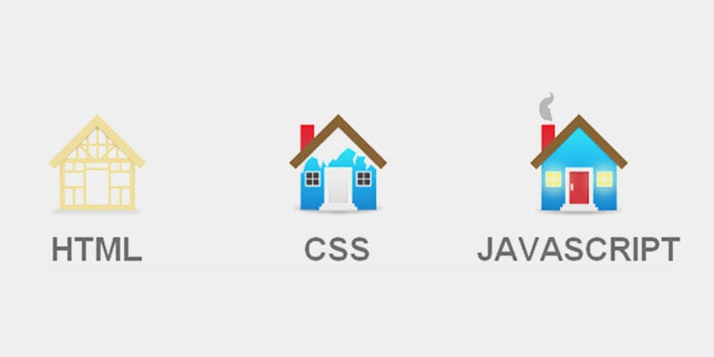

# HTML
Adalah kerangka/pondasi dari sebuah rumah/kerangka dari website
# CSS
Desain awal dari rumah seperti warna nya, jendela,seng,atap dan tembok.
>[!faq]- CSS dapat memperindah website atau pemisahan antara tata letak dan gaya dari struktur HTML
# Java script
Interaksi dari sebuah rumah seperti keluarnya asap dari sebuah cerobong asap karena adanya orang memasak,lampu yang menyala ,pintu yang tertutup
