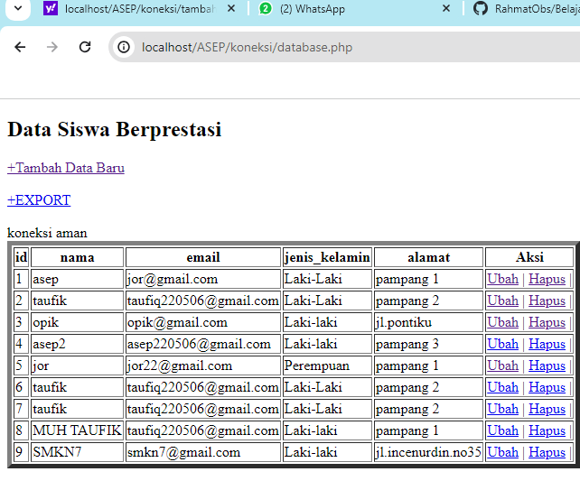
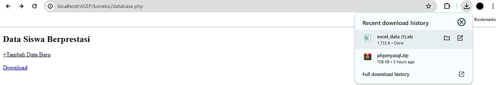

# koneksi database 
## Kode program
```php
<?php
//koneksi ke database
$koneksi = mysqli_connect('localhost', 'root', '', 'siswa');
if ($koneksi) {
    echo "<br> koneksi aman <br>";
} else {
    echo "error, tidak bisa koneksi ke database";
}
```
## hasil

## analisis
1. Koneksi ke database:
    - Menggunakan fungsi `mysqli_connect()` untuk membuat koneksi ke database MySQL dengan parameter host ('localhost'), username ('root'), password (''), dan nama database ('rental_rahmat').
    - Jika koneksi berhasil, maka pesan "koneksi aman" akan ditampilkan. Jika tidak, pesan "error, tidak bisa koneksi ke database" akan ditampilkan.

**Kesimpulan:**
Program PHP dan SQL di atas bertujuan untuk melakukan koneksi ke database MySQL menggunakan fungsi `mysqli_connect()`. Setelah koneksi berhasil, pesan "koneksi aman" akan ditampilkan. Jika terdapat masalah dalam koneksi, maka pesan "error, tidak bisa koneksi ke database" akan ditampilkan. Namun, pada kode yang diberikan, tag pembuka PHP ditulis sebagai "<php" yang seharusnya "<php" (dengan tanda "?"). Pastikan untuk mengubahnya menjadi "<php" agar kode PHP dapat dieksekusi dengan benar.

---
# Tampilkan data
## Kode program
```php
//jalankan query seleksi

$select = mysqli_query($koneksi, "SELECT * FROM  siswa");

//membuat array asosiatif dan memecah data berdasarkan kolomnya

$result = mysqli_fetch_assoc($select);

//menampilkan struktur array dari data tabel yang dijalankan di atas

//var_dump($result);

echo 'Berikut data<br>';

$a = 1;

foreach ($select as $key => $data) {

echo $a++ . ". " . $data['alamat'] . " : " . $data['nama'] . '<br>';
}
//echo '<p>Halo ' . $result['pemilik'] . '!!</p><br>';
```
## hasil

## analisis
- **mysqli_query**: Fungsi ini digunakan untuk menjalankan query SQL terhadap database yang terhubung. Dalam hal ini, query `SELECT * FROM siswa` akan mengambil semua data dari tabel `siswa`.
- **Error Handling**: Jika query gagal, `mysqli_query` mengembalikan `false`. Kondisi ini ditangani dengan `if (!$select)`, yang menggunakan `mysqli_error` untuk mendapatkan pesan error terkait dari koneksi (`$koneksi`), dan `die` untuk menghentikan eksekusi skrip sambil menampilkan pesan error.
- Inisialisasi: `echo 'Berikut data<br>';` digunakan untuk menampilkan teks awal yang menunjukkan bahwa data akan ditampilkan.
- **Variabel Counter**: `$a = 1;` inisialisasi variabel `$a` sebagai counter untuk menomori setiap baris data yang ditampilkan.
- **Loop While**: `while ($data = mysqli_fetch_assoc($select))` digunakan untuk mengambil baris data satu per satu dari hasil query. `mysqli_fetch_assoc` mengembalikan baris sebagai array asosiatif, atau `null` jika tidak ada lagi baris yang tersisa.
- **Menampilkan Data**: `echo $a++ . ". " . $data['alamat'] . " : " . $data['nama'] . '<br>';` menampilkan nomor urut, alamat, dan nama dari setiap baris data. `++` setelah `$a` memastikan bahwa counter ditambah setelah ditampilkan.
## kesimpulan
1. **Koneksi ke Database**: Bagian ini berhasil membuat koneksi ke database MySQL dan menangani kesalahan koneksi dengan baik.
2. **Jalankan Query Seleksi**: Bagian ini menjalankan query untuk mengambil data dari tabel `siswa` dan menangani kesalahan query dengan baik.
3. **Menampilkan Data**: Bagian ini mengambil data dari hasil query satu per satu dan menampilkannya dalam format yang terstruktur. Penggunaan loop `while` dan `mysqli_fetch_assoc` memastikan bahwa semua baris data ditampilkan.
4. **Menutup Koneksi**: Bagian ini menutup koneksi ke database, membebaskan sumber daya yang digunakan oleh koneksi tersebut.
---
# Tambahkan data 
## Kode program
```php
<!DOCTYPE html>
<html lang="en">
<head>
    <title>Tambah data</title>
</head>
<body>
    <h2>Tambah Data</h2>
<?php
    include "koneksi.php";

    if(isset($_POST['nama'])){
        $nama           = $_POST['nama'];
        $email          = $_POST['email'];
        $jenis_kelamin  = $_POST['jenis_kelamin'];
        $alamat         = $_POST['alamat'];
        $query = mysqli_query($koneksi, "INSERT into siswa(nama,email,jenis_kelamin,alamat) values ('$nama','$email','$jenis_kelamin','$alamat')");

        if($query) {
            echo "<script>
            alert('Tambah data Berhasil')
            window.location.href='database.php'
            </script>";
        }else {
            echo '<script>alert("Tambah data gagal")</script>';}
    }
    ?>
    <form method="post" >
        <table>
            <tr>
                <td>Nama</td>
                <td><input type="text" name="nama"></td>
            </tr>
            <tr>
                <td>Email</td>
                <td><input type="text" name="email"></td>
            </tr>
            <tr>
                <td>Jenis Kelamin</td>
                <td>>
                    <select name="jenis_kelamin">
                        <option>Laki-laki</option>
                        <option>Perempuan</option>
                    </select>  
                </td>
            </tr>
            <tr>
                <td>alamat</td>
                <td><input type="text" name="alamat"></td>
            </tr>
            <tr>
                <td></td>
                <td>
                    <button type="submit">Simpan</button>
                    <button type="reset">Reset</button>
                    <a href="database.php">Kembali</a>
                </td>
            </tr>
        </table>
    </form>
</body>
</html>
```
## hasil

## Sesudah Menambah data

## analisis
- **Include "koneksi.php"**: Memasukkan file eksternal untuk koneksi database.
- **Cek Form Submission**: Mengecek apakah form telah disubmit dengan mengecek `isset($_POST['nama'])`.
- **Mengambil Data dari Form**: Mengambil data dari input form dan menyimpannya dalam variabel.
- **Query Insert**: Menjalankan query `INSERT` untuk menambahkan data ke tabel `siswa`.
- **Error Handling**:
    - Jika query berhasil (`$query`), tampilkan pesan sukses dan arahkan pengguna ke halaman `database.php`.
    - Jika query gagal, tampilkan pesan gagal.
- **Form Tag**: Formulir menggunakan metode POST untuk mengirim data.
- **Input Fields**:
    - `Nama`: Input teks untuk nama.
    - `Email`: Input teks untuk email.
    - `Jenis Kelamin`: Dropdown untuk memilih jenis kelamin.
    - `Alamat`: Input teks untuk alamat.
- **Buttons**:
    - `Simpan`: Tombol submit untuk menyimpan data.
    - `Reset`: Tombol reset untuk mengosongkan form.
    - `Kembali`: Link untuk kembali ke halaman `database.php`.
## kesimpulan

1. **Struktur HTML**: Kode HTML tersusun dengan baik, berisi form untuk memasukkan data.
2. **Koneksi Database**: File `koneksi.php` digunakan untuk menghubungkan ke database, namun perlu dipastikan file tersebut tersedia dan berfungsi.
3. **Form Handling**: Data form ditangani dengan mengecek apakah form telah disubmit, kemudian mengambil data dan menjalankan query `INSERT` untuk menambah data ke tabel `siswa`.
4. **Error Handling**: Pesan error ditampilkan jika query gagal, dan pesan sukses ditampilkan jika query berhasil.
5. **Keamanan**: Kode ini rentan terhadap SQL Injection karena data dari form langsung dimasukkan ke query SQL. Disarankan untuk menggunakan prepared statements atau fungsi `mysqli_real_escape_string` untuk mengamankan data.

---
# Ubah data 
```php
<!DOCTYPE html>
<html lang="en">
<head>
    <title>Ubah Data</title>
</head>
<body>
    <h2>Ubah Data</h2>
    <?php
    include "koneksi.php"; // Ubah nama file koneksi.php sesuai dengan kebutuhan Anda
    // Menerima parameter id siswa dari URL
    $id_siswa = $_GET['id'];
    if(isset($_POST['S'])) {
        // Ambil data dari form
        $nama         = $_POST['nama'];
        $email        = $_POST['email'];
        $jenis_kelamin= $_POST['jenis_kelamin'];
        $alamat       = $_POST['alamat'];
        // Query untuk update data siswa
        $query = mysqli_query($koneksi, "UPDATE siswa SET nama='$nama', email='$email', jenis_kelamin='$jenis_kelamin', alamat='$alamat' WHERE id_siswa=$id_siswa");
        // Cek apakah query berhasil dijalankan
        if($query) {
            echo "<script>
            alert('Ubah data Berhasil')
            window.location.href='database.php'
            </script>";
        } else {
            echo '<script>alert("Ubah data gagal")</script>';
        }
    }
    // Query untuk mendapatkan data siswa berdasarkan id
    $query = mysqli_query($koneksi, "SELECT * FROM siswa WHERE id_siswa=$id_siswa");
    $data = mysqli_fetch_array($query);
    ?>
    <form method="post">
        <table>
            <tr>
                <td>Nama</td>
                <td><input type="text" name="nama" value="<?php echo $data['nama']; ?>"></td>
            </tr>
            <tr>
                <td>Email</td>
                <td><input type="email" name="email" value="<?php echo $data['email']; ?>"></td>
            </tr>
            <tr>
                <td>Jenis Kelamin</td>
                <td>
                    <select name="jenis_kelamin">
                        <option value="Laki-Laki" <?php if($data['jenis_kelamin'] == "Laki-Laki") echo 'selected'; ?>>Laki-Laki</option>

                        <option value="Perempuan" <?php if($data['jenis_kelamin'] == "Perempuan") echo 'selected'; ?>>Perempuan</option>
   </select>
    </td>
        </tr>
            <tr>
                <td>Alamat</td>
                <td><input type="text" name="alamat" value="<?php echo $data['alamat']; ?>"></td>
            </tr>
            <tr>
                <td></td>
                <td>
                    <button type="submit" name="S">Simpan</button>
                    <button type="reset">Reset</button>
                    <a href="database.php">Kembali</a>
                </td>
            </tr>
        </table>
    </form>
</body>
</html>
```
## Hasil

## Sesudah Mengubah data

## analisis
- **Form Tag**: Formulir menggunakan metode POST untuk mengirim data.
- **Input Fields**:
    - `Nama`: Input teks untuk nama yang diisi dengan nilai yang diambil dari database.
    - `Email`: Input email untuk email yang diisi dengan nilai yang diambil dari database.
    - `Jenis Kelamin`: Dropdown untuk memilih jenis kelamin, dengan nilai yang sesuai dari database yang ditandai sebagai `selected`.
    - `Alamat`: Input teks untuk alamat yang diisi dengan nilai yang diambil dari database.
- **Buttons**:
    - `Simpan`: Tombol submit untuk menyimpan data.
    - `Reset`: Tombol reset untuk mengosongkan form.
    - `Kembali`: Link untuk kembali ke halaman `database.php`.
## kesimpulan
1. **Struktur HTML**: Kode HTML tersusun dengan baik, berisi form untuk mengubah data siswa.
2. **Koneksi Database**: File `koneksi.php` digunakan untuk menghubungkan ke database, namun perlu dipastikan file tersebut tersedia dan berfungsi.
3. **Mengambil Data Siswa**: Data siswa diambil berdasarkan `id_siswa` yang diterima dari URL dan ditampilkan di form.
4. **Form Handling**: Data form ditangani dengan mengecek apakah form telah disubmit, kemudian mengambil data dan menjalankan query `UPDATE` untuk memperbarui data siswa.
5. **Error Handling**: Pesan error ditampilkan jika query gagal, dan pesan sukses ditampilkan jika query berhasil.
6. **Keamanan**: Kode ini rentan terhadap SQL Injection karena data dari form langsung dimasukkan ke query SQL. Disarankan untuk menggunakan prepared statements atau fungsi `mysqli_real_escape_string` untuk mengamankan data.

---
# Hapus data 

 ## kode program
```php
<?php
include('koneksi.php');
if(isset($_GET['id'])){
$id = $_GET['id'];
$query = mysqli_query($koneksi, "DELETE FROM siswa WHERE id_siswa = $id");
if($query) {
echo "<script>
alert('Hapus data Berhasil')
window.location.href='database.php'
</script>";
}else {
 echo '<script>alert("Hapus data gagal")</script>';
}
} 
?>
```
## hasil

## sesudah hapus data

## analisis

- Menggunakan fungsi `mysqli_connect()` untuk membuat koneksi ke database MySQL dengan parameter host ('localhost'), username ('root'), password (''), dan nama database ('siswa').
    - Jika koneksi berhasil, maka pesan "koneksi aman" akan ditampilkan. Jika tidak, pesan "Error, tidak bisa koneksi ke database" akan ditampilkan.
    - Menggunakan fungsi `mysqli_query()` untuk menjalankan query SQL yang melakukan seleksi data dari tabel "siswa" dalam database.
    - Hasil query disimpan dalam variabel `$select`
    - Menggunakan perulangan `foreach` untuk mengiterasi setiap baris data yang ditemukan dalam `$select`.
    - Menggunakan query SQL DELETE untuk menghapus data dari tabel daftar_mobil.
    - Data yang akan dihapus adalah baris dengan nomor plat yang sesuai dengan nilai variabel `$id`.

## kesimpulan
Program PHP dan SQL di atas berfungsi untuk melakukan koneksi ke database, menjalankan query seleksi, menampilkan data sebelum penghapusan, menghapus data dalam tabel "daftar_mobil", dan menampilkan data setelah penghapusan. Program ini akan menampilkan nama-nama pemilik mobil sebelum dan setelah penghapusan yang dilakukan.

----
# Session/login
```php
<?php
session_start();
if (isset ($_POST ['submit'])) {
   // var_dump($_POST);
   $username = $_POST['username'];
   $password = $_POST['password'];
   $koneksi = mysqli_connect('localhost', 'root', '', 'user') or die('error koneksi');
    $result = mysqli_query($koneksi, "SELECT * FROM userr WHERE username = '$username' AND password = '$password'");
    $data = mysqli_fetch_assoc($result);
    //var_dump($data);
    if (isset ($data)) {
        $_SESSION['username'] = $data['username'];
        $_SESSION['nama'] = $data['nama'];
        $_SESSION['status'] = 'login';
        header('location:user.php');
    } else {
        echo "Username dan Password Salah";
    }
}
?>
<!DOCTYPE html>
<html>
<head>
    <title>Login session</title>
</head>
<body>
    <form method="post">
        <label>username</label>
        <input type="text" name="username">
        <br><br>
        <label for="">password</label>
        <input type="password" name="password">
        <br>
        <button type="submit" name="submit">login</button>
    </form>
</body>
</html>
```
## kode user
```php
<?php

session_start();
if ($_SESSION['status'] == 'login' && $_SESSION['username'] == 'admin') {
    header("Location: admin.php");
}
if ($_SESSION['status'] != 'login') {
    header('Location: session.php');
}
?>
<!DOCTYPE html>
<html lang="en">
<head>
    <title>Document</title>

</head>
<body>
    <h1>Halaman User</h1>

    <h1>Halo, <?= $_SESSION['nama'] ?></h1>
    <a href="logout.php">Logout</a>
</body>
</html>
```
## kode cek_user
```php
<?php
if ($_SESSION['status'] == 'login' && $_SESSION['username'] != 'admin') {
    header("Location: user.php");
} else if ($_SESSION['status'] == 'login' && $_SESSION['username'] == 'admin') {
    header("Location: admin.php");
}else{

    header("Location: session.php");
}
```
## kode admin
```php
<?php

session_start();
if ($_SESSION['status'] != 'login' && $_SESSION['username'] = 'admin') {
    header("Location: user.php");
}
if ($_SESSION['status'] != 'login') {
    header('Location: session.php');
}
?>
<!DOCTYPE html>
<html lang="en">
<head>
    <title>Document</title>
</head>
<body>

    <h1>Halaman Admin</h1>
    <h2>Halo, <?= $_SESSION['nama'] ?></h2>
    <a href="logout.php">Logout</a>
</body>
</html>
```
## kode logout
```php
<?php
session_start();
session_destroy();
session_unset();
header('Location: session.php');
```
## hasil


## analisis
Pada bagian HALAMAN HTML:
- Terdapat sebuah form dengan metode POST.
- Form tersebut memiliki input field untuk username dan password.
- Terdapat tombol "Login" yang akan mengirimkan data form saat ditekan.
Pada bagian Halaman PHP:
    - Program memulai session dengan menggunakan fungsi `session_start()`. Hal ini penting untuk memulai dan mengelola session di PHP.
    - Jika terdapat data yang dikirimkan melalui metode POST dengan nama "submit" (diperiksa menggunakan `isset($_POST['submit'])`), maka program akan melakukan proses login.
    - Data username dan password yang dikirimkan melalui form diambil menggunakan `$_POST['username']` dan `$_POST['password']`.
    - Dilakukan koneksi ke database MySQL menggunakan `mysqli_connect()` dengan parameter host, username, password, dan nama database.
    - Dilakukan query SQL untuk mencocokkan data username dan password yang diberikan dengan data di tabel "user" menggunakan perintah `mysqli_query()`.
    - Hasil query diambil menggunakan `mysqli_fetch_assoc()` dan disimpan dalam variabel `$data`.
    - Hasil dari `$data` ditampilkan menggunakan `var_dump()` untuk tujuan debugging.
    - Jika `$data` memiliki nilai (artinya username dan password cocok), maka session akan diset dengan variabel-variabel dari data tersebut, dan pengguna akan diarahkan ke halaman "user.php" menggunakan `header('Location: user.php')`.
    - Jika tidak ada data yang cocok, maka akan ditampilkan pesan "Username dan Password Salah".
## kesimpulan
File `session.php` adalah program PHP yang melakukan proses login menggunakan session. Program ini memeriksa apakah data username dan password yang diberikan cocok dengan data yang ada di database. Jika cocok, session akan diset dengan variabel-variabel dari data tersebut dan pengguna akan diarahkan ke halaman "user.php". Jika tidak cocok, pesan kesalahan akan ditampilkan. Namun, perlu diperhatikan bahwa file ini belum mengimplementasikan fitur keamanan seperti sanitasi input dan penggunaan prepared statement untuk mencegah serangan SQL Injection.

---
# Upload dan download
## Upload
### kode program
```php
<!DOCTYPE html>

<html lang="en">

<head>

    <title>Tambah Data</title>

</head>

<body>

    <h2>Tambah Data</h2>

    <?php

    include "koneksi.php";

    function upload(): string

{

    $nameImage = $_FILES['gambar']['name'];

    $directoryFile = $_FILES['gambar']['tmp_name'];

    $errorImage = intval($_FILES['gambar']['error']);

    $sizeFile = $_FILES['gambar']['size'];

  

    // cek apakah gambar ada

    if ($errorImage === 4) {

        echo "<script>alert('Anda Belum Upload Gambar')</script>";

        return false;

    }

  

    // mengambil ekstensi file

    $validType = ['svg', 'jpg', 'png', 'jpeg', 'webp'];

    $extensionFile = explode(".", $nameImage);

    $extensionValid = strtolower(end($extensionFile));

  

    // cek apakah yang diupload gambar atau bukan

    if (!in_array($extensionValid, $validType)) {

        echo "<script>alert('yang anda Upload bukan gambar')</script>";

        return false;

    }

  

    // cek size file

    if ($sizeFile > 3_000_000) {

        echo "<script>alert('Ukuran File Terlalu Besar!!(Maks 3MB)')</script>";

        return false;

    }

  

    // upload file

    $nameImage = uniqid() . "." . $extensionValid;

    move_uploaded_file($directoryFile, "img/{$nameImage}");

  

    // mengembalikan namafile yg sudah divalidasi

    return $nameImage;

}

    if(isset($_POST['simpan'])){

        $nama = $_POST['nama'];

        $email = $_POST['email'];

        $jenis_kelamin = $_POST['jenis_kelamin'];

        $alamat = $_POST['alamat'];

        $gambar = upload();

        if (!$gambar) {

            return false;

        }

        $query = mysqli_query($koneksi, "INSERT into siswa(nama,email,jenis_kelamin,alamat,gambar)

        values ('$nama','$email','$jenis_kelamin','$alamat','$gambar')");

        if ($query) {

            echo "<script>

            alert('Tambah data Berhasil')

            window.location.href 'database.php'

            </script>";

        } else {

            echo '<script>alert("Tambah data gagal")</script>';

        }}

  

    ?>

    <form method="post" enctype="multipart/form-data" >

        <table>

        <tr>

                <td>Nama</td>

                <td><input type="text" name="nama"></td>

            </tr>

            <tr>

                <td>Email</td>

                <td><input type="text" name="email"></td>

            </tr>

            <tr>

                <td>Jenis Kelamin</td>

                <td>>

                    <select name="jenis_kelamin">

                        <option>Laki-laki</option>

                        <option>Perempuan</option>

                    </select>

                </td>

            </tr>

            <tr>

                <td>Alamat</td>

                <td><input type="text" name="alamat"></td>

            </tr>

            <tr>

                <td>gambar</td>

                <td><input type="file" name="gambar"></td>

            </tr>

            <tr>

                <td></td>

                <td>

                    <button name="simpan" type="submit">Simpan</button>

                    <button type="reset">Reset</button>

                    <a href="database.php">Kembali</a>

                </td>

            </tr>

        </table>

    </form>

</body>

</html>
```
### hasil 


### analisis
1. Pada bagian HTML, terdapat elemen `<form>` dengan atribut `enctype="multipart/form-data"`. Ini diperlukan agar formulir dapat mengirimkan data berupa file, dalam hal ini gambar.
2. Setelah itu, terdapat elemen input dengan `type="file"` dan `name="gambar"`. Bagian ini memungkinkan pengguna untuk memilih dan mengunggah file gambar dari perangkat mereka.
3. Pada bagian PHP, ada sebuah fungsi bernama `upload()` yang digunakan untuk mengelola proses upload gambar. Fungsi ini mengambil beberapa informasi dari `$_FILES`, seperti nama file (`$nameImage`), direktori sementara file (`$directoryFile`), kode error (`$errorImage`), dan ukuran file (`$sizeFile`).
4. Pertama, dilakukan pemeriksaan apakah gambar telah diunggah atau tidak. Jika `$errorImage` memiliki nilai 4, itu berarti tidak ada gambar yang diunggah. Dalam hal ini, pesan peringatan akan ditampilkan dan fungsi akan mengembalikan `false`.
5. Selanjutnya, ekstensi file ditentukan dengan memecah nama file menggunakan `explode()` dan mengambil bagian terakhir (`$extensionValid`). Kemudian, dilakukan pemeriksaan apakah ekstensi file tersebut ada di dalam array `$validType` yang berisi ekstensi yang diizinkan. Jika ekstensi tidak valid, pesan peringatan akan ditampilkan dan fungsi akan mengembalikan `false`.
6. Dilakukan pemeriksaan ukuran file dengan membandingkannya dengan batas maksimum yang ditetapkan (3MB dalam contoh ini). Jika ukuran file melebihi batas maksimum, pesan peringatan akan ditampilkan dan fungsi akan mengembalikan `false`.
7. Jika semua pemeriksaan berhasil, gambar akan diunggah ke direktori "img" dengan menggunakan fungsi `move_uploaded_file()`. Nama file gambar juga diubah menjadi unik dengan menggunakan fungsi `uniqid()`, ditambahkan dengan ekstensi yang valid.
8. Setelah file berhasil diunggah, nama file gambar yang telah divalidasi akan dikembalikan oleh fungsi.
9. Selanjutnya, pada bagian PHP yang mengurus penanganan formulir, dipanggil fungsi `upload()` untuk mengunggah gambar. Jika fungsi mengembalikan `false` (artinya terdapat kesalahan dalam upload gambar), maka program akan menghentikan eksekusi lebih lanjut dengan menggunakan `return`.
10. Jika upload gambar berhasil, data yang diisi pengguna seperti nama, email, jenis kelamin, alamat, dan nama file gambar akan dikumpulkan dan disimpan dalam variabel.
11. Dilakukan query SQL menggunakan `mysqli_query()` untuk memasukkan data siswa ke dalam tabel "siswa", termasuk nama file gambar yang sudah divalidasi.
12. Terakhir, terdapat penanganan pesan sukses atau gagal setelah query dieksekusi. Jika query berhasil, pesan sukses akan ditampilkan dan pengguna akan diarahkan kembali ke halaman "database.php". Jika query gagal, pesan gagal akan ditampilkan.

### Kesimpulan
Program PHP tersebut memungkinkan pengguna untuk mengunggah gambar sebagai bagian dari formulir data siswa. Program ini melakukan beberapa pemeriksaan keamanan, seperti memeriksa apakah gambar diunggah, memeriksa ekstensi file, dan memeriksa ukuran file sebelum mengizinkan unggahan. Jika semua pemeriksaan berhasil, gambar akan diunggah ke direktori "img" dengan nama file yang unik. Setelah itu, data siswa beserta nama file gambar akan disimpan dalam database.

---
## Download
### kode program
```php
<?php

include "koneksi.php";

$query = mysqli_query($koneksi, 'SELECT * FROM siswa');

$data = [];

$data[] = ["id_siswa","nama","email","jenis_kelamin", "alamat"];

while ($row = mysqli_fetch_assoc($query)) {

    $data[] = [

        $row['id_siswa'],

        $row['nama'],

        $row['email'],

        $row['jenis_kelamin'],

        $row['alamat']

    ];

}

$namafile = "excel_data.xls";

header("Content-Type: application/vnd.ms-excel");

header("Content-Disposition: attachment;filename=\"$namafile\"");

header("Cache-Control: max-age=0");

$output = fopen("php://output", "w");

foreach ($data as $row) {

    fputcsv($output, $row, "\t");

}

fclose($output);

exit;
```
### hasil

### analisis
### Analisis
- include "koneksi.php"; = Menyertakan file koneksi untuk menghubungkan ke database MySQL.
- mysqli_query($koneksi, 'SELECT * FROM siswa'); = Menjalankan query SQL untuk mengambil semua data dari tabel siswa.
- $data = []; = Mendeklarasikan array kosong untuk menyimpan data.
- $data[] = `["ID", "Nama", "Email" ,"Jenis Kelamin", "Alamat"];` = Menambahkan header kolom ke array data.
- while  `($row = mysqli_fetch_assoc($query)) { ... }` = Looping melalui setiap baris hasil query dan menambahkan data ke array $data.
- $namafile = "excel_data.xls";: Menetapkan nama file untuk file yang akan diekspor.
- header `("Content-Type: application/vnd.ms-excel");` = Menetapkan tipe konten file menjadi Excel.
- header `("Content-Disposition: attachment;filename=\"$namafile\"") ;` = Menetapkan bahwa file yang akan dihasilkan adalah sebuah lampiran dengan nama file yang telah ditentukan.
- header `("Cache-Control: max-age=0"); `= Mencegah caching agar file yang dihasilkan selalu terbaru.
- `$output = fopen("php://output", "w");` : Membuka stream keluaran untuk menulis data.
- `foreach ($data as $row) { ... }` = Melakukan iterasi pada setiap baris data.
- `fputcsv($output, $row, "\t");` = Menulis setiap baris data ke file dengan pemisah tab ("\t"), format yang sesuai untuk file Excel.
- `fclose($output);`= Menutup stream keluaran.
- `exit;` = Menghentikan eksekusi skrip.
### Kesimpulan
Program ini menyediakan cara yang efisien untuk mengekspor data dari database MySQL ke file Excel dengan menggunakan PHP. Ini sangat berguna untuk membuat laporan atau backup data dalam format yang mudah dibaca dan diproses lebih lanjut.
