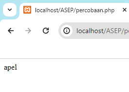

## Apa itu web dinamis dan PHP?
>[!info] Web dinamis merujuk pada jenis situs web yang menggunakan teknologi untuk menghasilkan konten yang berubah secara dinamis berdasarkan interaksi pengguna, data dari database, atau faktor-faktor lainnya. PHP (Hypertext Preprocessor) adalah bahasa pemrograman yang sering digunakan untuk membuat situs web dinamis. Dengan PHP, pengembang dapat membuat halaman web yang dapat berinteraksi dengan database, menghasilkan konten berdasarkan input pengguna, dan melakukan berbagai tugas pemrosesan data lainnya secara dinamis.
## Echo & commentar
Echo adalah sebuah perintah dalam bahasa pemrograman PHP yang digunakan untuk menampilkan teks atau nilai variabel ke dalam halaman web. Ini memungkinkan pengembang untuk menghasilkan output langsung di dalam kode PHP.
```PHP
// Menampilkan teks menggunakan echo
echo "Halo, dunia!";

// Menampilkan nilai variabel menggunakan echo
$nama = "John";
echo "Halo, " . $nama . "!"; // Output: Halo, John!
?>
```

Komentar dalam PHP adalah bagian dari kode yang tidak dieksekusi oleh server web. Mereka digunakan untuk memberikan dokumentasi atau penjelasan tentang kode kepada pengembang atau orang lain yang membaca kode tersebut. Komentar tidak memengaruhi perilaku program dan biasanya dimulai dengan tanda // untuk komentar satu baris atau /* untuk komentar blok.
```PHP
<?php
// Ini adalah contoh komentar satu baris
/*
Ini adalah contoh
komentar blok
*/
```

## Variabel dan konstanta
Variabel digunakan untuk menyimpan data. Anda bisa mendefinisikan variabel menggunakan tanda dollar ==($)== diikuti dengan nama variabelnya, misalnya $nama_variabel.
Contohnya:

```php
//Variabel
$meja = 30;
$tk_kelas = "XI";
$ketua_kelas = "July";
$wali_kelas = "Saleh";
$ketua_gank = "Rahmat";

```

Konstanta didefinisikan dengan menggunakan fungsi define() dan tidak dapat diubah nilainya setelah didefinisikan.
Contohnya:

```Php
//Konstanta
const KEPSEK = "Herwelis";
define('Kelas', 'RPL 1');
```

---
# Php Dasar
# Operator
## Aritmatika
### Penjelasan
Program ini menggunakan operator aritmatika dasar seperti penjumlahan, pengurangan, perkalian, pembagian, sisa bagi, dan pangkat.
### Struktur
```php
<?php
// Program Operator Aritmatika dalam PHP

// 1. Inisialisasi Variabel Input
$a = 10;
$b = 5;

// 2. Operasi Aritmatika
$penjumlahan = $a + $b;
$pengurangan = $a - $b;
$perkalian = $a * $b;
$pembagian = $a / $b;
$sisa_bagi = $a % $b;
$pangkat = $a ** $b;

// 3. Output Hasil
echo "Hasil Penjumlahan: " . $penjumlahan . "\n";
echo "Hasil Pengurangan: " . $pengurangan . "\n";
echo "Hasil Perkalian: " . $perkalian . "\n";
echo "Hasil Pembagian: " . $pembagian . "\n";
echo "Sisa Bagi: " . $sisa_bagi . "\n";
echo "Hasil Pangkat: " . $pangkat . "\n";
?>

```
### Program
```php
<?php

$a = 10;

$b = 5;

$penjumlahan = $a + $b;

$pengurangan = $a - $b;

$perkalian = $a * $b;

$pembagian = $a / $b;

$sisa_bagi = $a % $b;

$pangkat = $a ** $b;

echo "Hasil Penjumlahan: " . $penjumlahan . "\n";

echo "Hasil Pengurangan: " . $pengurangan . "\n";

echo "Hasil Perkalian: " . $perkalian . "\n";

echo "Hasil Pembagian: " . $pembagian . "\n";

echo "Sisa Bagi: " . $sisa_bagi . "\n";

echo "Hasil Pangkat: " . $pangkat . "\n";

?>
```
### Hasil


### analisis
1.  Program ini menggunakan operator aritmatika dasar seperti penjumlahan, pengurangan, perkalian, pembagian, sisa bagi, dan pangkat.
2. Nilai $a dan $b diinisialisasi dengan nilai masing-masing.
3. Kemudian, operasi aritmatika dilakukan menggunakan operator yang sesuai.
4. Hasil dari setiap operasi ditampilkan ke layar.
### Kesimpulan
- Program ini merupakan contoh sederhana dari penggunaan operator aritmatika dalam PHP.
- Meskipun sederhana, program ini mencakup operasi dasar seperti penjumlahan, pengurangan, perkalian, dan lain-lain, yang merupakan fondasi bagi pemrograman komputer.
- Kekurangan dari program ini adalah kurangnya penanganan kesalahan dan validasi input, yang dapat menyebabkan program gagal jika input tidak sesuai.
- Program ini dapat dijadikan sebagai dasar untuk memahami cara menggunakan operator aritmatika dalam PHP dan dapat diperluas dengan penanganan kesalahan atau validasi input sesuai kebutuhan.
---
## Perbandingan
### Penjelasan
perbandingan dalam PHP adalah proses membandingkan dua nilai atau ekspresi untuk menentukan hubungan antara keduanya. Hasil dari perbandingan ini adalah nilai logika (boolean), yang bisa jadi true jika perbandingan benar, atau false jika perbandingan salah.
### Struktur
```PHP
// 1. Deklarasi variabel

$a = 5;

$b = 10;
// 2. Fungsi untuk membandingkan dua angka

function compare($x, $y) {

// 3. Logika perbandingan

    if ($x > $y) {

        return "$x lebih besar dari $y";

    } elseif ($x < $y) {

        return "$x lebih kecil dari $y";

    } else {

        return "$x sama dengan $y";}
}
// 4. Pemanggilan fungsi dan output

echo compare($a, $b);

?>
```
### Program
```PHP

$a = 5;

$b = 10;

function compare($x, $y) {

    if ($x > $y) {

        return "$x lebih besar dari $y";

    } elseif ($x < $y) {

        return "$x lebih kecil dari $y";

    } else {

        return "$x sama dengan $y";

    }

}
echo compare($a, $b);

?>
```
### Hasil

### Analisis
- Dua variabel $a dan $b dideklarasikan dengan nilai 5 dan 10.
Variabel ini digunakan untuk menyimpan nilai yang akan dibandingkan.
- Fungsi compare:
Fungsi ini menerima dua parameter, $x dan $y, yang mewakili nilai yang akan dibandingkan.
- Fungsi ini mengandung logika perbandingan menggunakan operator perbandingan:
untuk memeriksa apakah $x lebih besar dari $y.
< untuk memeriksa apakah $x lebih kecil dari $y.
== untuk memeriksa apakah $x sama dengan $y.
Fungsi mengembalikan string yang menggambarkan hasil perbandingan.
- Pemanggilan Fungsi dan Output:
Fungsi compare dipanggil dengan parameter $a dan $b.
Hasil dari fungsi compare ditampilkan menggunakan echo.
### Kesimpulan Program
- Deklarasi variabel untuk menyimpan nilai yang akan dibandingkan.
- Definisi fungsi yang mengandung logika perbandingan.
- Pemanggilan fungsi tersebut dan penampilan hasilnya

---
## Logika
### Penjelasan
Operator logika digunakan untuk menggabungkan atau memanipulasi hasil dari pernyataan-pernyataan logis. Beberapa operator logika yang umum digunakan dalam PHP adalah:
- && (AND): Operator AND menghasilkan nilai true jika kedua pernyataan logis yang diberikan benar, dan false jika salah satu atau kedua pernyataan tersebut salah.
- || (OR): Operator OR menghasilkan nilai true jika salah satu dari kedua pernyataan logis yang diberikan benar, dan false hanya jika kedua pernyataan tersebut salah.
- ! (NOT): Operator NOT digunakan untuk membalikkan nilai dari sebuah pernyataan logis. Jika suatu pernyataan logis bernilai true, operator NOT akan mengubahnya menjadi false, dan sebaliknya.
### Struktur
```php
<?php
// 1. Inisialisasi Variabel
$umur = 25;
$status = "mahasiswa";

// 2. Pernyataan Logika dan Pernyataan Pengkondisian
if ($umur >= 18 && $status == "mahasiswa") {
    // Blok kode yang akan dieksekusi jika kedua kondisi terpenuhi
    echo "Anda adalah mahasiswa dewasa.";
} elseif ($umur < 18 || $status != "mahasiswa") {
    // Blok kode yang akan dieksekusi jika salah satu dari kondisi tersebut tidak terpenuhi
    echo "Anda bukan mahasiswa dewasa.";
}

// 3. Pesan Output (Opsional)
?>
```
### Program
```PHP
<?php
$umur = 20;
$status = "mahasiswa";
if ($umur >= 18 && $status == "mahasiswa") {
    echo "Anda adalah mahasiswa dewasa.";
} elseif ($umur < 18 || $status != "mahasiswa") {
    echo "Anda bukan mahasiswa dewasa.";
}

?>
```
### Hasil

### Analisis
- Program di atas mengevaluasi dua kondisi: apakah seseorang berumur 18 tahun atau lebih, dan apakah statusnya adalah "mahasiswa".
- Jika kedua kondisi tersebut terpenuhi (umur lebih dari atau sama dengan 18 dan status adalah "mahasiswa"), pesan "Anda adalah mahasiswa dewasa." akan ditampilkan.
- Jika salah satu dari dua kondisi tersebut tidak terpenuhi (umur kurang dari 18 atau status bukan "mahasiswa"), pesan "Anda bukan mahasiswa dewasa." yang akan ditampilkan
### Kesimpulan Program
Program ini mengilustrasikan penggunaan operator logika dalam PHP untuk mengevaluasi kondisi-kondisi yang kompleks. Dengan menggunakan operator logika, kita dapat membuat pernyataan-pernyataan logis yang kompleks untuk membuat keputusan berdasarkan pada berbagai kondisi.

---
# Conditional Statement
## IF
### Penjelasan
If digunakan untuk mengeksekusi blok kode jika kondisi tertentu benar.
### Struktur
```php
if (kondisi){
// kode yang akan di eksekusi jika kondisi benar
```
### Program
```php
$umur = 18;
if($umur >= 18) {
echo "Anda sudah dewasa";
}
```

### Hasil

### Analisis
Jika umur lebih besar atau sama dengan 18, pesan "Anda sudah dewasa" akan dicetak. Jika tidak, pesan "Anda masih di bawah umur" akan dicetak.
### Kesimpulan Program
Digunakan untuk mengambil keputusan alternatif berdasarkan kondisi tertentu. Memberikan kemungkinan eksekusi kode lain jika kondisi pertama tidak terpenuhi.

---
## IF-ELSE
### Penjelasan
If else digunakan untuk mengeksekusi blok kode jika kondisi benar, dan blok kode lain jika kondisi salah.
### Struktur
```php
if (kondisi) {
    // kode yang akan dieksekusi jika kondisi benar
} else {
    // kode yang akan dieksekusi jika kondisi salah
}
```
### Program
```php
<?php
$umur = 15;
if ($umur >= 18) {
    echo "Anda sudah dewasa";
} else {
    echo "Anda masih di bawah umur";
}
?>
```
### Hasil

### Analisis
Jika umur lebih besar atau sama dengan 18, pesan "Anda sudah dewasa" akan dicetak. Jika tidak, pesan "Anda masih di bawah umur" akan dicetak.
Kesimpulan: If else digunakan untuk mengambil keputusan alternatif berdasarkan kondisi.
### Kesimpulan Program
Digunakan untuk mengambil keputusan alternatif berdasarkan kondisi tertentu. Memberikan kemungkinan eksekusi kode lain jika kondisi pertama tidak terpenuhi.

---
## IF-ELSE IF-ELSE
### Penjelasan
If else if else digunakan untuk mengeksekusi salah satu blok kode dari beberapa blok kode alternatif, tergantung pada kondisi yang memenuhi syarat pertama
### Struktur
```PHP
if (kondisi1){
} elseif(kondisi2){
}else {}
```
### Program
```php
$nilai = 75;
if ($nilai => 80) {
echo "Nilai Anda A";
}elseif(nilai >= 70){
echo "Nilai Anda B";
} else {
echo "Nilai Anda C";
}
```
### Hasil

### Analisis
Jika nilai lebih besar atau sama dengan 80, pesan "Nilai Anda A" akan dicetak. Jika tidak, jika nilai lebih besar atau sama dengan 70, pesan "Nilai Anda B" akan dicetak. Jika tidak memenuhi kedua kondisi tersebut, pesan "Nilai Anda C" akan dicetak.
Kesimpulan: If else if else digunakan untuk mengambil keputusan alternatif berdasarkan beberapa kondisi.
### Kesimpulan Program
Digunakan untuk mengambil keputusan alternatif berdasarkan beberapa kondisi yang berbeda. Cocok digunakan ketika terdapat beberapa kemungkinan hasil yang bisa terjadi.

---
## SWITCH CASE
### Penjelasan
Switch case digunakan untuk mengevaluasi ekspresi yang mungkin memiliki beberapa nilai dan menjalankan blok kode yang sesuai dengan nilai yang cocok.
### Struktur
```php
switch (ekspresi) {
    case nilai1:
        // kode yang akan dieksekusi jika ekspresi == nilai1
        break;
    case nilai2:
        // kode yang akan dieksekusi jika ekspresi == nilai2
        break;
    ...
    default:
        // kode yang akan dieksekusi jika ekspresi tidak cocok dengan nilai apapun
}

```
### Program
```php
// Variabel untuk contoh

$hari = "Senin";
// Statement switch-case

switch ($hari) {

    case "Senin":

        echo "Hari ini adalah hari Senin.";

        break;

    case "Selasa":

        echo "Hari ini adalah hari Selasa.";

        break;

    case "Rabu":

        echo "Hari ini adalah hari Rabu.";

        break;

    case "Kamis":

        echo "Hari ini adalah hari Kamis.";

        break;

    case "Jumat":

        echo "Hari ini adalah hari Jumat.";

        break;

    case "Sabtu":

        echo "Hari ini adalah hari Sabtu.";

        break;

    case "Minggu":

        echo "Hari ini adalah hari Minggu.";

        break;

    default:

        echo "Hari tidak valid.";

}
```
### Hasil

### Analisis
Switch case memberikan kejelasan dalam menyatakan serangkaian pilihan.
Kesimpulan: Switch case berguna dalam membuat kode yang mudah dibaca dan dapat digunakan dalam PHP untuk mengevaluasi ekspresi dengan beberapa kemungkinan nilai.
### Kesimpulan Program
Memberikan kejelasan dalam menyatakan serangkaian pilihan dan memungkinkan eksekusi kode yang berbeda berdasarkan nilai dari sebuah ekspresi. Namun, perlu diingat bahwa struktur ini tidak tersedia secara bawaan dalam PHP, namun dapat disimulasikan dengan menggunakan if else.

---
# Array
## Array 1 dimensi
### Penjelasan
Array 1 dimensi adalah kumpulan nilai yang disimpan dalam satu variabel. Setiap nilai di dalam array diakses menggunakan indeks numerik yang dimulai dari 0.
### Struktur
```php
$array = [nilai1, nilai2, nilai3, ];
```
### Program
```php
$buah = ["apel", "pisang", "jeruk"];
echo $buah[0]; // Output: apel
```
### Hasil

### Analisis
Array 1 dimensi cocok digunakan ketika data yang akan disimpan adalah kumpulan nilai tunggal dan mudah diindeks.
### Kesimpulan Program
Array 1 dimensi cocok digunakan untuk menyimpan kumpulan nilai tunggal yang diakses menggunakan indeks numerik.

---
## Array Assosiatif
### Penjelasan
Array asosiatif adalah kumpulan pasangan kunci-nilai, di mana setiap nilai diakses menggunakan kunci yang ditetapkan pengguna.
### Struktur
```php
$array = ["kunci1" => nilai1, "kunci2" => nilai2, "kunci3" => nilai3, ...];
```
### Program
```php
<?php

// Array asosiatif berisi informasi mahasiswa

$siswa = array(

    array(

        "nama" => "Muh.Taufik",

        "jurusan" => "Teknik Informatika"

    ),

    array(

        "nama" => "Zhafran",

        "jurusan" => "TKJ"

    ),

    array(

        "nama" => "jordan",

        "jurusan" => "RPL 1"

    )

);

  

// Menampilkan informasi mahasiswa

foreach ($siswa as $mhs) {

    echo "Nama: " . $mhs["nama"] . "\n";

    echo "Jurusan: " . $mhs["jurusan"] . "\n";

}

?>
```
### Hasil

### Analisis

1. **Struktur Data**:
- Kode ini menggunakan array asosiatif untuk menyimpan data mahasiswa. Setiap mahasiswa diwakili oleh sebuah array asosiatif dengan kunci `nama` dan `jurusan`.
-  Array utama `$siswa` berisi beberapa array asosiatif yang masing-masing mewakili satu mahasiswa.
2. **Perulangan `foreach`**:
- Perulangan `foreach` digunakan untuk mengiterasi setiap elemen dalam array `$siswa`.
- Pada setiap iterasi, elemen array disimpan dalam variabel `$mhs`, dan kemudian nilai dari kunci `nama` dan `jurusan` dicetak menggunakan `echo`.
3. **Output Format**:
- Setiap iterasi mencetak dua baris output: satu untuk nama dan satu lagi untuk jurusan mahasiswa.
- Penggunaan `\n` untuk memulai baris baru memastikan bahwa setiap informasi mahasiswa dicetak pada baris yang berbeda.
### Kesimpulan

1. **Keterbacaan dan Struktur**:
    - Kode ini mudah dibaca dan dipahami karena menggunakan struktur array asosiatif yang jelas dan perulangan yang sederhana.
    - Penamaan variabel dan penggunaan array asosiatif memberikan deskripsi yang jelas tentang data yang disimpan dan diolah.
2. **Fleksibilitas dan Ekstensibilitas**:
    - Struktur array asosiatif memungkinkan untuk dengan mudah menambahkan lebih banyak informasi mahasiswa tanpa perlu mengubah logika utama program.
    - Jika ingin menambahkan informasi lain seperti `umur` atau `alamat`, cukup tambahkan elemen baru ke dalam array asosiatif untuk setiap mahasiswa.
3. **Konsistensi Format**:
    - Kode ini menghasilkan output yang terformat dengan baik dan konsisten, dengan setiap informasi mahasiswa dicetak pada dua baris terpisah.
    - Memastikan bahwa semua nama dimulai dengan huruf kapital akan meningkatkan konsistensi dan profesionalisme dalam penyajian data.
4. **Pemrosesan Data**:
    - Kode ini dapat dengan mudah dimodifikasi untuk melakukan pemrosesan data yang lebih kompleks, seperti pengelompokan mahasiswa berdasarkan jurusan atau pencarian mahasiswa berdasarkan nama.

---
## Array Multidimensi 
### Penjelasan
Array multidimensi adalah array yang berisikan array di dalamnya.
### Struktur
```php
$nama_array = array(
    array(nilai1, nilai2, nilai3, ...),
    array(nilai1, nilai2, nilai3, ...),
    array(nilai1, nilai2, nilai3, ...),
);
```
### Program
```php
<?php
// Array Multidimensi
$matriks = array(
    array(1, 2, 3),
    array(4, 5, 6),
    array(7, 8, 9)
);

// Menampilkan isi array
echo "Matriks:<br>";
foreach ($matriks as $baris) {
    foreach ($baris as $nilai) {
        echo $nilai . " ";
    }
    echo "<br>";
}
?>
```
### Hasil

### Analisis
- Variabel $matriks adalah variabel yang menyimpan array multidimensi.
- Setiap elemen array dalam $matriks adalah array sendiri yang merepresentasikan baris dalam matriks.
### Kesimpulan Program
Array multidimensi di PHP memungkinkan kita untuk menyimpan data dalam struktur data yang lebih kompleks seperti matriks atau tabel.

---
# Var_dump
## Penjelasan
- Fungsi var_dump mengambil satu atau lebih variabel sebagai argumen dan mencetak informasi tentang tipe dan nilai dari setiap variabel tersebut.
- Informasi yang dicetak mencakup tipe data (misalnya, integer, string, array), panjang (jika berlaku), dan nilai variabel.
## struktur
```php
<?php
// 1. Inisialisasi Variabel
$angka = ;
$kata = " ";
$array = array(1, 2, 3);

// 2. Pemanggilan var_dump
var_dump($angka);
var_dump($kata);
var_dump($array);

// 3. Pesan Output (Opsional)
echo "Ini adalah contoh penggunaan var_dump";
?>


```
## program
```php
<?php
$angka = 10;
$kata = "Hello";
$array = array(1, 2, 3);

var_dump($angka);
var_dump($kata);
var_dump($array);
echo "Ini adalah contoh penggunaan var_dump";
?>
```
## hasil

## analisis
- Program ini menginisialisasi beberapa variabel, yaitu $angka, $kata, dan $array.
- Fungsi var_dump dipanggil untuk masing-masing variabel, yang akan mencetak informasi rinci tentang tipe dan nilai dari setiap variabel tersebut.
- Setelah itu, pesan "Ini adalah contoh penggunaan var_dump" ditampilkan.
### Kesimpulan
Program ini menggunakan fungsi var_dump untuk mencetak informasi detail tentang variabel-variabel yang diberikan. Hal ini berguna untuk debug dan analisis kode, karena memberikan informasi yang lebih lengkap tentang variabel-variabel tersebut.

---
# Looping (Perulangan)
## For
### Penjelasan
Pengulangan for digunakan ketika kita ingin mengeksekusi blok kode sejumlah tertentu kali
### Struktur
```php
<?php

// Fungsi untuk mengecek apakah sebuah bilangan adalah bilangan prima
function isPrime($number) {
    if ($number <= 1) {
        return false; // Jika bilangan <= 1, bukan bilangan prima
    }
    for ($i = 2; $i <= sqrt($number); $i++) { // Periksa pembagi dari 2 hingga akar kuadrat dari bilangan
        if ($number % $i == 0) { // Jika ada pembagi, bukan bilangan prima
            return false;
        }
    }
    return true; // Jika tidak ada pembagi, bilangan adalah prima
}
// Menampilkan semua bilangan prima dari 1 sampai 100
echo "Bilangan prima antara 1 sampai 100 adalah:\n";
for ($i = 1; $i <= 100; $i++) { // Iterasi dari 1 hingga 100
    if (isPrime($i)) { // Jika bilangan prima, cetak bilangan
        echo $i . " ";}}
?>
```
### Program
```php
// Fungsi untuk mengecek apakah sebuah bilangan adalah bilangan prima
function isPrime($number) {
    if ($number <= 1) {
        return false;
    }
    for ($i = 2; $i <= sqrt($number); $i++) {
        if ($number % $i == 0) {
            return false;
        }
    }
    return true;
}
// Menampilkan semua bilangan prima dari 1 sampai 100
echo "Bilangan prima antara 1 sampai 100 adalah:\n";
for ($i = 1; $i <= 100; $i++) {
    if (isPrime($i)) {
        echo $i . " ";
    }
}

```
### Hasil

### Analisis
1. **Fungsi `isPrime($number)`**:
- **Parameter**: Fungsi ini menerima satu parameter, yaitu `$number`.
- **Penanganan Kasus Khusus**: Jika `$number` kurang dari atau sama dengan 1, fungsi akan mengembalikan `false` karena bilangan kurang dari atau sama dengan 1 bukanlah bilangan prima.
- **Perulangan**: Fungsi menggunakan perulangan `for` untuk mengecek pembagian dari 2 hingga akar kuadrat dari `$number`. Jika `$number` habis dibagi oleh bilangan manapun dalam rentang tersebut, fungsi akan mengembalikan `false`.
- **Mengembalikan Nilai**: Jika tidak ada pembagi yang ditemukan dalam rentang tersebut, fungsi mengembalikan `true`, menandakan bahwa `$number` adalah bilangan prima.

2. **Menampilkan Bilangan Prima**:
- **Pesan Awal**: Sebuah pesan dicetak untuk memberitahu bahwa bilangan prima antara 1 sampai 100 akan ditampilkan.
- **Perulangan**: Perulangan `for` digunakan untuk iterasi dari 1 sampai 100. Pada setiap iterasi, fungsi `isPrime($i)` dipanggil untuk mengecek apakah bilangan tersebut adalah bilangan prima.
- **Menampilkan Bilangan Prima**: Jika `isPrime($i)` mengembalikan `true`, bilangan tersebut dicetak dengan spasi sebagai pemisah.
### Kesimpulan Program
1. **Implementasi Fungsi yang Efisien**:
    - Fungsi `isPrime($number)` diimplementasikan dengan cara yang efisien dengan hanya memeriksa pembagi hingga akar kuadrat dari `$number`. Ini mengurangi jumlah perulangan yang diperlukan untuk menentukan apakah sebuah bilangan adalah prima.
2. **Kemudahan dalam Penggunaan**:
    - Kode utama untuk menampilkan bilangan prima dari 1 hingga 100 sangat sederhana dan mudah dipahami, hanya terdiri dari perulangan `for` dan pemanggilan fungsi `isPrime`.
3. **Hasil yang Benar**:
    - Kode ini akan menghasilkan daftar semua bilangan prima antara 1 dan 100, yang akan mencakup: 2, 3, 5, 7, 11, 13, 17, 19, 23, 29, 31, 37, 41, 43, 47, 53, 59, 61, 67, 71, 73, 79, 83, 89, 97.
4. **Struktur yang Terorganisir**:
    - Pemisahan logika pengecekan bilangan prima ke dalam fungsi `isPrime` membuat kode lebih terorganisir dan dapat digunakan kembali untuk keperluan lain yang membutuhkan pengecekan bilangan prima.
---
## While 
### Penjelasan
Pengulangan while digunakan ketika kita ingin mengeksekusi blok kode selama suatu kondisi terpenuhi.
### Struktur
```php
php
while ($kondisi) {
    // blok kode yang akan diulang
}
```
### Program
```php
<?php
$count = 0;
while ($count < 20) {
echo "Pengulangan Ke: $count <br>";
$count++;
}
?>
```
### Hasil

### Analisis
- Variabel $count diinisialisasi dengan nilai 0.
- Blok kode dalam pengulangan while akan dieksekusi selama nilai $count kurang dari 20.
- Setiap kali blok kode dieksekusi, program mencetak nomor yang diikuti dengan nilai variabel $count.
- Setelah mencetak nomor, nilai $count akan bertambah satu.
### Kesimpulan Program
Pengulangan while digunakan ketika kita tidak tahu berapa kali blok kode harus diulang tetapi kita tahu kondisi berhenti.

---
## Do-while
### Penjelasan
Pengulangan do-while hampir sama dengan while, namun blok kode akan dieksekusi setidaknya satu kali, bahkan jika kondisi awalnya salah.
### Struktur
```php
do {
    // blok kode yang akan diulang
} while ($kondisi);

```
### Program
```php
<?php
$count = 0;
do {
echo "Nomor: $count <br>";
$count++;
} while ($count < 10);
?>
```
### Hasil

### Analisis
- Variabel $count diinisialisasi dengan nilai 0.
- Blok kode dalam pengulangan do-while akan dieksekusi setidaknya satu kali, karena kondisi tidak diuji hingga setelah blok kode dieksekusi.
- Setiap kali blok kode dieksekusi, program mencetak nomor yang diikuti dengan nilai variabel $count.
- Setelah mencetak nomor, nilai $count akan bertambah satu.
- Pengulangan akan terus berlanjut selama nilai $count kurang dari 10.
### Kesimpulan Program
Pengulangan do-while cocok ketika kita ingin blok kode dieksekusi setidaknya satu kali, bahkan jika kondisi tidak terpenuhi.

---
## Foreach
### Penjelasan
Pengulangan foreach digunakan untuk mengeksekusi blok kode untuk setiap elemen dalam array atau objek
### Struktur
```php
foreach ($array as $nilai) {
    // blok kode yang akan diulang
}
```
### Program
```php
<?php
$hewan = array("monyet", "orang utan", "kera");
foreach ($hewan as $nama) {
echo "nama hewan: $nama <br>";
}
?>
```
### Hasil

### Analisis
- Variabel $hewan adalah array yang berisi beberapa nama hewan.
- Pengulangan foreach akan mengulangi setiap elemen dalam array hewan.
- Setiap elemen dalam array akan disimpan dalam variabel $nama.
- Setiap iterasi, program mencetak "Nama hewan:" diikuti dengan nilai variabel
### Kesimpulan Program
Pengulangan foreach sangat berguna untuk mengulangi setiap elemen dalam array atau objek tanpa perlu mengkhawatirkan indeks atau menghitung jumlah elemen.

---
# Function
### Penjelasan
Fungsi dalam PHP adalah blok kode yang dapat dipanggil berulang kali di dalam program untuk melakukan tugas tertentu. Fungsi memungkinkan untuk mengorganisir kode secara lebih baik, mengurangi duplikasi kode, dan membuat kode lebih mudah dipahami.
### Struktur
```php
<?php
// Fungsi untuk mengecek apakah sebuah bilangan adalah genap

function isEven($number) {

    return $number % 2 == 0;
}
// Menggunakan fungsi untuk mengecek beberapa bilangan

$numbers = [1, 2, 3, 4, 5, 6, 7, 8, 9, 10];
foreach ($numbers as $num) {
    if (isEven($num)) {
        echo "$num adalah bilangan genap\n";
    } else {
        echo "$num adalah bilangan ganjil\n";
    }
}
?>
```
### Program
```php
<?php
function isEven($number) {
    return $number % 2 == 0;
}
$numbers = [1, 2, 3, 4, 5, 6, 7, 8, 9, 10];
foreach ($numbers as $num) {
    if (isEven($num)) {
        echo "$num adalah bilangan genap\n";
    } else {
        echo "$num adalah bilangan ganjil\n";
    }
}
?>
```
### Hasil

### Analisis
1. **Fungsi `isEven`**:
    - Fungsi ini mengecek apakah sebuah bilangan adalah genap dengan memeriksa apakah sisa hasil bagi bilangan tersebut dengan 2 adalah 0. Jika iya, fungsi mengembalikan `true`, menandakan bilangan tersebut adalah genap.
2. **Array Bilangan**:
    - Array `$numbers` berisi daftar bilangan yang akan dicek apakah masing-masing bilangan adalah genap atau ganjil.
3. **Perulangan `foreach`**:
    - Perulangan ini mengiterasi setiap elemen dalam array `$numbers`. Pada setiap iterasi, fungsi `isEven` digunakan untuk mengecek apakah bilangan saat ini adalah genap.
    - Jika bilangan tersebut genap, pesan `<bilangan>` adalah bilangan genap" dicetak. Jika tidak, pesan `<bilangan>` adalah bilangan ganjil" dicetak.
4. Output:
    - Program ini akan mencetak hasil pengecekan genap atau ganjil untuk setiap bilangan dalam array, dengan format yang mudah dibaca.
### Kesimpulan program
1. **Pemisahan Logika ke dalam Fungsi**:
    - Fungsi `isEven` secara efektif memisahkan logika pengecekan bilangan genap dari logika utama program. Ini membuat kode lebih modular, terorganisir, dan mudah untuk digunakan kembali.
2. **Efisiensi Pengecekan**:
    - Fungsi `isEven` menggunakan operator modulus (`%`) untuk menentukan apakah sebuah bilangan adalah genap. Ini adalah metode yang sederhana dan efisien untuk melakukan pengecekan ini.
3. **Penggunaan Perulangan `foreach`**:
    - Perulangan `foreach` digunakan untuk mengiterasi array `$numbers`. Ini membuat kode lebih bersih dan lebih mudah dibaca dibandingkan dengan menggunakan perulangan `for` tradisional, terutama ketika bekerja dengan array.
4. **Output yang Jelas dan Terstruktur**:
    - Program ini mencetak hasil pengecekan dalam format yang jelas dan mudah dibaca, menunjukkan apakah masing-masing bilangan adalah genap atau ganjil.
5. **Kemudahan Pengembangan dan Pemeliharaan**:
    - Struktur program yang modular dan terorganisir mempermudah pengembangan lebih lanjut dan pemeliharaan kode. Misalnya, fungsi `isEven` dapat dengan mudah diperluas atau dimodifikasi tanpa mengubah logika utama program.
6. **Contoh Praktis Penggunaan Fungsi**:
    - Program ini adalah contoh praktis bagaimana fungsi dapat digunakan untuk tugas-tugas spesifik dalam pemrograman PHP, memberikan gambaran yang baik tentang bagaimana memanfaatkan fungsi untuk membuat kode lebih terstruktur dan modular.

---

# PHP Form
## GET Method
### Penjelasan
Metode GET adalah salah satu dari dua metode HTTP yang umum digunakan untuk mengirimkan data dari klien ke server. Ketika metode GET digunakan, data dikirim sebagai bagian dari URL. Ini adalah metode yang sering digunakan untuk mengambil data dari server, misalnya, ketika mengirimkan data formulir seperti dalam contoh program di atas.
### struktur
```php
<!DOCTYPE html>
<html lang="en">
<head>
    <meta charset="UTF-8">
    <meta name="viewport" content="width=device-width, initial-scale=1.0">
    <title>GET Method</title>
</head>
<body>
    <h2>GetMethod</h2>
    <form action="php.php" method="get">
        <label for="name">Name:</label><br>
        <input type="text" id="name" name="name"><br>
        <label for="email">Email:</label><br>
        <input type="text" id="email" name="email"><br><br>
        <input type="submit" value="Submit">
    </form>
    <?php
    // Mengecek apakah ada data yang dikirim melalui metode GET
    if (isset($_GET['name']) && isset($_GET['email'])) {
        $name = $_GET['name'];
        $email = $_GET['email'];
        echo "<h2>Proses Data</h2>";
        echo "Name: $name <br>";
        echo "Email: $email";
    } else {
        echo "<p>Tidak ada data</p>";
    }
    ?>
</body>
</html>
```
### Program
```php
<!DOCTYPE html>
<html lang="en">
<head>
    <meta charset="UTF-8">
    <meta name="viewport" content="width=device-width, initial-scale=1.0">
    <title>GET Method</title>
</head>
<body>
    <h2>GetMethod</h2>
    <form action="php.php" method="get">
        <label for="name">Name:</label><br>
        <input type="text" id="name" name="name"><br>
        <label for="email">Email:</label><br>
        <input type="text" id="email" name="email"><br><br>
        <input type="submit" value="Submit">
    </form>
    <?php
    // Mengecek apakah ada data yang dikirim melalui metode GET
    if (isset($_GET['name']) && isset($_GET['email'])) {
        $name = $_GET['name'];
        $email = $_GET['email'];
        echo "<h2>Proses Data</h2>";
        echo "Name: $name <br>";
        echo "Email: $email";
    } else {
        echo "<p>Tidak ada data</p>";
    }
    ?>
</body>
</html>
```
### Hasil

### Analisis
1. Program di atas adalah halaman web sederhana yang memiliki formulir HTML dengan dua input: "Name" dan "Email".
2. Form tersebut memiliki atribut method="get", yang berarti data formulir akan dikirimkan melalui metode GET.
3. Ketika pengguna mengisi formulir dan menekan tombol "Submit", data yang dimasukkan akan dikirimkan sebagai bagian dari URL ke halaman "Php.php".
4. Di dalam kode PHP di halaman "Php.php", program memeriksa apakah ada data yang diterima melalui metode GET.
5. Jika ada data yang diterima, program akan mengambil nilai "Name" dan "Email" dari URL dan menampilkannya sebagai "Processed Data".
6. Jika tidak ada data yang diterima, program akan menampilkan pesan "No data received".
### Kesimpulan Program
Program ini adalah contoh sederhana penggunaan metode GET dalam pemrosesan formulir web. Pengguna dapat mengisi formulir dengan nama dan email, kemudian data tersebut dikirimkan melalui URL ke halaman PHP untuk diproses. Setelah itu, halaman PHP menampilkan kembali data yang telah diproses. Dengan demikian, pengguna dapat melihat kembali data yang telah mereka masukkan ke dalam formulir.

---
## POST Method
### Penjelasan
Metode POST adalah salah satu dari dua metode HTTP yang umum digunakan untuk mengirimkan data dari klien (biasanya browser web) ke server web. Ketika metode POST digunakan, data dikirimkan dalam badan permintaan HTTP, bukan sebagai bagian dari URL seperti pada metode GET. Ini membuat metode POST lebih cocok untuk mengirim data yang lebih sensitif atau data yang memiliki ukuran yang besar.
### struktur
```php
<!DOCTYPE html>
<html lang="en">
<head>
    <meta charset="UTF-8">
    <meta name="viewport" content="width=device-width, initial-scale=1.0">
    <title>POST Method</title>
</head>
<body>
    <h2>PHP Form POST</h2>
    <form action="Php.php" method="post">
        <label for="name">Name:</label><br>
        <input type="text" id="name" name="name"><br>
        <label for="email">Email:</label><br>
        <input type="text" id="email" name="email"><br><br>
        <input type="submit" value="Submit">
    </form>
    <?php
    // Mengecek apakah ada data yang dikirim melalui metode POST
    if ($_SERVER["REQUEST_METHOD"] == "POST") {
        if (!empty($_POST['name']) && !empty($_POST['email'])) {
            $name = $_POST['name'];
            $email = $_POST['email'];
            echo "<h2>Processed Data</h2>";
            echo "Name: $name <br>";
            echo "Email: $email";
        } else {
            echo "<p>Please fill in all fields</p>";
        }
    }
    ?>
</body>
</html>
```
### Program
```php
<!DOCTYPE html>
<html lang="en">
<head>
    <meta charset="UTF-8">
    <meta name="viewport" content="width=device-width, initial-scale=1.0">
    <title>POST Method</title>
</head>
<body>
    <h2>PHP Form POST</h2>
    <form action="Php.php" method="post">
        <label for="name">Name:</label><br>
        <input type="text" id="name" name="name"><br>
        <label for="email">Email:</label><br>
        <input type="text" id="email" name="email"><br><br>
        <input type="submit" value="Submit">
    </form>
    <?php
    // Mengecek apakah ada data yang dikirim melalui metode POST
    if ($_SERVER["REQUEST_METHOD"] == "POST") {
        if (!empty($_POST['name']) && !empty($_POST['email'])) {
            $name = $_POST['name'];
            $email = $_POST['email'];
            echo "<h2>Processed Data</h2>";
            echo "Name: $name <br>";
            echo "Email: $email";
        } else {
            echo "<p>Please fill in all fields</p>";
        }
    }
    ?>
</body>
</html>
```
### Hasil

### Analisis
1. *Fungsionalitas*: Program ini berfungsi sebagai halaman web yang memungkinkan pengguna untuk mengisi formulir dengan nama dan email. Setelah pengguna mengisi formulir dan mengirimkannya, program akan memproses data yang dikirimkan dan menampilkannya kembali sebagai "Processed Data" jika formulir diisi dengan benar.
    
2. *Kode HTML*: Program menggunakan HTML untuk membangun struktur halaman web dan formulir. Formulir tersebut memiliki atribut action yang menunjuk ke halaman Php.php, yang artinya data akan dikirimkan ke halaman tersebut untuk diproses. Penggunaan tag <``label``> dan <`input`> membuat formulir lebih mudah dipahami oleh pengguna.
    
3. *Metode Pengiriman Data*: Program menyediakan dua versi: satu dengan metode GET dan satu dengan metode POST. Metode GET mengirimkan data sebagai bagian dari URL, sementara metode POST mengirimkan data dalam badan permintaan HTTP. Penggunaan metode POST lebih disukai untuk mengirim data sensitif seperti kata sandi karena data tidak terlihat di URL.
    
4. *Kode PHP*: Di dalam kode PHP, program melakukan pemeriksaan terhadap data yang diterima. Jika data yang diterima valid, program akan menampilkan kembali data tersebut sebagai "Processed Data". Namun, jika ada input yang kosong, program akan menampilkan pesan kesalahan yang sesuai.
    
5. *Validasi Data*: Program melakukan validasi sederhana untuk memastikan bahwa kedua input, yaitu nama dan email, tidak kosong sebelum memprosesnya. Ini membantu memastikan bahwa data yang dikirimkan ke server valid sebelum diproses lebih lanjut.
    
6. *Tampilan Responsif*: Program juga memiliki tampilan yang responsif dengan menggunakan tag <`meta name="viewport" content="width=device-width, initial-scale=1.0"`>. Ini membantu agar halaman web dapat ditampilkan dengan baik di berbagai perangkat.
    
7. *Keamanan*: Penggunaan metode POST untuk mengirim data membantu meningkatkan keamanan formulir karena data tidak terlihat langsung di URL. Namun, program ini tidak memberikan perlindungan penuh terhadap serangan seperti SQL injection atau cross-site scripting (XSS), sehingga diperlukan tindakan tambahan untuk melindungi formulir dari serangan tersebut.
### Kesimpulan Program
Program ini adalah contoh penggunaan metode POST dalam formulir web untuk mengumpulkan dan memproses data dari pengguna. Dengan menggunakan metode POST, data formulir dikirimkan secara aman dan tidak terlihat langsung di URL. Ini meningkatkan keamanan formulir, terutama jika data yang dikirimkan sensitif seperti kata sandi.