# Data Tabel
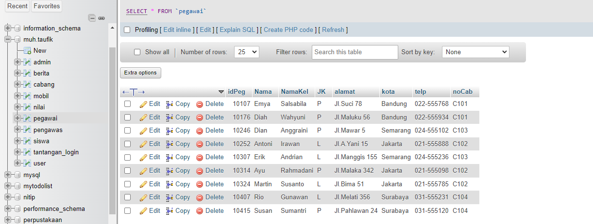
## Perubahan Struktur Tabel
### Before
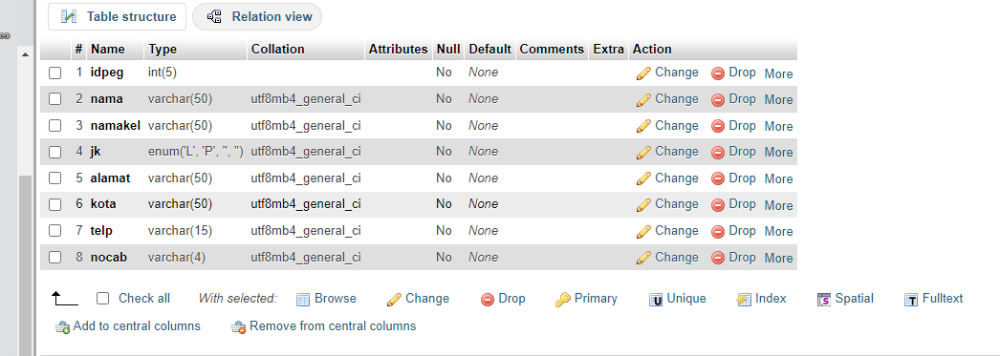
### After
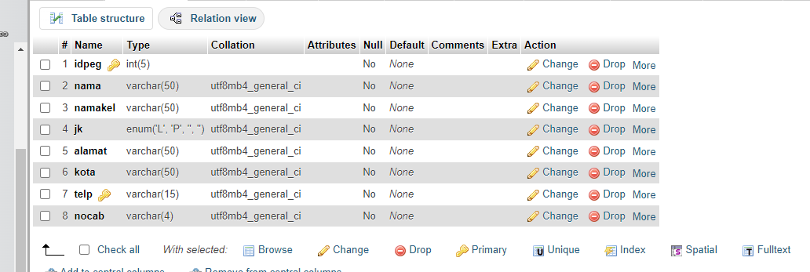

## Perubahan Data Tabel Pegawai Dan Cabang

### Pegawai
#### Before

#### After
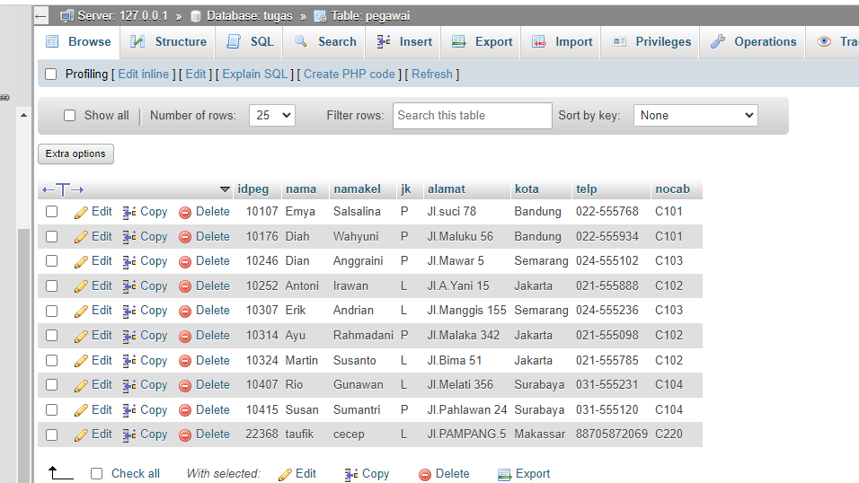
### Cabang
#### Before
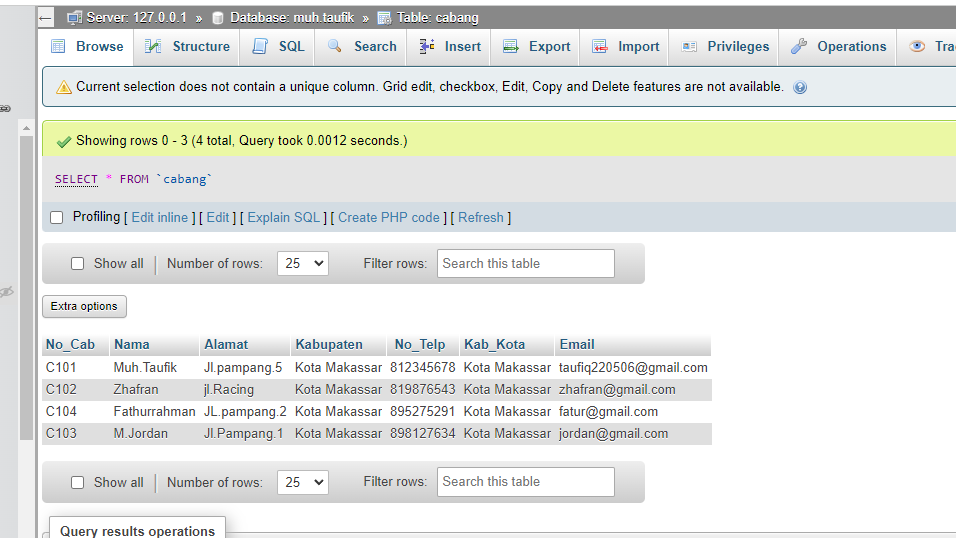
#### After
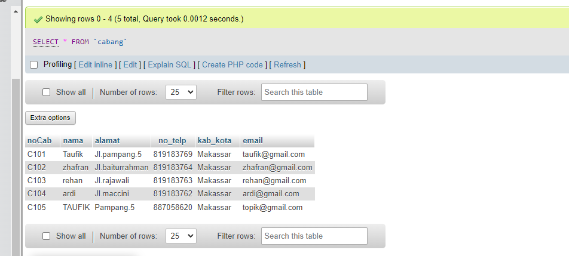

## Relasi Tabel Pengawas & Siswa

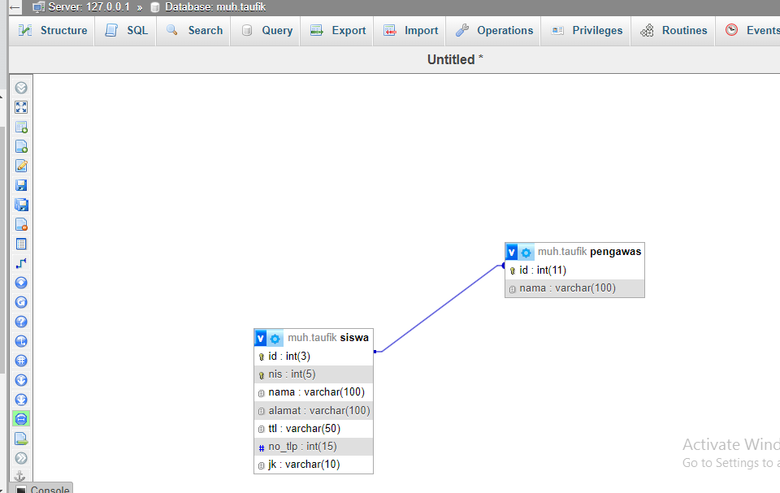

## Query dan Hasil

### Query
```php
select s.nama,n.nilai from nilai AS n INNER JOIN siswa AS s ON s.nis
WHERE n.nilai > 75;
```
### Hasil
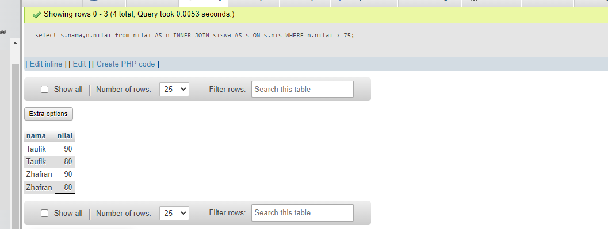

___
# Tugas Group By Having

## 1.tampilkan jumlah data mobil dan kelompok kan berdasarkan warna nya sesuai dengan tabel mobil kalian.

## Struktur Query
```mysql
select nama_data,COUNT(nama_data) AS nama_sementara FROM nama_tabel GROUP BY nama_data;
```
### Query
```mysql
select warna,COUNT(id_mobil) AS Jumlah_Data_Mobil FROM data_mobil GROUP BY warna;
```
### Hasil
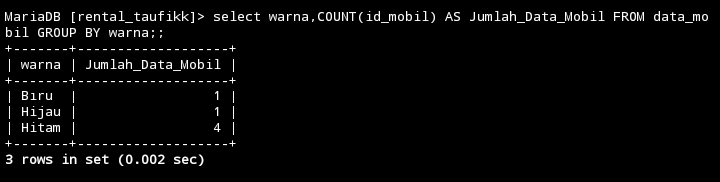

### Analisis
- ``SELECT Klausa :``
warna: Memilih kolom warna dari tabel data_mobil.
- ``COUNT(id_mobil) AS Jumlah_Data_Mobil:
Menghitung jumlah baris (mobil) untuk setiap warna unik dan memberi alias Jumlah_Data_Mobil pada hasil hitungan tersebut.
- ``FROM Klausa:``
data_mobil: Menentukan tabel data_mobil sebagai sumber data.
- ``GROUP BY Klausa:``
warna: Mengelompokkan hasil query berdasarkan nilai di kolom warna. Setiap nilai unik dalam kolom warna akan menjadi satu grup.
___
## 2.berdasarkan query ini tampilkan yang lebih BESAR dari 3 atau sama dengan 3 pemilik mobil nya

## Struktur Query
```mysql
select nama_data,COUNT(nama_data) AS nama_sementara from nama_tabel GROUP BY nama_data HAVING COUNT(nama_data) >= 3;
```
### Query
```mysql
select pemilik,COUNT(id_mobil) AS jumlah_mobil from data_mobil GROUP BY pemilik HAVING COUNT(id_mobil) >= 3;
```
### Hasil

### Analisis
1. SELECT Klausa
pemilik: Kolom ini dipilih dari tabel data_mobil. Kolom pemilik berisi data tentang pemilik mobil.
2. COUNT(id_mobil) AS jumlah_mobil: Fungsi agregat COUNT digunakan untuk menghitung jumlah baris dalam setiap grup yang memiliki pemilik yang sama. Hasil hitungan ini diberi alias jumlah_mobil, sehingga dalam hasil akhir, kolom ini akan diberi nama jumlah_mobil.
3. FROM Klausa data_mobil: Tabel ini merupakan sumber data dari query. Tabel ini diasumsikan berisi data mobil, termasuk kolom pemilik dan id_mobil.
4. GROUP BY pemilik: Pernyataan ini mengelompokkan baris-baris data berdasarkan nilai dalam kolom pemilik. Semua baris yang memiliki nilai pemilik yang sama akan dimasukkan ke dalam grup yang sama.
5. HAVING COUNT(id_mobil) >= 3: Pernyataan ini menyaring grup-grup yang terbentuk berdasarkan hasil agregat. Hanya grup yang memiliki jumlah baris (mobil) setidaknya 3 yang akan dimasukkan dalam hasil akhir. HAVING digunakan setelah pengelompokan data, berbeda dengan WHERE yang digunakan sebelum pengelompokan.

___
## 3.tampilkan semua pemilik dengan jumlah mobilnya yang memiliki atau sama dengan 3 mobil
## Struktur Query
```mysql
SELECT nama_data,COUNT(nama_data) AS nama_sementara FROM nama_tabel GROUP BY nama_data;
```
### Query
```mysql
SELECT pemilik, 
COUNT(id_mobil) AS jumlah_mobil 
FROM data_mobil GROUP BY pemilik;
```
### Hasil
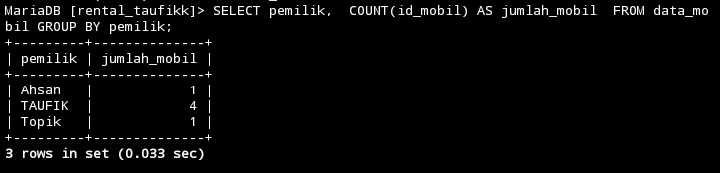
### Analisis
 - `SELECT pemilik, COUNT(*) AS jumlah_mobil`: Memilih kolom `pemilik` dan menghitung jumlah mobil (`COUNT(*)`) untuk setiap pemilik. Hasil perhitungan ini diberi alias `jumlah_mobil`.
- `FROM data_mobil`: Mengambil data dari tabel `mobil`.
- `GROUP BY pemilik`: Mengelompokkan hasil berdasarkan kolom `pemilik`.
- `HAVING COUNT(*) >= 3`: Menyaring hasil kelompok yang jumlah mobilnya lebih besar atau sama dengan 3.

___
## 4.berdasarkan query yang ada pada praktikum 5 bagian 7 tampilkan data pada table mobil dengan mengelompokkan berdasarkan pemiliknya.hitung menggunakan sum total pendapatan pemilik berdasarkan harga rental

## Struktur Query
```mysql
select data 3,SUM(data 5) AS nama_sementara from nama_tabel GROUP BY data 3;
```
### Query
```mysql
select pemilik,SUM(harga_rental) AS jumlah_pendapatan from data_mobil GROUP BY pemilik;
```
### Hasil
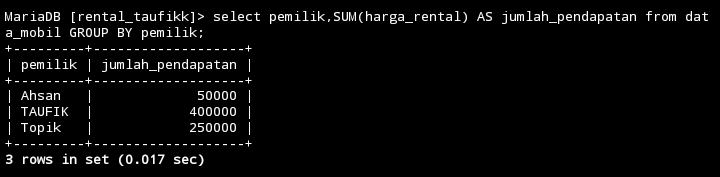
### Analisis
- `SELECT pemilik, SUM(harga_rental) AS total_pendapatan`: Memilih kolom pemilik dan menghitung total pendapatan (SUM(harga_rental)) untuk setiap pemilik. Hasil perhitungan ini diberi alias total_pendapatan.
- `FROM data_mobil`: Mengambil data dari tabel mobil.
- `GROUP BY pemilik`: Mengelompokkan hasil berdasarkan kolom pemilik.

___
## 5. Berdasarkan praktikum 5 query no 8 tampilkan jumlah pemasukan pemilik berdasarkan harga rental kelompokkan berdasarkan pemiliknya dan seleksi yang total pemasukannya atau harga rentalnya mencapai lebih besar atau sama dengan 300k

## Struktur Query
```mysql
select data_mobil,SUM(data_mobil) AS nama_sementara from nama_tabel GROUP BY data_mobil HAVING SUM(data_mobil) >= 300000;
```
### Query
```mysql
select pemilik,SUM(harga_rental) AS jumlah_pemasukan from data_mobil GROUP BY pemilik HAVING SUM(harga_rental) >= 300000;
```
### Hasil
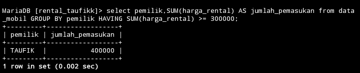
### Analisis
- `SELECT pemilik, SUM(harga_rental) AS total_pendapatan`: Memilih kolom pemilik dan menghitung total pendapatan (SUM(harga_rental)) untuk setiap pemilik. Hasil perhitungan ini diberi alias total_pendapatan.
- `FROM data_mobil`: Mengambil data dari tabel mobil.
- `GROUP BY pemilik`: Mengelompokkan hasil berdasarkan kolom pemilik.
- `HAVING SUM(harga_rental) >= 300000`: Menyaring hasil kelompok yang total pendapatannya lebih besar atau sama dengan 300.000.

___
## 6. Berdasarkan praktikum 6 no 12 tampilkan rata_rata pemasukan pemilik mobil kelompokkan berdasarkan pemiliknya
### Struktur Query
```mysql
select nama_data,AVG(nama_data) AS nama_sementara from nama_tabel GROUP BY nama_data;
```
## Query 
```mysql
select pemilik,AVG(harga_rental) AS rata_pemasukam from data_mobil GROUP BY pemilik;
```
### Hasil
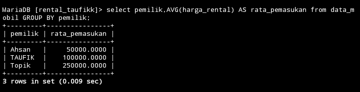
### Analisis
- `SELECT pemilik, SUM(harga_rental) AS total_pendapatan`: Memilih kolom `pemilik` dan menghitung total pendapatan (`SUM(harga_rental)`) untuk setiap pemilik. Hasil perhitungan ini diberi alias `total_pendapatan`.
- `FROM data_mobil`: Mengambil data dari tabel `mobil`.
- `GROUP BY pemilik`: Mengelompokkan hasil berdasarkan kolom `pemilik`.

___
## 7. Berdasarkan praktikum 5 no 16 tampilkan pemasukan  terbesar dan pemasukan terkecil kelompokkan berdasarkan pemiliknya dan seleksi data pemilik yg tampil atau memiliki jumlah mobil lebih besar dari 1.

## Struktur Query
```mysql
select nama_data,MAX(nama_data) AS nama_sementara,MIN(nama_data) AS nama_sementara from nama_tabel GROUP BY nama_data HAVING COUNT(nama_data) >= 1;
```
### Query
```mysql
select pemilik,MAX(harga_rental) AS Pemasukan_Terbesar ,MIN(harga_rental) AS pemasukan_terkecil from data_mobil GROUP BY pemilik HAVING COUNT(harga_rental) > 1;
```
### Hasil
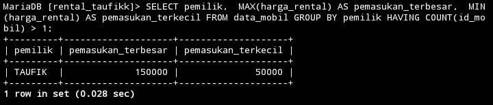

### Analisis
Subquery:
- `SELECT pemilik, SUM(harga_rental) AS total_pendapatan FROM data_mobil GROUP BY pemilik HAVING COUNT(id_mobil) > 1`: Mengelompokkan data berdasarkan pemilik dan menghitung total pemasukan (SUM(harga_rental)) untuk setiap pemilik, kemudian menyaring hasil hanya untuk pemilik yang memiliki lebih dari 1 mobil (HAVING COUNT(id_mobil) > 1).

Outher query:
- `SELECT pemilik, MAX(harga_rental) AS pemasukan_terbesar, MIN(harga_rental) AS pemasukan_terkecil FROM GROUP BY pemilik`: Dari hasil subquery, mengelompokkan lagi berdasarkan pemilik dan menghitung pemasukan terbesar (MAX(harga_rental)) dan terkecil (MIN(harga_rental)) untuk setiap pemilik.